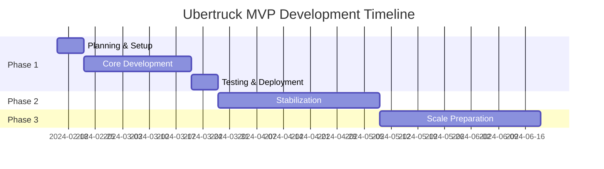

# Project Plan Document
## Ubertruck MVP - Implementation Roadmap
### Version 1.0 | Date: February 2024

---

## Executive Summary

This document outlines the comprehensive project plan for developing and launching the Ubertruck MVP within a 6-week development timeline followed by 6 weeks of stabilization. The plan emphasizes lean development, rapid iteration, and achieving 95%+ operational success on the Nalgonda-Miryalguda corridor.

**Key Objectives:**
- Launch functional MVP in 6 weeks
- Onboard 15 shippers and 100 trucks in 90 days
- Achieve ₹35 lakhs GMV by Day 90
- Maintain development costs under ₹10 lakhs

---

## 1. Project Overview

### 1.1 Project Scope

```yaml
In Scope:
  - Single corridor: Nalgonda-Miryalguda (40km)
  - Fixed-rate pricing: ₹5/tonne/km
  - Web application (mobile responsive)
  - 6 microservices architecture
  - OTP-based authentication
  - Manual payment tracking
  - Basic tracking and POD
  - SMS notifications
  - English language only

Out of Scope (MVP):
  - Mobile applications
  - Real-time GPS tracking
  - Payment gateway integration
  - Multi-language support
  - Bidding system
  - Multi-corridor operations
  - AI/ML features
  - Advanced analytics
```

### 1.2 Success Criteria

```yaml
Technical Success:
  - All 6 services operational
  - 99.5% uptime achieved
  - <3 second page load time
  - <500ms API response time
  - Zero critical security issues

Business Success:
  - 15 active shippers
  - 100 active trucks
  - 500+ completed bookings
  - ₹35 lakhs GMV
  - 95%+ delivery success rate
  - <2% dispute rate
```

### 1.3 Project Constraints

```yaml
Budget Constraints:
  Development: ₹10 lakhs
  Infrastructure: ₹15,000/month
  Operations: ₹50,000/month

Time Constraints:
  MVP Development: 6 weeks
  Stabilization: 6 weeks
  Scale Preparation: 6 weeks

Resource Constraints:
  Team Size: 4-5 developers
  Testing: 1 QA engineer
  DevOps: Part-time
  Project Manager: 1
```

---

## 2. Project Timeline

### 2.1 High-Level Phases



### 2.2 Detailed Sprint Plan

#### Sprint 0: Planning & Setup (Week 1)
```yaml
Duration: Feb 15-21, 2024

Objectives:
  - Finalize requirements
  - Setup development environment
  - Configure CI/CD pipeline
  - Initialize repositories
  - Setup monitoring tools

Deliverables:
  - Development environment ready
  - Git repositories created
  - CI/CD pipeline configured
  - Database schema finalized
  - API contracts defined

Team Allocation:
  - Full Stack Lead: Environment setup
  - Backend Dev: Database design
  - Frontend Dev: UI mockups
  - DevOps: Infrastructure setup
```

#### Sprint 1: Foundation (Week 2)
```yaml
Duration: Feb 22-28, 2024

User Service:
  - Registration/Login API
  - OTP generation/verification
  - JWT authentication
  - Profile management
  - Database tables

Fleet Service:
  - Truck registration API
  - Driver management
  - Availability tracking
  - Basic CRUD operations

Deliverables:
  - User authentication working
  - Fleet management APIs
  - Database migrations
  - Unit tests (>80% coverage)
```

#### Sprint 2: Core Booking (Week 3)
```yaml
Duration: Feb 29 - Mar 6, 2024

Booking Service:
  - Booking creation API
  - Price calculation engine
  - Status management
  - Assignment logic
  - Cancellation handling

Route Service:
  - Route calculation
  - Distance estimation
  - Basic tracking APIs
  - POD upload

Deliverables:
  - Complete booking flow
  - Route calculation working
  - Integration tests
  - API documentation
```

#### Sprint 3: Payment & Admin (Week 4)
```yaml
Duration: Mar 7-13, 2024

Payment Service:
  - Invoice generation
  - Payment tracking
  - GST calculations
  - Settlement logic
  - Reports generation

Admin Service:
  - Dashboard APIs
  - Metrics collection
  - User management
  - System configuration

Deliverables:
  - Payment system operational
  - Admin dashboard APIs
  - Financial reports
  - Performance optimization
```

#### Sprint 4: Frontend Development (Week 5)
```yaml
Duration: Mar 14-20, 2024

Frontend Implementation:
  - Authentication screens
  - Shipper dashboard
  - Carrier dashboard
  - Booking flow
  - Tracking interface
  - Admin panel

UI/UX:
  - Responsive design
  - Mobile optimization
  - Cross-browser testing
  - Accessibility compliance

Deliverables:
  - Complete frontend
  - Integration with APIs
  - E2E test scenarios
  - User documentation
```

#### Sprint 5: Integration & Testing (Week 6)
```yaml
Duration: Mar 21-27, 2024

Integration:
  - End-to-end testing
  - Performance testing
  - Security testing
  - UAT preparation
  - Bug fixes

Deployment:
  - Production setup
  - SSL certificates
  - Domain configuration
  - Monitoring setup
  - Backup configuration

Deliverables:
  - Production deployment
  - All tests passing
  - Performance benchmarks met
  - Security audit complete
  - Go-live readiness
```

### 2.3 Stabilization Phase (Weeks 7-12)

```yaml
Week 7-8: Soft Launch
  - 5 shippers onboarding
  - 50 trucks registration
  - Daily monitoring
  - Issue resolution
  - Performance tuning

Week 9-10: Gradual Scaling
  - 10 shippers active
  - 75 trucks active
  - Feature refinements
  - Process optimization
  - Customer feedback

Week 11-12: Full Operations
  - 15 shippers active
  - 100 trucks active
  - Stable operations
  - Metrics achievement
  - Scale planning
```

---

## 3. Resource Plan

### 3.1 Team Structure

```yaml
Core Development Team:

Full Stack Lead:
  Responsibilities:
    - Architecture decisions
    - Code reviews
    - Integration coordination
    - Technical mentoring
  Allocation: 100%

Backend Developer:
  Responsibilities:
    - API development
    - Database design
    - Service implementation
    - Testing
  Allocation: 100%

Frontend Developer:
  Responsibilities:
    - UI implementation
    - React components
    - State management
    - Responsive design
  Allocation: 100%

Full Stack Developer:
  Responsibilities:
    - Feature development
    - Bug fixes
    - Testing support
    - Documentation
  Allocation: 100%

DevOps Engineer:
  Responsibilities:
    - Infrastructure setup
    - CI/CD pipeline
    - Monitoring
    - Deployment
  Allocation: 50%
```

### 3.2 Support Team

```yaml
QA Engineer:
  - Test planning
  - Test execution
  - Bug tracking
  - UAT coordination
  Allocation: 75%

Project Manager:
  - Sprint planning
  - Stakeholder communication
  - Risk management
  - Progress tracking
  Allocation: 100%

UI/UX Designer:
  - Design mockups
  - User flows
  - Design system
  - Usability testing
  Allocation: 25%
```

### 3.3 Skill Requirements

```yaml
Technical Skills Required:
  - Node.js/TypeScript (3+ years)
  - React.js (2+ years)
  - PostgreSQL (2+ years)
  - REST API design
  - Microservices architecture
  - Docker/DevOps basics
  - Git/GitHub

Domain Knowledge:
  - Logistics industry (preferred)
  - Indian market understanding
  - GST/compliance basics
  - B2B platforms
```

---

## 4. Risk Management

### 4.1 Risk Register

| Risk ID | Risk Description | Probability | Impact | Mitigation Strategy | Owner |
|---------|-----------------|-------------|---------|-------------------|--------|
| R001 | Development delays | Medium | High | Buffer time, parallel development | PM |
| R002 | Low user adoption | High | Critical | Incentives, training, support | Business |
| R003 | Technical debt accumulation | Medium | Medium | Code reviews, refactoring sprints | Tech Lead |
| R004 | Integration failures | Low | High | Early integration testing | DevOps |
| R005 | Security vulnerabilities | Low | High | Security audit, OWASP compliance | Tech Lead |
| R006 | Database performance issues | Medium | High | Query optimization, indexing | Backend |
| R007 | Third-party service failures | Medium | Medium | Fallback mechanisms, multiple providers | Backend |
| R008 | Budget overrun | Low | Medium | Cost monitoring, resource optimization | PM |
| R009 | Key person dependency | Medium | High | Knowledge sharing, documentation | PM |
| R010 | Regulatory compliance issues | Low | High | Legal consultation, compliance check | Business |

### 4.2 Risk Response Plan

```yaml
High Priority Risks:

Development Delays:
  Prevention:
    - Daily standups
    - Clear requirements
    - Automated testing
    - Parallel workstreams
  Response:
    - Scope reduction
    - Additional resources
    - Overtime approval
    - Feature postponement

Low User Adoption:
  Prevention:
    - User research
    - Onboarding incentives
    - Training programs
    - Support system
  Response:
    - Marketing campaign
    - Referral program
    - Feature adjustments
    - Pricing review

Technical Issues:
  Prevention:
    - Code reviews
    - Testing coverage
    - Performance monitoring
    - Security scanning
  Response:
    - Hotfix process
    - Rollback capability
    - Incident response
    - Communication plan
```

### 4.3 Contingency Planning

```yaml
Schedule Contingency:
  - 1 week buffer built into timeline
  - Critical path identified
  - Parallel development where possible
  - Feature prioritization matrix

Budget Contingency:
  - 15% contingency reserve (₹1.5 lakhs)
  - Cost tracking weekly
  - Approval process for overruns
  - Resource optimization options

Technical Contingency:
  - Fallback to monolith if needed
  - Manual processes as backup
  - Third-party service alternatives
  - Gradual rollout strategy
```

---

## 5. Communication Plan

### 5.1 Stakeholder Matrix

```yaml
Internal Stakeholders:
  Executive Team:
    Interest: High
    Influence: High
    Communication: Weekly status, milestone reviews

  Development Team:
    Interest: High
    Influence: Medium
    Communication: Daily standups, sprint meetings

  Operations Team:
    Interest: Medium
    Influence: Low
    Communication: Training sessions, documentation

External Stakeholders:
  Early Customers:
    Interest: High
    Influence: Medium
    Communication: Regular updates, feedback sessions

  Investors:
    Interest: High
    Influence: High
    Communication: Monthly reports, milestone updates

  Partners:
    Interest: Medium
    Influence: Low
    Communication: Integration updates, API docs
```

### 5.2 Meeting Schedule

```yaml
Daily:
  Standup Meeting:
    Time: 10:00 AM
    Duration: 15 minutes
    Participants: Dev team
    Format: What done, what next, blockers

Weekly:
  Sprint Planning (Monday):
    Time: 11:00 AM
    Duration: 2 hours
    Participants: Full team

  Progress Review (Wednesday):
    Time: 3:00 PM
    Duration: 1 hour
    Participants: PM, Tech Lead

  Stakeholder Update (Friday):
    Time: 4:00 PM
    Duration: 30 minutes
    Participants: Leadership

Bi-weekly:
  Sprint Review:
    Duration: 2 hours
    Participants: Full team + stakeholders

  Sprint Retrospective:
    Duration: 1 hour
    Participants: Dev team
```

### 5.3 Reporting Structure

```yaml
Status Reports:
  Daily Status:
    - Slack updates
    - Blocker alerts
    - Progress percentage

  Weekly Report:
    - Sprint progress
    - Metrics dashboard
    - Risk updates
    - Budget status

  Monthly Report:
    - Milestone achievement
    - KPI tracking
    - Financial summary
    - Forecast updates

Dashboards:
  Development:
    - Sprint burndown
    - Velocity tracking
    - Bug metrics
    - Code coverage

  Business:
    - User onboarding
    - Booking metrics
    - Revenue tracking
    - System health
```

---

## 6. Quality Plan

### 6.1 Quality Standards

```yaml
Code Quality:
  - ESLint/Prettier enforcement
  - Code review mandatory
  - Test coverage >80%
  - Documentation required
  - SOLID principles

Performance Standards:
  - Page load <3 seconds
  - API response <500ms
  - 99.5% uptime
  - Error rate <1%

Security Standards:
  - OWASP Top 10 compliance
  - SSL/TLS everywhere
  - Regular security scans
  - Penetration testing
```

### 6.2 Testing Strategy

```yaml
Testing Levels:

Unit Testing:
  Coverage: >80%
  Framework: Jest
  Automation: CI/CD
  Responsibility: Developers

Integration Testing:
  Coverage: Critical paths
  Framework: Supertest
  Automation: CI/CD
  Responsibility: Developers

E2E Testing:
  Coverage: User journeys
  Framework: Cypress
  Automation: Nightly
  Responsibility: QA

Performance Testing:
  Tool: k6/Artillery
  Scenarios: Load, stress
  Frequency: Weekly
  Responsibility: DevOps

Security Testing:
  Tool: OWASP ZAP
  Frequency: Sprint end
  Scope: Full application
  Responsibility: Security team
```

### 6.3 Quality Gates

```yaml
Code Commit:
  - Linting passed
  - Unit tests passed
  - Code review approved
  - No merge conflicts

Pull Request:
  - All tests passed
  - Coverage maintained
  - Documentation updated
  - No critical issues

Release:
  - Integration tests passed
  - Performance benchmarks met
  - Security scan clean
  - Stakeholder approval
```

---

## 7. Delivery Plan

### 7.1 Milestones

| Milestone | Date | Deliverables | Success Criteria |
|-----------|------|--------------|------------------|
| M1: Environment Ready | Feb 21 | Dev setup, CI/CD | All tools configured |
| M2: Core APIs Complete | Mar 6 | User, Fleet, Booking APIs | All endpoints working |
| M3: Full Backend Ready | Mar 13 | All 6 services | Integration complete |
| M4: Frontend Complete | Mar 20 | Web application | UI fully functional |
| M5: MVP Launch | Mar 27 | Production deployment | System operational |
| M6: 30-Day Success | Apr 27 | 5 shippers, 50 trucks | 100 bookings done |
| M7: 60-Day Growth | May 27 | 10 shippers, 75 trucks | 300 bookings done |
| M8: 90-Day Target | Jun 27 | 15 shippers, 100 trucks | ₹35 lakhs GMV |

### 7.2 Release Strategy

```yaml
Release Process:

Development:
  - Feature branches
  - Pull request reviews
  - Automated testing
  - Merge to develop

Staging:
  - Deploy to staging
  - Integration testing
  - UAT execution
  - Performance testing

Production:
  - Blue-green deployment
  - Smoke testing
  - Gradual rollout
  - Monitoring alerts

Rollback Plan:
  - Previous version ready
  - Database backups
  - Quick switch capability
  - <5 minute rollback
```

### 7.3 Go-Live Plan

```yaml
Pre-Launch (Week 6):
  Day 1-2:
    - Final testing
    - Security audit
    - Performance tuning
    - Documentation review

  Day 3-4:
    - Production deployment
    - SSL configuration
    - Monitoring setup
    - Backup verification

  Day 5-7:
    - User training
    - Support preparation
    - Launch communication
    - Final checks

Launch Day:
  Morning:
    - System health check
    - Team briefing
    - Support ready
    - Monitoring active

  Launch:
    - Soft launch (5 users)
    - Monitor metrics
    - Gather feedback
    - Fix critical issues

  Evening:
    - Review session
    - Issue tracking
    - Next day planning
    - Stakeholder update

Post-Launch:
  Week 1:
    - Daily monitoring
    - Issue resolution
    - User support
    - Performance tuning

  Week 2-4:
    - Gradual scaling
    - Feature refinements
    - Process optimization
    - Growth tracking
```

---

## 8. Budget Plan

### 8.1 Development Budget

```yaml
Personnel Costs (6 weeks):
  Full Stack Lead: ₹2,00,000
  Backend Developer: ₹1,50,000
  Frontend Developer: ₹1,50,000
  Full Stack Developer: ₹1,25,000
  DevOps (50%): ₹75,000
  QA Engineer (75%): ₹75,000
  Project Manager: ₹1,00,000
  UI/UX (25%): ₹25,000

  Subtotal: ₹9,00,000

Infrastructure Costs:
  Cloud hosting: ₹15,000/month
  Domain & SSL: ₹5,000
  Third-party APIs: ₹10,000/month
  Development tools: ₹10,000

  Subtotal: ₹70,000

Other Costs:
  Security audit: ₹25,000
  Legal consultation: ₹5,000

  Subtotal: ₹30,000

Total Budget: ₹10,00,000
```

### 8.2 Operational Budget (Monthly)

```yaml
Fixed Costs:
  Infrastructure: ₹15,000
  Third-party services: ₹10,000
  Support staff: ₹15,000

Variable Costs:
  SMS notifications: ₹5,000
  Customer acquisition: ₹5,000

Total Monthly: ₹50,000
```

### 8.3 Cost Optimization

```yaml
Optimization Strategies:
  - Use spot instances where possible
  - Implement caching aggressively
  - Optimize database queries
  - Compress static assets
  - Rate limit API calls
  - Monitor resource usage
  - Right-size infrastructure
  - Negotiate vendor rates
```

---

## 9. Success Metrics

### 9.1 KPI Dashboard

```yaml
Technical KPIs:
  System Health:
    - Uptime: Target 99.5%
    - Response time: <500ms
    - Error rate: <1%
    - Page load: <3s

  Development:
    - Sprint velocity: 40 points
    - Bug count: <10 critical
    - Code coverage: >80%
    - Tech debt: <10%

Business KPIs:
  Growth:
    - Shippers: 15 by day 90
    - Trucks: 100 by day 90
    - Bookings: 500 by day 90
    - GMV: ₹35 lakhs

  Quality:
    - Success rate: >95%
    - Dispute rate: <2%
    - User satisfaction: >4/5
    - Support tickets: <5%

Operational KPIs:
  Efficiency:
    - Booking time: <3 minutes
    - Truck utilization: >60%
    - Empty returns: <10%
    - Payment cycle: <7 days

  Cost:
    - CAC: <₹500
    - Cost per booking: <₹50
    - Burn rate: <₹75,000/month
    - Unit economics: Positive by month 6
```

### 9.2 Success Criteria Tracking

```yaml
Daily Metrics:
  - Active users
  - Bookings created
  - System uptime
  - Error rates

Weekly Metrics:
  - User growth
  - Revenue generated
  - Sprint progress
  - Bug resolution

Monthly Metrics:
  - GMV achievement
  - User retention
  - Cost analysis
  - Performance review
```

---

## 10. Transition Plan

### 10.1 Handover Process

```yaml
Development to Operations:
  Documentation:
    - Technical documentation
    - Operational runbooks
    - Troubleshooting guides
    - API documentation

  Training:
    - System walkthrough
    - Common issues
    - Monitoring tools
    - Support processes

  Support:
    - 2-week hypercare
    - On-call availability
    - Knowledge transfer
    - Issue escalation

Knowledge Transfer:
  Week 1:
    - Architecture overview
    - Code walkthrough
    - Database design
    - API structure

  Week 2:
    - Deployment process
    - Monitoring setup
    - Issue resolution
    - Performance tuning
```

### 10.2 Support Model

```yaml
Support Structure:

L1 Support:
  - User queries
  - Basic troubleshooting
  - Ticket creation
  - FAQ responses
  Response: <30 minutes

L2 Support:
  - Technical issues
  - Bug investigation
  - Configuration changes
  - Database queries
  Response: <2 hours

L3 Support:
  - Critical issues
  - Code changes
  - Infrastructure issues
  - Performance problems
  Response: <4 hours

Escalation Matrix:
  Severity 1: Immediate (system down)
  Severity 2: 2 hours (major feature broken)
  Severity 3: 8 hours (minor feature issue)
  Severity 4: 24 hours (enhancement request)
```

---

## Appendices

### Appendix A: Work Breakdown Structure

```yaml
1. Project Management
   1.1 Planning
   1.2 Monitoring
   1.3 Reporting
   1.4 Risk Management

2. Development
   2.1 Backend Services
       2.1.1 User Service
       2.1.2 Fleet Service
       2.1.3 Booking Service
       2.1.4 Route Service
       2.1.5 Payment Service
       2.1.6 Admin Service
   2.2 Frontend Application
       2.2.1 Authentication
       2.2.2 Dashboards
       2.2.3 Booking Flow
       2.2.4 Tracking
   2.3 Database
       2.3.1 Schema Design
       2.3.2 Migrations
       2.3.3 Optimization

3. Infrastructure
   3.1 Environment Setup
   3.2 CI/CD Pipeline
   3.3 Monitoring
   3.4 Security

4. Testing
   4.1 Unit Testing
   4.2 Integration Testing
   4.3 E2E Testing
   4.4 Performance Testing

5. Deployment
   5.1 Staging Deployment
   5.2 Production Deployment
   5.3 Rollback Planning

6. Operations
   6.1 User Onboarding
   6.2 Support Setup
   6.3 Monitoring
   6.4 Maintenance
```

### Appendix B: RACI Matrix

| Activity | PM | Tech Lead | Backend | Frontend | DevOps | QA |
|----------|-----|-----------|---------|----------|--------|----|
| Requirements | A | R | C | C | I | C |
| Architecture | C | R | C | C | C | I |
| API Development | I | A | R | C | I | C |
| UI Development | I | A | C | R | I | C |
| Database Design | I | A | R | I | C | I |
| Testing | C | A | R | R | I | R |
| Deployment | A | R | C | C | R | C |
| Documentation | A | R | R | R | C | C |
| Training | R | C | C | C | I | C |

*R: Responsible, A: Accountable, C: Consulted, I: Informed*

### Appendix C: Technology Stack Details

```yaml
Frontend:
  - React 18.2.0
  - TypeScript 5.0
  - Redux Toolkit 1.9
  - Material-UI 5.14
  - Axios 1.4
  - React Router 6.11
  - Vite 4.3

Backend:
  - Node.js 20.11 LTS
  - Express 4.18
  - TypeScript 5.0
  - Prisma 5.7
  - JWT 9.0
  - Joi 17.9
  - Winston 3.8

Database:
  - PostgreSQL 15.5
  - Redis 7.2
  - PostGIS 3.3

DevOps:
  - Docker 24.0
  - Docker Compose 2.20
  - Nginx 1.24
  - PM2 5.3
  - GitHub Actions

Monitoring:
  - PM2 Plus
  - Custom dashboards
  - Uptime monitoring
  - Log aggregation
```

---

*Document Version: 1.0*
*Last Updated: February 2024*
*Status: Approved for Execution*
*Next Review: Weekly during project execution*