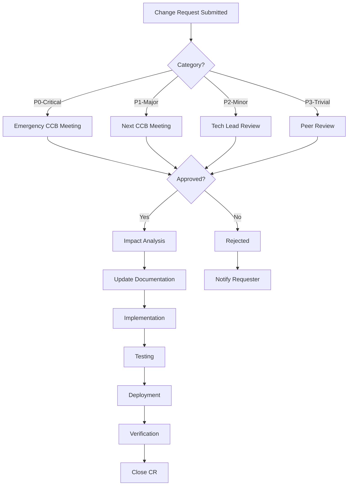

# Change Management Process
## Ubertruck MVP - Formal Change Control Procedures
### Version 1.0 | Date: February 2024

---

## Executive Summary

This document establishes a formal Change Management Process for the Ubertruck MVP project, addressing the critical gap of uncontrolled requirement changes that led to GPS tracking contradictions and other scope creep issues identified in the audit.

## 1. Change Management Framework

### 1.1 Change Categories

```yaml
Change Types:
  Critical (P0):
    Definition: Security vulnerabilities, legal compliance, system down
    Approval: CTO + Product Owner
    SLA: 4 hours
    Examples:
      - DPDP compliance violation
      - Payment processing failure
      - Data breach vulnerability

  Major (P1):
    Definition: Feature changes, API modifications, architecture changes
    Approval: Tech Lead + Product Owner
    SLA: 24 hours
    Examples:
      - GPS tracking scope change
      - New microservice addition
      - Database schema changes

  Minor (P2):
    Definition: UI improvements, bug fixes, documentation updates
    Approval: Tech Lead
    SLA: 48 hours
    Examples:
      - UI color changes
      - Error message updates
      - Documentation corrections

  Trivial (P3):
    Definition: Typos, comments, formatting
    Approval: Peer Review
    SLA: 72 hours
    Examples:
      - Code formatting
      - Comment updates
      - README changes
```

### 1.2 Change Control Board (CCB)

```yaml
Board Members:
  Permanent:
    - Product Owner (Business decisions)
    - Technical Lead (Technical feasibility)
    - QA Lead (Testing impact)
    - DevOps Lead (Deployment impact)

  Optional (as needed):
    - Customer Representative
    - Legal/Compliance Officer
    - Security Officer
    - Finance Representative

Meeting Schedule:
  Regular: Weekly (Thursdays 2 PM IST)
  Emergency: Within 4 hours for P0

Quorum:
  P0 Changes: All permanent members
  P1 Changes: 3 of 4 permanent members
  P2 Changes: 2 of 4 permanent members
  P3 Changes: 1 permanent member
```

## 2. Change Request Process

### 2.1 Change Request Form

```markdown
# Change Request Template

## CR-[YYYY]-[NNN] (e.g., CR-2024-001)

### 1. Change Summary
- **Title**: [Brief description]
- **Category**: [P0/P1/P2/P3]
- **Requester**: [Name, Role]
- **Date**: [Submission date]
- **Target Sprint**: [Sprint number]

### 2. Change Description
- **Current State**: [What exists now]
- **Proposed State**: [What is being requested]
- **Justification**: [Why this change is needed]

### 3. Business Impact
- **Benefits**: [List of benefits]
- **Risks**: [Potential risks]
- **Cost**: [Estimated cost in person-days]
- **ROI**: [Expected return]

### 4. Technical Impact
- **Affected Components**:
  - [ ] User Service
  - [ ] Fleet Service
  - [ ] Booking Service
  - [ ] Route Service
  - [ ] Payment Service
  - [ ] Admin Service
  - [ ] Database Schema
  - [ ] External APIs

- **Dependencies**: [List of dependencies]
- **Breaking Changes**: [Yes/No, details]

### 5. Testing Impact
- **New Test Cases**: [Number required]
- **Regression Testing**: [Scope]
- **Performance Impact**: [Expected impact]

### 6. Documentation Impact
- [ ] Vision Document
- [ ] SRS
- [ ] System Design
- [ ] API Documentation
- [ ] User Manual
- [ ] Deployment Guide

### 7. Timeline
- **Development**: [Days]
- **Testing**: [Days]
- **Documentation**: [Days]
- **Total**: [Days]

### 8. Approval
- [ ] Product Owner: [Name, Date]
- [ ] Tech Lead: [Name, Date]
- [ ] QA Lead: [Name, Date]
- [ ] DevOps Lead: [Name, Date]
```

### 2.2 Change Workflow



## 3. Impact Analysis Template

### 3.1 Technical Impact Matrix

| Component | Impact Level | Changes Required | Effort (days) | Risk |
|-----------|--------------|------------------|---------------|------|
| Frontend | High/Med/Low | List changes | X | H/M/L |
| Backend API | High/Med/Low | List changes | X | H/M/L |
| Database | High/Med/Low | List changes | X | H/M/L |
| Integration | High/Med/Low | List changes | X | H/M/L |
| Testing | High/Med/Low | List changes | X | H/M/L |

### 3.2 Stakeholder Impact

```yaml
Impact Assessment:
  Shippers:
    - Feature availability
    - Downtime required
    - Training needed
    - Communication plan

  Carriers:
    - App updates required
    - Process changes
    - Revenue impact
    - Support needed

  Internal Teams:
    - Development effort
    - Testing effort
    - Documentation updates
    - Training requirements

  External Partners:
    - API changes
    - Integration updates
    - Contract modifications
    - SLA impacts
```

## 4. Change Implementation Process

### 4.1 Implementation Phases

```yaml
Phase 1 - Preparation:
  - Create feature branch
  - Update specifications
  - Prepare rollback plan
  - Set up feature flags

Phase 2 - Development:
  - Implement changes
  - Write unit tests
  - Update documentation
  - Code review

Phase 3 - Testing:
  - Integration testing
  - Regression testing
  - Performance testing
  - UAT (if required)

Phase 4 - Deployment:
  - Deploy to staging
  - Smoke testing
  - Deploy to production
  - Monitor metrics

Phase 5 - Verification:
  - Validate functionality
  - Check performance metrics
  - Gather user feedback
  - Document lessons learned
```

### 4.2 Rollback Procedures

```yaml
Rollback Triggers:
  - Critical bug in production
  - Performance degradation >20%
  - Data corruption detected
  - Security vulnerability exposed
  - Business logic failure

Rollback Process:
  Immediate (< 5 minutes):
    - Revert feature flag
    - Switch to previous version
    - Restore from backup

  Standard (< 30 minutes):
    - Deploy previous version
    - Revert database migrations
    - Clear caches
    - Verify functionality

  Complex (< 2 hours):
    - Full environment restore
    - Data reconciliation
    - Partner notification
    - Customer communication
```

## 5. Change Tracking and Metrics

### 5.1 Change Register

```typescript
interface ChangeRecord {
  id: string;                    // CR-2024-001
  title: string;
  category: "P0" | "P1" | "P2" | "P3";
  status: "PENDING" | "APPROVED" | "IN_PROGRESS" | "COMPLETED" | "REJECTED";
  requester: {
    name: string;
    role: string;
    department: string;
  };
  dates: {
    requested: Date;
    approved?: Date;
    implemented?: Date;
    deployed?: Date;
    closed?: Date;
  };
  impact: {
    components: string[];
    effort: number;              // person-days
    cost: number;                // INR
    risk: "HIGH" | "MEDIUM" | "LOW";
  };
  approvals: Array<{
    approver: string;
    role: string;
    decision: "APPROVED" | "REJECTED" | "CONDITIONAL";
    date: Date;
    comments?: string;
  }>;
  artifacts: {
    specifications?: string[];   // Document links
    testPlans?: string[];
    deploymentPlans?: string[];
  };
}
```

### 5.2 Change Metrics Dashboard

```yaml
Key Metrics:
  Volume Metrics:
    - Total CRs per sprint
    - CRs by category
    - CRs by component
    - CRs by requester

  Efficiency Metrics:
    - Approval cycle time
    - Implementation duration
    - Success rate
    - Rollback rate

  Quality Metrics:
    - Defects per change
    - Post-change incidents
    - Documentation completeness
    - Test coverage

  Business Metrics:
    - Planned vs emergency changes
    - Business value delivered
    - Cost of change
    - Schedule variance
```

## 6. Communication Plan

### 6.1 Stakeholder Communications

```yaml
Internal Communications:
  Development Team:
    Channel: Slack #dev-changes
    Frequency: Real-time
    Content: Technical details, implementation updates

  Management:
    Channel: Email + Dashboard
    Frequency: Weekly summary
    Content: Progress, risks, decisions needed

  QA Team:
    Channel: JIRA + Slack
    Frequency: Per change
    Content: Test requirements, regression scope

External Communications:
  Customers (Shippers/Carriers):
    Channel: In-app notification + Email
    Frequency: 48 hours before change
    Content: Feature updates, downtime notices

  Partners:
    Channel: API changelog + Email
    Frequency: 2 weeks before change
    Content: API changes, deprecations
```

### 6.2 Change Notification Template

```markdown
## Change Notification

### Change ID: [CR-YYYY-NNN]
### Scheduled Date: [Date and Time IST]
### Expected Duration: [X hours]

**What's Changing:**
[Brief description of the change]

**Why We're Making This Change:**
[Business justification]

**How This Affects You:**
- [Impact point 1]
- [Impact point 2]
- [Impact point 3]

**What You Need to Do:**
- [ ] [Action item 1]
- [ ] [Action item 2]

**Support Contact:**
- Email: support@ubertruck.in
- Phone: 1800-XXX-XXXX
- Slack: #customer-support
```

## 7. Special Procedures

### 7.1 Emergency Change Process

```yaml
Emergency Change Criteria:
  - Production system down
  - Security breach detected
  - Legal compliance violation
  - Major data loss risk

Fast-Track Process:
  1. Verbal approval from 2 CCB members
  2. Implement fix
  3. Document within 24 hours
  4. Full CCB review within 48 hours
  5. Lessons learned within 1 week

Documentation Required:
  - Incident description
  - Root cause
  - Fix implemented
  - Testing performed
  - Rollback plan
```

### 7.2 Scope Creep Prevention

```yaml
Scope Controls:
  Requirements Freeze:
    - Sprint 1-2: Changes allowed
    - Sprint 3-4: Major changes require CCB
    - Sprint 5-6: Only critical fixes
    - Sprint 7: Complete freeze

  Change Budget:
    - 20% buffer for changes
    - Track against original estimate
    - Escalate when >20%

  Feature Flags:
    - New features behind flags
    - Gradual rollout
    - Easy rollback
    - A/B testing capability
```

## 8. Change Categories Examples

### 8.1 Recent Changes (Lessons Learned)

| Change | Category | Issue | Resolution | Prevention |
|--------|----------|-------|------------|------------|
| GPS Tracking Removal | P1 | Scope contradiction | Created clarification doc | Formal change process |
| Corridor Change | P2 | Multiple location updates | Systematic update | Location config file |
| E-Way Bill Addition | P1 | Missing compliance | Added to scope | Regulatory checklist |
| DPDP Compliance | P0 | Legal requirement | Urgent implementation | Legal review process |

### 8.2 Change Cost Analysis

```yaml
Cost Factors:
  Direct Costs:
    - Development effort
    - Testing effort
    - Documentation updates
    - Training delivery

  Indirect Costs:
    - Context switching
    - Technical debt
    - Schedule delays
    - Quality impact

  Risk Costs:
    - Rollback efforts
    - Customer impact
    - Reputation damage
    - Compliance penalties
```

## 9. Tools and Automation

### 9.1 Change Management Tools

```yaml
JIRA Configuration:
  Issue Type: Change Request
  Workflow: CR-Workflow
  Fields:
    - Category (P0-P3)
    - Impact Components
    - Business Value
    - Technical Complexity
    - Test Scope

  Automation:
    - Auto-assign to CCB
    - SLA tracking
    - Notification triggers
    - Status transitions

GitFlow Integration:
  Branch Naming: feature/CR-YYYY-NNN
  Commit Format: "CR-YYYY-NNN: Description"
  PR Template: Includes CR reference
  Merge Requirements: CR approved status
```

### 9.2 Reporting Automation

```python
# Change Report Generator
def generate_change_report(sprint_number: int) -> dict:
    return {
        "sprint": sprint_number,
        "total_changes": get_change_count(sprint_number),
        "by_category": {
            "P0": count_by_category("P0"),
            "P1": count_by_category("P1"),
            "P2": count_by_category("P2"),
            "P3": count_by_category("P3")
        },
        "by_status": {
            "completed": count_by_status("COMPLETED"),
            "in_progress": count_by_status("IN_PROGRESS"),
            "pending": count_by_status("PENDING")
        },
        "metrics": {
            "avg_cycle_time": calculate_avg_cycle_time(),
            "success_rate": calculate_success_rate(),
            "rollback_rate": calculate_rollback_rate()
        },
        "top_requesters": get_top_requesters(5),
        "affected_components": get_affected_components()
    }
```

## 10. Compliance and Audit

### 10.1 Audit Requirements

```yaml
Audit Trail:
  Required Information:
    - All change requests
    - Approval records
    - Implementation evidence
    - Test results
    - Deployment logs
    - Rollback records

  Retention Period:
    - Change records: 3 years
    - Implementation artifacts: 1 year
    - Test results: 6 months
    - Communication logs: 1 year

  Audit Frequency:
    - Internal: Monthly
    - External: Quarterly
    - Compliance: Annually
```

### 10.2 Compliance Checklist

```markdown
## Change Compliance Checklist

### Regulatory Compliance
- [ ] DPDP Act requirements reviewed
- [ ] GST implications assessed
- [ ] E-Way Bill integration checked
- [ ] Motor Vehicles Act compliance verified

### Security Compliance
- [ ] Security review completed
- [ ] Vulnerability assessment done
- [ ] Data protection impact assessed
- [ ] Access control changes reviewed

### Quality Compliance
- [ ] Code review completed
- [ ] Test coverage >80%
- [ ] Performance benchmarks met
- [ ] Documentation updated

### Process Compliance
- [ ] CCB approval obtained
- [ ] Impact analysis documented
- [ ] Rollback plan prepared
- [ ] Communication sent
```

## 11. Training and Adoption

### 11.1 Training Plan

```yaml
Target Audiences:
  Development Team:
    Content: Full process, tools, templates
    Duration: 2 hours
    Format: Workshop + Hands-on

  Management:
    Content: Overview, approval process, metrics
    Duration: 1 hour
    Format: Presentation

  QA Team:
    Content: Testing impact, regression planning
    Duration: 1.5 hours
    Format: Workshop

  Support Team:
    Content: Change communications, escalation
    Duration: 1 hour
    Format: Training session
```

### 11.2 Process Adoption Metrics

```yaml
Adoption Targets:
  Month 1:
    - 50% changes follow process
    - Basic tracking in place
    - CCB meetings started

  Month 2:
    - 80% changes follow process
    - Automation implemented
    - Metrics dashboard live

  Month 3:
    - 100% changes follow process
    - Process optimization
    - Lessons learned incorporated
```

## 12. Continuous Improvement

### 12.1 Process Review

```yaml
Review Frequency: Monthly

Review Metrics:
  - Process compliance rate
  - Cycle time trends
  - Change success rate
  - Stakeholder satisfaction

Improvement Areas:
  - Simplify approval for low-risk changes
  - Automate impact analysis
  - Improve communication templates
  - Reduce documentation overhead
```

### 12.2 Lessons Learned Template

```markdown
## Lessons Learned Report

### Change ID: [CR-YYYY-NNN]
### Date: [Completion Date]

**What Went Well:**
- [Success point 1]
- [Success point 2]

**What Could Be Improved:**
- [Improvement area 1]
- [Improvement area 2]

**Action Items:**
- [ ] [Process improvement 1]
- [ ] [Tool enhancement 2]
- [ ] [Training need 3]

**Recommendations:**
[Specific recommendations for future changes]
```

---

*This Change Management Process is effective immediately and supersedes all previous change control procedures. All team members must complete training within 2 weeks of joining the project.*