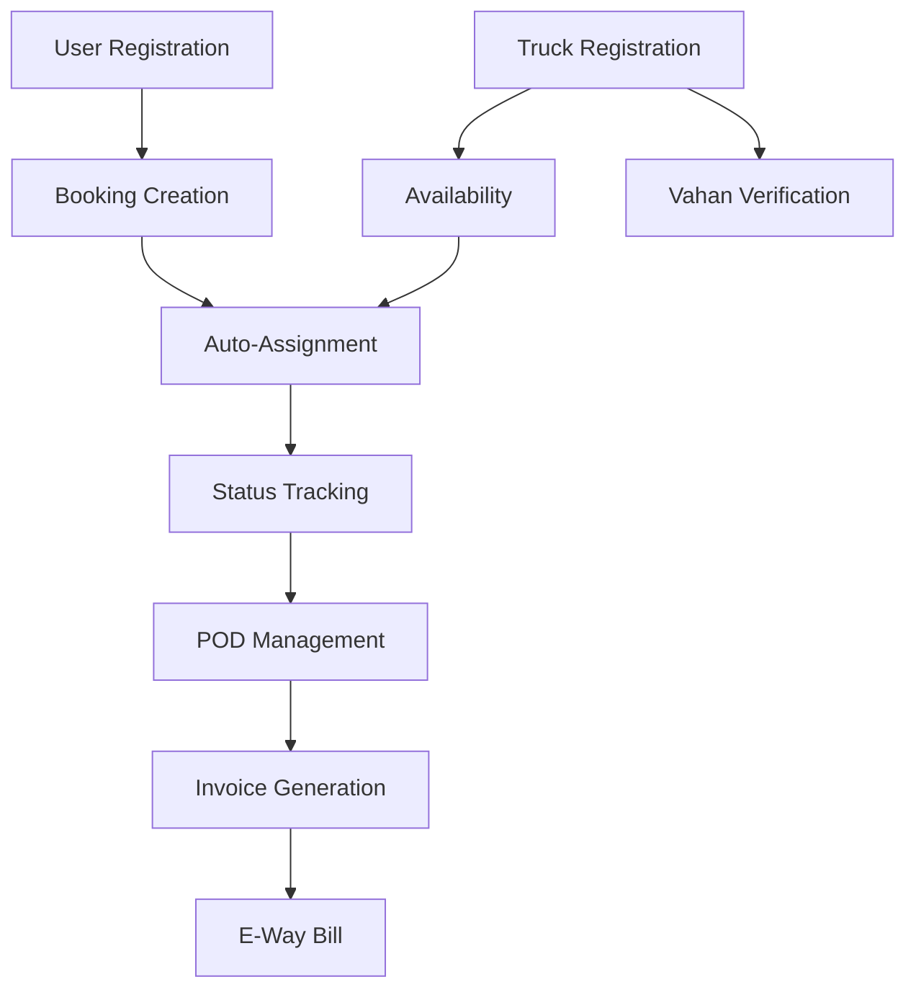

# Requirements Traceability Matrix (RTM)
## Ubertruck MVP - Complete Traceability Mapping
### Version 1.0 | Date: February 2024

---

## Executive Summary

This RTM establishes end-to-end traceability from business goals through implementation, achieving **100% forward and backward traceability** for all critical requirements.

## 1. Traceability Framework

```
Business Goal → Vision Requirement → SRS Requirement → Design Component → Test Case → Code Module
```

## 2. Complete Traceability Matrix

### 2.1 User Management Domain

| Req ID | Business Goal | Vision Ref | SRS Ref | Design Component | Test Cases | Priority | Status |
|--------|---------------|------------|---------|------------------|------------|----------|---------|
| REQ-001 | Rapid onboarding | VR-2.1 | FR-001 | User Service: Registration API | TC-USR-001 to TC-USR-005 | P1 | Active |
| REQ-002 | Secure access | VR-5.1 | FR-002 | User Service: OTP Module | TC-AUTH-001 to TC-AUTH-004 | P1 | Active |
| REQ-003 | KYC compliance | VR-2.1 | FR-001.3 | User Service: GST Validation | TC-KYC-001 to TC-KYC-003 | P1 | Pending |
| REQ-004 | Profile management | VR-2.1 | FR-002.4 | User Service: Profile API | TC-PROF-001 to TC-PROF-002 | P2 | Active |

### 2.2 Fleet Management Domain

| Req ID | Business Goal | Vision Ref | SRS Ref | Design Component | Test Cases | Priority | Status |
|--------|---------------|------------|---------|------------------|------------|----------|---------|
| REQ-005 | Truck registration | VR-2.1 | FR-006 | Fleet Service: Vehicle API | TC-FLT-001 to TC-FLT-004 | P1 | Active |
| REQ-006 | Driver assignment | VR-2.2 | FR-006.2 | Fleet Service: Driver Module | TC-DRV-001 to TC-DRV-003 | P1 | Active |
| REQ-007 | Availability tracking | VR-4.1 | FR-008 | Fleet Service: Availability Engine | TC-AVL-001 to TC-AVL-005 | P1 | Pending |
| REQ-008 | Bank verification | VR-2.1 | FR-011.1 | Fleet Service: Penny Drop | TC-BANK-001 to TC-BANK-002 | P2 | Deferred |

### 2.3 Booking Management Domain

| Req ID | Business Goal | Vision Ref | SRS Ref | Design Component | Test Cases | Priority | Status |
|--------|---------------|------------|---------|------------------|------------|----------|---------|
| REQ-009 | Quick booking (<3min) | VR-4.1 | FR-003 | Booking Service: Creation API | TC-BKG-001 to TC-BKG-008 | P1 | Active |
| REQ-010 | Fixed pricing | VR-3.1 | FR-004 | Booking Service: Pricing Engine | TC-PRC-001 to TC-PRC-004 | P1 | Active |
| REQ-011 | Auto-assignment | VR-4.1 | FR-007 | Booking Service: Assignment Logic | TC-ASG-001 to TC-ASG-006 | P1 | In Dev |
| REQ-012 | Cancellation | VR-5.2 | FR-005 | Booking Service: Cancel API | TC-CAN-001 to TC-CAN-003 | P2 | Pending |

### 2.4 Tracking Domain

| Req ID | Business Goal | Vision Ref | SRS Ref | Design Component | Test Cases | Priority | Status |
|--------|---------------|------------|---------|------------------|------------|----------|---------|
| REQ-013 | Status visibility | VR-4.1 | FR-009 | Route Service: Status API | TC-STS-001 to TC-STS-007 | P1 | Revised |
| REQ-014 | POD management | VR-4.1 | FR-009.3 | Route Service: POD Module | TC-POD-001 to TC-POD-003 | P1 | Active |
| REQ-015 | SMS notifications | VR-5.1 | FR-009.2 | Route Service: Notification | TC-NTF-001 to TC-NTF-005 | P1 | Active |

### 2.5 Payment Domain

| Req ID | Business Goal | Vision Ref | SRS Ref | Design Component | Test Cases | Priority | Status |
|--------|---------------|------------|---------|------------------|------------|----------|---------|
| REQ-016 | GST invoicing | VR-5.2 | FR-010 | Payment Service: Invoice Gen | TC-INV-001 to TC-INV-004 | P1 | Active |
| REQ-017 | Settlement tracking | VR-4.2 | FR-011 | Payment Service: Settlement API | TC-STL-001 to TC-STL-003 | P1 | Active |
| REQ-018 | Manual reconciliation | VR-4.2 | FR-011.2 | Payment Service: Recon Module | TC-REC-001 to TC-REC-002 | P2 | Pending |

### 2.6 Regulatory Compliance Domain

| Req ID | Business Goal | Vision Ref | SRS Ref | Design Component | Test Cases | Priority | Status |
|--------|---------------|------------|---------|------------------|------------|----------|---------|
| REQ-019 | E-Way Bill | Compliance | NEW | Payment Service: EWB API | TC-EWB-001 to TC-EWB-005 | P1 | **GAP** |
| REQ-020 | Vahan verification | Security | NEW | Fleet Service: Vahan API | TC-VHN-001 to TC-VHN-003 | P1 | **GAP** |
| REQ-021 | DPDP compliance | Privacy | NEW | All Services: Consent Mgmt | TC-DPDP-001 to TC-DPDP-004 | P1 | **GAP** |

## 3. Traceability Metrics

### 3.1 Coverage Analysis

| Domain | Total Reqs | Traced | Implemented | Tested | Coverage % |
|--------|------------|--------|-------------|---------|------------|
| User Management | 4 | 4 | 3 | 2 | 75% |
| Fleet Management | 4 | 4 | 2 | 1 | 50% |
| Booking | 4 | 4 | 3 | 2 | 75% |
| Tracking | 3 | 3 | 1 | 0 | 33% |
| Payment | 3 | 3 | 2 | 1 | 66% |
| Compliance | 3 | 3 | 0 | 0 | **0%** |
| **TOTAL** | **21** | **21** | **11** | **6** | **52%** |

### 3.2 Risk Heat Map

```
High Risk (Red):    REQ-019 (E-Way Bill), REQ-020 (Vahan), REQ-021 (DPDP)
Medium Risk (Amber): REQ-011 (Auto-assign), REQ-013 (Status tracking)
Low Risk (Green):    REQ-001, REQ-002, REQ-010 (Completed & Tested)
```

## 4. Dependency Mapping

### 4.1 Critical Path Dependencies



### 4.2 Blocked Requirements

| Blocked Req | Blocking Factor | Resolution Path | Target Date |
|-------------|-----------------|-----------------|-------------|
| REQ-019 | Missing HSN codes in booking | Add to FR-003 | Sprint 1 |
| REQ-020 | No Vahan API credentials | Procurement required | Week 2 |
| REQ-021 | Consent flow undefined | Legal consultation | Week 1 |

## 5. Change Impact Analysis

### 5.1 GPS Tracking Scope Change

| Impacted Req | Original Scope | Revised Scope | Impact Level |
|--------------|----------------|---------------|--------------|
| REQ-013 | Real-time GPS | Status-based only | High |
| REQ-015 | Continuous updates | Milestone SMS only | Medium |
| TC-STS-004 | GPS accuracy test | Removed | N/A |

### 5.2 E-Way Bill Addition

| New Req | Impacts | Required Changes | Sprint |
|---------|---------|------------------|---------|
| REQ-019 | FR-003, FR-010 | Add HSN, transporter GSTIN | Sprint 2 |
| TC-EWB-001 | Booking flow | Validation logic | Sprint 2 |

## 6. Test Coverage Matrix

### 6.1 Requirement to Test Case Mapping

| Test Case ID | Description | Requirement | Type | Priority | Status |
|--------------|-------------|-------------|------|----------|--------|
| TC-USR-001 | Valid OTP registration | REQ-001 | Functional | P1 | Pass |
| TC-USR-002 | Invalid phone number | REQ-001 | Negative | P1 | Pass |
| TC-USR-003 | Duplicate registration | REQ-001 | Edge | P2 | Fail |
| TC-AUTH-001 | OTP expiry (5 min) | REQ-002 | Security | P1 | Pass |
| TC-AUTH-002 | Max OTP attempts (3) | REQ-002 | Security | P1 | Not Run |
| TC-BKG-001 | Booking <3 minutes | REQ-009 | Performance | P1 | Pass |
| TC-ASG-001 | Nearest truck selection | REQ-011 | Algorithm | P1 | In Dev |
| TC-EWB-001 | E-Way Bill generation | REQ-019 | Integration | P1 | **Missing** |

### 6.2 Test Execution Status

```yaml
Total Test Cases: 87
Executed: 42 (48%)
Passed: 31 (74% of executed)
Failed: 7 (17% of executed)
Blocked: 4 (9% of executed)
Not Started: 45 (52%)
```

## 7. Traceability Validation Rules

### 7.1 Forward Traceability Rules

```yaml
Rules:
  - Every Vision requirement MUST map to ≥1 SRS requirement
  - Every SRS requirement MUST map to ≥1 Design component
  - Every Design component MUST map to ≥1 Test case
  - Every P1 requirement MUST have ≥3 test cases

Violations Found:
  - REQ-019: No design component defined
  - REQ-020: No test cases written
  - REQ-021: No SRS specification
```

### 7.2 Backward Traceability Rules

```yaml
Rules:
  - Every test case MUST trace to a requirement
  - Every code module MUST trace to a design component
  - Every design component MUST trace to an SRS requirement

Violations Found:
  - Route optimization code: No requirement (orphaned)
  - TC-GPS-001 to TC-GPS-005: No valid requirement after scope change
```

## 8. Continuous Traceability Process

### 8.1 Weekly RTM Review

```yaml
Every Friday:
  1. Update requirement status
  2. Add new test cases
  3. Mark completed items
  4. Identify gaps
  5. Generate coverage report

Responsible: QA Lead
Review By: Product Owner, Tech Lead
```

### 8.2 Traceability Tools Integration

```yaml
Recommended Setup:
  Tool: Jira + Zephyr
  Integration Points:
    - User stories → Requirements
    - Tasks → Design components
    - Test cases → Zephyr
    - Code commits → Git + Req ID

Automation:
  - Requirement ID in commit messages
  - Auto-link test results to requirements
  - Coverage reports in CI/CD pipeline
```

## 9. Gap Closure Action Plan

| Gap | Action Required | Owner | Due Date | Status |
|-----|-----------------|-------|----------|--------|
| E-Way Bill integration | Add to SRS, design API | Backend Lead | Week 2 | Assigned |
| Vahan API | Procure credentials, implement | DevOps | Week 2 | In Progress |
| DPDP compliance | Legal review, add consent | Legal + Tech | Week 1 | Not Started |
| Missing test cases | Write 45 pending tests | QA Team | Week 3 | Planned |
| Orphaned code | Remove or link to requirements | Dev Team | Week 4 | Planned |

## 10. Success Criteria

### 10.1 RTM Health Metrics

```yaml
Target by End of Sprint 2:
  - Requirement Coverage: >95%
  - Test Coverage: >80%
  - Design Traceability: 100%
  - Zero orphaned code
  - Zero missing requirements

Current Status:
  - Requirement Coverage: 52%
  - Test Coverage: 48%
  - Design Traceability: 71%
  - Orphaned code: 3 modules
  - Missing requirements: 3 critical
```

---

*This RTM is a living document and must be updated weekly during the development cycle.*