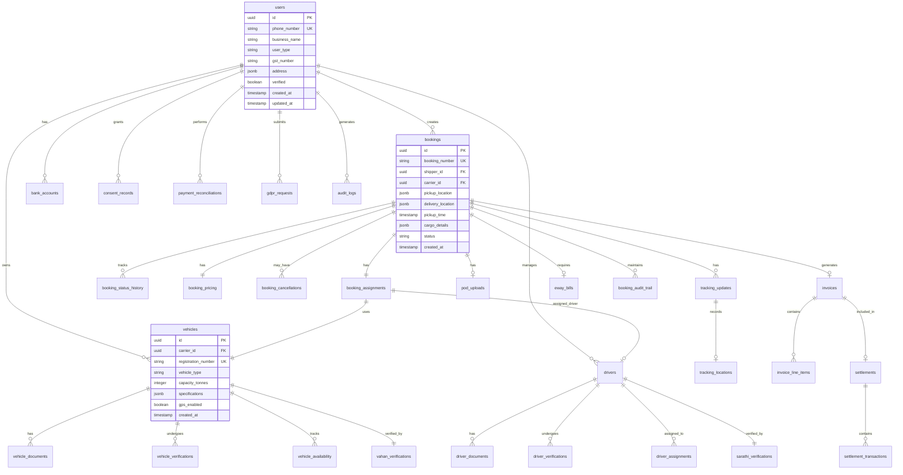

# Complete Data Dictionary and Entity Relationship Diagram
## Ubertruck MVP - Database Schema and Data Specifications
### Version 1.0 | Date: February 2024

---

## Executive Summary

This document provides a comprehensive Data Dictionary and Entity Relationship Diagram (ERD) for the Ubertruck MVP, addressing the critical gap of missing database documentation that creates risk for schema changes and impact analysis.

## 1. Database Architecture Overview

### 1.1 Database Configuration

```yaml
Database Engine: PostgreSQL 15
Extensions:
  - uuid-ossp (UUID generation)
  - PostGIS 3.3 (Geospatial operations)
  - pgcrypto (Encryption)
  - pg_stat_statements (Performance monitoring)

Connection Pool:
  Min Connections: 10
  Max Connections: 100
  Idle Timeout: 30s
  Connection Timeout: 10s

Storage:
  Initial Size: 10GB
  Max Size: 50GB
  WAL Archive: Enabled
  Point-in-Time Recovery: 7 days

Character Set: UTF8
Collation: en_US.UTF-8
Time Zone: Asia/Kolkata
```

### 1.2 Schema Organization

```sql
-- Schema structure
CREATE SCHEMA IF NOT EXISTS core;        -- User management, authentication
CREATE SCHEMA IF NOT EXISTS fleet;       -- Vehicles, drivers, availability
CREATE SCHEMA IF NOT EXISTS booking;     -- Bookings, assignments, pricing
CREATE SCHEMA IF NOT EXISTS tracking;    -- Status updates, POD, locations
CREATE SCHEMA IF NOT EXISTS payment;     -- Invoices, settlements, transactions
CREATE SCHEMA IF NOT EXISTS compliance;  -- E-Way bills, Vahan/Sarathi, DPDP
CREATE SCHEMA IF NOT EXISTS audit;       -- Audit logs, change tracking
CREATE SCHEMA IF NOT EXISTS archive;     -- Archived data

-- Schema permissions
GRANT USAGE ON SCHEMA core TO ubertruck_app;
GRANT USAGE ON SCHEMA fleet TO ubertruck_app;
GRANT USAGE ON SCHEMA booking TO ubertruck_app;
GRANT USAGE ON SCHEMA tracking TO ubertruck_app;
GRANT USAGE ON SCHEMA payment TO ubertruck_app;
GRANT USAGE ON SCHEMA compliance TO ubertruck_app;
GRANT SELECT ON SCHEMA audit TO ubertruck_readonly;
GRANT ALL ON SCHEMA archive TO ubertruck_admin;
```

## 2. Entity Relationship Diagram



## 3. Detailed Data Dictionary

### 3.1 Core Schema Tables

#### Table: core.users

| Column | Data Type | Constraints | Description | Encryption | Index |
|--------|-----------|-------------|-------------|------------|-------|
| id | UUID | PRIMARY KEY, DEFAULT gen_random_uuid() | Unique user identifier | No | PK |
| phone_number | VARCHAR(15) | UNIQUE, NOT NULL, CHECK (phone_number ~ '^\+91[6-9]\d{9}$') | Mobile number with country code | AES-256 | UNIQUE |
| business_name | VARCHAR(200) | NOT NULL | Registered business name | No | GIN |
| user_type | VARCHAR(20) | NOT NULL, CHECK (user_type IN ('SHIPPER', 'CARRIER', 'ADMIN')) | User category | No | BTREE |
| gst_number | VARCHAR(15) | CHECK (gst_number ~ '^[0-9]{2}[A-Z]{5}[0-9]{4}[A-Z]{1}[1-9A-Z]{1}Z[0-9A-Z]{1}$') | GST identification number | No | BTREE |
| pan_number | VARCHAR(10) | CHECK (pan_number ~ '^[A-Z]{5}[0-9]{4}[A-Z]{1}$') | PAN for KYC | AES-256 | No |
| address | JSONB | NOT NULL | Structured address {street, city, state, pincode} | No | GIN |
| email | VARCHAR(255) | CHECK (email ~ '^[a-zA-Z0-9._%+-]+@[a-zA-Z0-9.-]+\.[a-zA-Z]{2,}$') | Email for invoices | No | BTREE |
| verified | BOOLEAN | DEFAULT false | KYC verification status | No | BTREE |
| verified_at | TIMESTAMP | | Verification timestamp | No | No |
| is_active | BOOLEAN | DEFAULT true | Account active status | No | BTREE |
| last_login | TIMESTAMP | | Last successful login | No | No |
| failed_login_attempts | INTEGER | DEFAULT 0, CHECK (failed_login_attempts >= 0) | Failed login counter | No | No |
| locked_until | TIMESTAMP | | Account lock expiry | No | BTREE |
| metadata | JSONB | DEFAULT '{}' | Additional user metadata | No | No |
| created_at | TIMESTAMP | DEFAULT CURRENT_TIMESTAMP | Record creation time | No | BTREE |
| updated_at | TIMESTAMP | DEFAULT CURRENT_TIMESTAMP | Last update time | No | No |
| deleted_at | TIMESTAMP | | Soft delete timestamp | No | BTREE |

**Indexes:**
```sql
CREATE INDEX idx_users_phone_active ON core.users(phone_number) WHERE is_active = true;
CREATE INDEX idx_users_type_verified ON core.users(user_type, verified);
CREATE INDEX idx_users_gst ON core.users(gst_number) WHERE gst_number IS NOT NULL;
CREATE INDEX idx_users_created ON core.users(created_at DESC);
```

#### Table: core.user_sessions

| Column | Data Type | Constraints | Description | Encryption | Index |
|--------|-----------|-------------|-------------|------------|-------|
| id | UUID | PRIMARY KEY | Session identifier | No | PK |
| user_id | UUID | NOT NULL, REFERENCES core.users(id) ON DELETE CASCADE | User reference | No | FK |
| token_hash | VARCHAR(64) | UNIQUE, NOT NULL | SHA-256 hash of JWT | No | UNIQUE |
| refresh_token_hash | VARCHAR(64) | UNIQUE | SHA-256 hash of refresh token | No | UNIQUE |
| device_info | JSONB | | Device fingerprint | No | No |
| ip_address | INET | NOT NULL | Client IP address | No | BTREE |
| user_agent | TEXT | | Browser/app user agent | No | No |
| expires_at | TIMESTAMP | NOT NULL | Token expiry time | No | BTREE |
| refresh_expires_at | TIMESTAMP | | Refresh token expiry | No | BTREE |
| created_at | TIMESTAMP | DEFAULT CURRENT_TIMESTAMP | Session start time | No | No |
| last_activity | TIMESTAMP | DEFAULT CURRENT_TIMESTAMP | Last API call time | No | BTREE |
| revoked_at | TIMESTAMP | | Session revocation time | No | No |

**Indexes:**
```sql
CREATE INDEX idx_sessions_user_active ON core.user_sessions(user_id)
  WHERE revoked_at IS NULL AND expires_at > CURRENT_TIMESTAMP;
CREATE INDEX idx_sessions_expiry ON core.user_sessions(expires_at)
  WHERE revoked_at IS NULL;
```

#### Table: core.bank_accounts

| Column | Data Type | Constraints | Description | Encryption | Index |
|--------|-----------|-------------|-------------|------------|-------|
| id | UUID | PRIMARY KEY | Account identifier | No | PK |
| user_id | UUID | NOT NULL, REFERENCES core.users(id) | User reference | No | FK |
| account_number | VARCHAR(20) | NOT NULL | Bank account number | AES-256 | No |
| account_number_masked | VARCHAR(20) | NOT NULL | Masked display (****1234) | No | No |
| ifsc_code | VARCHAR(11) | NOT NULL, CHECK (ifsc_code ~ '^[A-Z]{4}0[A-Z0-9]{6}$') | Bank IFSC code | No | BTREE |
| account_holder_name | VARCHAR(100) | NOT NULL | Account holder name | No | No |
| bank_name | VARCHAR(100) | | Bank name from IFSC | No | No |
| branch_name | VARCHAR(100) | | Branch from IFSC | No | No |
| account_type | VARCHAR(20) | DEFAULT 'CURRENT' | Account type | No | No |
| is_primary | BOOLEAN | DEFAULT false | Primary account flag | No | No |
| verified | BOOLEAN | DEFAULT false | Penny drop verification | No | BTREE |
| verified_at | TIMESTAMP | | Verification timestamp | No | No |
| verification_ref | VARCHAR(50) | | Penny drop reference | No | No |
| created_at | TIMESTAMP | DEFAULT CURRENT_TIMESTAMP | Added timestamp | No | No |
| updated_at | TIMESTAMP | DEFAULT CURRENT_TIMESTAMP | Modified timestamp | No | No |

**Constraints:**
```sql
-- Only one primary account per user
CREATE UNIQUE INDEX idx_bank_primary ON core.bank_accounts(user_id)
  WHERE is_primary = true;
```

### 3.2 Fleet Schema Tables

#### Table: fleet.vehicles

| Column | Data Type | Constraints | Description | Encryption | Index |
|--------|-----------|-------------|-------------|------------|-------|
| id | UUID | PRIMARY KEY | Vehicle identifier | No | PK |
| carrier_id | UUID | NOT NULL, REFERENCES core.users(id) | Owner reference | No | FK |
| registration_number | VARCHAR(20) | UNIQUE, NOT NULL, CHECK (registration_number ~ '^[A-Z]{2}[0-9]{2}[A-Z]{1,2}[0-9]{4}$') | Vehicle RC number | No | UNIQUE |
| vehicle_type | VARCHAR(20) | NOT NULL, CHECK (vehicle_type IN ('TRUCK', 'MINI_TRUCK', 'TRAILER', 'CONTAINER')) | Vehicle category | No | BTREE |
| capacity_tonnes | INTEGER | NOT NULL, CHECK (capacity_tonnes BETWEEN 1 AND 50) | Load capacity | No | BTREE |
| make | VARCHAR(50) | | Manufacturer | No | No |
| model | VARCHAR(50) | | Model name | No | No |
| year | INTEGER | CHECK (year BETWEEN 2000 AND EXTRACT(YEAR FROM CURRENT_DATE)) | Manufacturing year | No | No |
| engine_number | VARCHAR(50) | | Engine identifier | No | No |
| chassis_number | VARCHAR(50) | | Chassis identifier | No | No |
| fuel_type | VARCHAR(20) | CHECK (fuel_type IN ('DIESEL', 'CNG', 'ELECTRIC')) | Fuel type | No | No |
| color | VARCHAR(20) | | Vehicle color | No | No |
| fitness_valid_upto | DATE | NOT NULL | Fitness certificate expiry | No | BTREE |
| permit_valid_upto | DATE | NOT NULL | Permit expiry | No | BTREE |
| insurance_valid_upto | DATE | NOT NULL | Insurance expiry | No | BTREE |
| puc_valid_upto | DATE | | Pollution certificate expiry | No | BTREE |
| gps_enabled | BOOLEAN | DEFAULT false | GPS tracking available | No | BTREE |
| gps_device_id | VARCHAR(50) | | GPS device IMEI | No | No |
| current_location | GEOGRAPHY(POINT, 4326) | | Last known location | No | GIST |
| is_active | BOOLEAN | DEFAULT true | Available for booking | No | BTREE |
| created_at | TIMESTAMP | DEFAULT CURRENT_TIMESTAMP | Registration time | No | No |
| updated_at | TIMESTAMP | DEFAULT CURRENT_TIMESTAMP | Last update | No | No |

**Indexes:**
```sql
CREATE INDEX idx_vehicles_carrier_active ON fleet.vehicles(carrier_id, is_active);
CREATE INDEX idx_vehicles_type_capacity ON fleet.vehicles(vehicle_type, capacity_tonnes);
CREATE INDEX idx_vehicles_location ON fleet.vehicles USING GIST(current_location);
CREATE INDEX idx_vehicles_expiry ON fleet.vehicles(
  LEAST(fitness_valid_upto, permit_valid_upto, insurance_valid_upto)
);
```

#### Table: fleet.drivers

| Column | Data Type | Constraints | Description | Encryption | Index |
|--------|-----------|-------------|-------------|------------|-------|
| id | UUID | PRIMARY KEY | Driver identifier | No | PK |
| carrier_id | UUID | NOT NULL, REFERENCES core.users(id) | Employer reference | No | FK |
| name | VARCHAR(100) | NOT NULL | Full name | No | GIN |
| phone_number | VARCHAR(15) | NOT NULL, CHECK (phone_number ~ '^\+91[6-9]\d{9}$') | Contact number | AES-256 | BTREE |
| alternate_phone | VARCHAR(15) | CHECK (alternate_phone ~ '^\+91[6-9]\d{9}$') | Emergency contact | AES-256 | No |
| license_number | VARCHAR(20) | UNIQUE, NOT NULL | Driving license | No | UNIQUE |
| license_type | VARCHAR(10) | NOT NULL, CHECK (license_type IN ('LMV', 'HMV', 'HAZMAT')) | License category | No | BTREE |
| license_valid_upto | DATE | NOT NULL | License expiry | No | BTREE |
| date_of_birth | DATE | NOT NULL, CHECK (AGE(date_of_birth) >= INTERVAL '18 years') | DOB for verification | No | No |
| blood_group | VARCHAR(5) | CHECK (blood_group IN ('A+', 'A-', 'B+', 'B-', 'AB+', 'AB-', 'O+', 'O-')) | Blood group | No | No |
| address | JSONB | | Current address | No | No |
| aadhaar_number_hash | VARCHAR(64) | UNIQUE | SHA-256 of Aadhaar | No | UNIQUE |
| emergency_contact | JSONB | | {name, phone, relation} | AES-256 | No |
| experience_years | INTEGER | CHECK (experience_years >= 0) | Driving experience | No | No |
| is_active | BOOLEAN | DEFAULT true | Available for duty | No | BTREE |
| created_at | TIMESTAMP | DEFAULT CURRENT_TIMESTAMP | Registration time | No | No |
| updated_at | TIMESTAMP | DEFAULT CURRENT_TIMESTAMP | Last update | No | No |

**Indexes:**
```sql
CREATE INDEX idx_drivers_carrier_active ON fleet.drivers(carrier_id, is_active);
CREATE INDEX idx_drivers_license_expiry ON fleet.drivers(license_valid_upto);
CREATE INDEX idx_drivers_phone ON fleet.drivers(phone_number);
```

### 3.3 Booking Schema Tables

#### Table: booking.bookings

| Column | Data Type | Constraints | Description | Encryption | Index |
|--------|-----------|-------------|-------------|------------|-------|
| id | UUID | PRIMARY KEY | Booking identifier | No | PK |
| booking_number | VARCHAR(12) | UNIQUE, NOT NULL, DEFAULT 'BK' || LPAD(nextval('booking_seq')::TEXT, 10, '0') | Display number | No | UNIQUE |
| shipper_id | UUID | NOT NULL, REFERENCES core.users(id) | Shipper reference | No | FK |
| carrier_id | UUID | REFERENCES core.users(id) | Assigned carrier | No | FK |
| pickup_location | JSONB | NOT NULL | {lat, lng, address, pincode} | No | GIN |
| pickup_geom | GEOGRAPHY(POINT, 4326) | NOT NULL | PostGIS point | No | GIST |
| delivery_location | JSONB | NOT NULL | {lat, lng, address, pincode} | No | GIN |
| delivery_geom | GEOGRAPHY(POINT, 4326) | NOT NULL | PostGIS point | No | GIST |
| distance_km | DECIMAL(10,2) | NOT NULL, CHECK (distance_km > 0) | Calculated distance | No | No |
| pickup_time | TIMESTAMP | NOT NULL | Scheduled pickup | No | BTREE |
| estimated_delivery_time | TIMESTAMP | | Calculated ETA | No | BTREE |
| actual_delivery_time | TIMESTAMP | | Actual delivery | No | No |
| cargo_type | VARCHAR(20) | NOT NULL, CHECK (cargo_type IN ('GENERAL', 'FRAGILE', 'HAZMAT', 'PERISHABLE', 'HEAVY')) | Cargo category | No | BTREE |
| cargo_weight | DECIMAL(10,2) | NOT NULL, CHECK (cargo_weight > 0 AND cargo_weight <= 50) | Weight in tonnes | No | BTREE |
| cargo_volume | DECIMAL(10,2) | CHECK (cargo_volume > 0) | Volume in m³ | No | No |
| cargo_description | TEXT | NOT NULL | Cargo details | No | No |
| cargo_value | DECIMAL(12,2) | CHECK (cargo_value >= 0) | For insurance | No | No |
| hsn_code | VARCHAR(8) | CHECK (hsn_code ~ '^\d{4,8}$') | For E-Way Bill | No | BTREE |
| invoice_number | VARCHAR(50) | | Shipper invoice | No | No |
| invoice_date | DATE | | Shipper invoice date | No | No |
| invoice_value | DECIMAL(12,2) | CHECK (invoice_value >= 0) | For E-Way Bill | No | No |
| pickup_contact | JSONB | NOT NULL | {name, phone} | AES-256 | No |
| delivery_contact | JSONB | NOT NULL | {name, phone} | AES-256 | No |
| special_instructions | TEXT | | Driver instructions | No | No |
| status | VARCHAR(20) | NOT NULL, DEFAULT 'CREATED' | Current status | No | BTREE |
| created_at | TIMESTAMP | DEFAULT CURRENT_TIMESTAMP | Booking time | No | BTREE |
| updated_at | TIMESTAMP | DEFAULT CURRENT_TIMESTAMP | Last update | No | No |
| cancelled_at | TIMESTAMP | | Cancellation time | No | No |

**Constraints:**
```sql
ALTER TABLE booking.bookings
  ADD CONSTRAINT chk_booking_status
  CHECK (status IN ('CREATED', 'ASSIGNED', 'ACCEPTED', 'PICKUP_STARTED',
                    'IN_TRANSIT', 'DELIVERED', 'COMPLETED', 'CANCELLED'));

-- Status transitions
CREATE TRIGGER enforce_status_transitions
  BEFORE UPDATE ON booking.bookings
  FOR EACH ROW EXECUTE FUNCTION check_valid_status_transition();
```

**Indexes:**
```sql
CREATE INDEX idx_bookings_shipper_status ON booking.bookings(shipper_id, status);
CREATE INDEX idx_bookings_carrier_status ON booking.bookings(carrier_id, status)
  WHERE carrier_id IS NOT NULL;
CREATE INDEX idx_bookings_pickup_time ON booking.bookings(pickup_time);
CREATE INDEX idx_bookings_pickup_location ON booking.bookings USING GIST(pickup_geom);
CREATE INDEX idx_bookings_delivery_location ON booking.bookings USING GIST(delivery_geom);
CREATE INDEX idx_bookings_created_date ON booking.bookings(DATE(created_at));
```

#### Table: booking.booking_assignments

| Column | Data Type | Constraints | Description | Encryption | Index |
|--------|-----------|-------------|-------------|------------|-------|
| id | UUID | PRIMARY KEY | Assignment ID | No | PK |
| booking_id | UUID | UNIQUE, NOT NULL, REFERENCES booking.bookings(id) | Booking reference | No | UK |
| vehicle_id | UUID | NOT NULL, REFERENCES fleet.vehicles(id) | Assigned vehicle | No | FK |
| driver_id | UUID | REFERENCES fleet.drivers(id) | Assigned driver | No | FK |
| assigned_at | TIMESTAMP | DEFAULT CURRENT_TIMESTAMP | Assignment time | No | No |
| assigned_by | UUID | REFERENCES core.users(id) | Assigner (system/admin) | No | No |
| assignment_method | VARCHAR(20) | CHECK (assignment_method IN ('AUTO', 'MANUAL')) | How assigned | No | No |
| estimated_arrival | TIMESTAMP | | ETA at pickup | No | No |
| priority | INTEGER | DEFAULT 0 | Assignment priority | No | No |

**Constraints:**
```sql
-- Vehicle can only have one active assignment
CREATE UNIQUE INDEX idx_vehicle_active_assignment
  ON booking.booking_assignments(vehicle_id)
  WHERE booking_id IN (
    SELECT id FROM booking.bookings
    WHERE status NOT IN ('COMPLETED', 'CANCELLED')
  );
```

#### Table: booking.booking_pricing

| Column | Data Type | Constraints | Description | Encryption | Index |
|--------|-----------|-------------|-------------|------------|-------|
| id | UUID | PRIMARY KEY | Pricing ID | No | PK |
| booking_id | UUID | UNIQUE, NOT NULL, REFERENCES booking.bookings(id) | Booking reference | No | UK |
| base_rate | DECIMAL(10,2) | NOT NULL, CHECK (base_rate > 0) | ₹/tonne/km | No | No |
| distance_charge | DECIMAL(10,2) | NOT NULL, CHECK (distance_charge >= 0) | Distance component | No | No |
| weight_charge | DECIMAL(10,2) | NOT NULL, CHECK (weight_charge >= 0) | Weight component | No | No |
| fuel_surcharge | DECIMAL(10,2) | DEFAULT 0, CHECK (fuel_surcharge >= 0) | Fuel adjustment | No | No |
| urgent_surcharge | DECIMAL(10,2) | DEFAULT 0, CHECK (urgent_surcharge >= 0) | Urgent delivery | No | No |
| night_surcharge | DECIMAL(10,2) | DEFAULT 0, CHECK (night_surcharge >= 0) | Night delivery | No | No |
| subtotal | DECIMAL(10,2) | NOT NULL, CHECK (subtotal > 0) | Before tax | No | No |
| cgst_rate | DECIMAL(5,2) | DEFAULT 9, CHECK (cgst_rate >= 0) | CGST % | No | No |
| cgst_amount | DECIMAL(10,2) | NOT NULL, CHECK (cgst_amount >= 0) | CGST amount | No | No |
| sgst_rate | DECIMAL(5,2) | DEFAULT 9, CHECK (sgst_rate >= 0) | SGST % | No | No |
| sgst_amount | DECIMAL(10,2) | NOT NULL, CHECK (sgst_amount >= 0) | SGST amount | No | No |
| igst_rate | DECIMAL(5,2) | DEFAULT 0, CHECK (igst_rate >= 0) | IGST % | No | No |
| igst_amount | DECIMAL(10,2) | DEFAULT 0, CHECK (igst_amount >= 0) | IGST amount | No | No |
| total_amount | DECIMAL(10,2) | NOT NULL, CHECK (total_amount > 0) | Final amount | No | No |
| currency | VARCHAR(3) | DEFAULT 'INR', CHECK (currency = 'INR') | Currency code | No | No |
| price_valid_until | TIMESTAMP | | Quote validity | No | No |
| created_at | TIMESTAMP | DEFAULT CURRENT_TIMESTAMP | Pricing time | No | No |

### 3.4 Tracking Schema Tables

#### Table: tracking.status_updates

| Column | Data Type | Constraints | Description | Encryption | Index |
|--------|-----------|-------------|-------------|------------|-------|
| id | UUID | PRIMARY KEY | Update ID | No | PK |
| booking_id | UUID | NOT NULL, REFERENCES booking.bookings(id) | Booking reference | No | FK |
| status | VARCHAR(20) | NOT NULL | New status | No | BTREE |
| previous_status | VARCHAR(20) | | Previous status | No | No |
| updated_at | TIMESTAMP | NOT NULL, DEFAULT CURRENT_TIMESTAMP | Update time | No | BTREE |
| updated_by | UUID | REFERENCES core.users(id) | User/driver | No | FK |
| update_source | VARCHAR(20) | CHECK (update_source IN ('WEB', 'MOBILE', 'API', 'SYSTEM')) | Update channel | No | No |
| location_lat | DECIMAL(10,8) | CHECK (location_lat BETWEEN -90 AND 90) | Latitude | No | No |
| location_lng | DECIMAL(11,8) | CHECK (location_lng BETWEEN -180 AND 180) | Longitude | No | No |
| location_geom | GEOGRAPHY(POINT, 4326) | | PostGIS point | No | GIST |
| location_accuracy | DECIMAL(10,2) | | GPS accuracy meters | No | No |
| notes | TEXT | | Status notes | No | No |
| network_status | VARCHAR(10) | CHECK (network_status IN ('online', 'offline')) | Connection state | No | No |
| synced_at | TIMESTAMP | | Cloud sync time | No | BTREE |

**Indexes:**
```sql
CREATE INDEX idx_status_booking_time ON tracking.status_updates(booking_id, updated_at DESC);
CREATE INDEX idx_status_unsynced ON tracking.status_updates(synced_at)
  WHERE synced_at IS NULL;
CREATE INDEX idx_status_location ON tracking.status_updates USING GIST(location_geom);
```

#### Table: tracking.pod_uploads

| Column | Data Type | Constraints | Description | Encryption | Index |
|--------|-----------|-------------|-------------|------------|-------|
| id | UUID | PRIMARY KEY | POD ID | No | PK |
| booking_id | UUID | UNIQUE, NOT NULL, REFERENCES booking.bookings(id) | Booking reference | No | UK |
| file_name | VARCHAR(255) | NOT NULL | Original filename | No | No |
| file_size | INTEGER | NOT NULL, CHECK (file_size <= 2097152) | Size in bytes (max 2MB) | No | No |
| file_type | VARCHAR(50) | CHECK (file_type IN ('image/jpeg', 'image/png')) | MIME type | No | No |
| storage_path | VARCHAR(500) | NOT NULL | S3/local path | No | No |
| storage_url | VARCHAR(1000) | | Public URL | No | No |
| thumbnail_url | VARCHAR(1000) | | Thumbnail URL | No | No |
| receiver_name | VARCHAR(100) | | Receiver name | No | No |
| receiver_signature | TEXT | | Base64 signature | No | No |
| uploaded_at | TIMESTAMP | DEFAULT CURRENT_TIMESTAMP | Upload time | No | BTREE |
| uploaded_by | UUID | REFERENCES core.users(id) | Uploader | No | FK |
| verified | BOOLEAN | DEFAULT false | Admin verified | No | BTREE |
| verified_at | TIMESTAMP | | Verification time | No | No |
| verified_by | UUID | REFERENCES core.users(id) | Verifier | No | No |
| archived | BOOLEAN | DEFAULT false | Moved to cold storage | No | BTREE |
| archived_at | TIMESTAMP | | Archive time | No | No |

**Indexes:**
```sql
CREATE INDEX idx_pod_uploaded_date ON tracking.pod_uploads(DATE(uploaded_at));
CREATE INDEX idx_pod_unarchived ON tracking.pod_uploads(uploaded_at)
  WHERE archived = false;
```

### 3.5 Payment Schema Tables

#### Table: payment.invoices

| Column | Data Type | Constraints | Description | Encryption | Index |
|--------|-----------|-------------|-------------|------------|-------|
| id | UUID | PRIMARY KEY | Invoice ID | No | PK |
| invoice_number | VARCHAR(20) | UNIQUE, NOT NULL, DEFAULT 'INV-' || TO_CHAR(CURRENT_DATE, 'YYYY') || '-' || LPAD(nextval('invoice_seq')::TEXT, 6, '0') | Invoice number | No | UNIQUE |
| booking_id | UUID | UNIQUE, NOT NULL, REFERENCES booking.bookings(id) | Booking reference | No | UK |
| shipper_id | UUID | NOT NULL, REFERENCES core.users(id) | Bill to | No | FK |
| carrier_id | UUID | NOT NULL, REFERENCES core.users(id) | Bill from | No | FK |
| invoice_date | DATE | NOT NULL, DEFAULT CURRENT_DATE | Issue date | No | BTREE |
| due_date | DATE | NOT NULL, DEFAULT CURRENT_DATE + INTERVAL '7 days' | Payment due | No | BTREE |
| shipper_gstin | VARCHAR(15) | | Shipper GST | No | No |
| carrier_gstin | VARCHAR(15) | | Carrier GST | No | No |
| hsn_code | VARCHAR(8) | | Service HSN | No | No |
| sac_code | VARCHAR(8) | DEFAULT '996511' | Service SAC code | No | No |
| subtotal | DECIMAL(12,2) | NOT NULL | Before tax | No | No |
| cgst_amount | DECIMAL(10,2) | NOT NULL | CGST | No | No |
| sgst_amount | DECIMAL(10,2) | NOT NULL | SGST | No | No |
| igst_amount | DECIMAL(10,2) | DEFAULT 0 | IGST | No | No |
| total_amount | DECIMAL(12,2) | NOT NULL | Total payable | No | No |
| amount_in_words | TEXT | NOT NULL | Amount in words | No | No |
| payment_status | VARCHAR(20) | DEFAULT 'PENDING' | Payment status | No | BTREE |
| payment_date | DATE | | Payment received date | No | No |
| payment_reference | VARCHAR(100) | | Bank reference | No | No |
| eway_bill_number | VARCHAR(12) | CHECK (eway_bill_number ~ '^\d{12}$') | E-Way Bill | No | BTREE |
| pdf_url | VARCHAR(1000) | | PDF location | No | No |
| created_at | TIMESTAMP | DEFAULT CURRENT_TIMESTAMP | Generation time | No | No |
| updated_at | TIMESTAMP | DEFAULT CURRENT_TIMESTAMP | Last update | No | No |

**Constraints:**
```sql
ALTER TABLE payment.invoices
  ADD CONSTRAINT chk_payment_status
  CHECK (payment_status IN ('PENDING', 'PAID', 'PARTIALLY_PAID', 'OVERDUE', 'CANCELLED'));
```

**Indexes:**
```sql
CREATE INDEX idx_invoices_shipper_status ON payment.invoices(shipper_id, payment_status);
CREATE INDEX idx_invoices_carrier_date ON payment.invoices(carrier_id, invoice_date);
CREATE INDEX idx_invoices_due_pending ON payment.invoices(due_date)
  WHERE payment_status = 'PENDING';
```

### 3.6 Compliance Schema Tables

#### Table: compliance.eway_bills

| Column | Data Type | Constraints | Description | Encryption | Index |
|--------|-----------|-------------|-------------|------------|-------|
| id | UUID | PRIMARY KEY | Record ID | No | PK |
| booking_id | UUID | UNIQUE, NOT NULL, REFERENCES booking.bookings(id) | Booking reference | No | UK |
| eway_bill_number | VARCHAR(12) | UNIQUE, NOT NULL, CHECK (eway_bill_number ~ '^\d{12}$') | 12-digit EWB | No | UNIQUE |
| generation_date | TIMESTAMP | NOT NULL | Generation time | No | No |
| valid_from | TIMESTAMP | NOT NULL | Validity start | No | No |
| valid_upto | TIMESTAMP | NOT NULL | Validity end | No | BTREE |
| supply_type | VARCHAR(10) | DEFAULT 'O' | Outward supply | No | No |
| sub_type | VARCHAR(10) | DEFAULT 'Others' | Sub type | No | No |
| doc_type | VARCHAR(10) | DEFAULT 'INV' | Document type | No | No |
| doc_number | VARCHAR(50) | NOT NULL | Invoice number | No | No |
| doc_date | DATE | NOT NULL | Invoice date | No | No |
| from_gstin | VARCHAR(15) | | Consignor GSTIN | No | No |
| to_gstin | VARCHAR(15) | | Consignee GSTIN | No | No |
| hsn_code | VARCHAR(8) | NOT NULL | HSN code | No | No |
| item_description | TEXT | | Item details | No | No |
| quantity | DECIMAL(10,2) | | Quantity | No | No |
| unit | VARCHAR(10) | | Unit of measure | No | No |
| taxable_value | DECIMAL(12,2) | NOT NULL | Taxable amount | No | No |
| cgst_rate | DECIMAL(5,2) | | CGST rate | No | No |
| sgst_rate | DECIMAL(5,2) | | SGST rate | No | No |
| igst_rate | DECIMAL(5,2) | | IGST rate | No | No |
| cess_rate | DECIMAL(5,2) | DEFAULT 0 | Cess rate | No | No |
| transport_mode | VARCHAR(10) | DEFAULT 'ROAD' | Mode | No | No |
| vehicle_number | VARCHAR(20) | | Part-B vehicle | No | BTREE |
| transporter_id | VARCHAR(15) | | Transporter GSTIN | No | No |
| part_b_updated | BOOLEAN | DEFAULT false | Part-B status | No | No |
| part_b_updated_at | TIMESTAMP | | Part-B update time | No | No |
| distance | INTEGER | | Distance in KM | No | No |
| status | VARCHAR(20) | DEFAULT 'ACTIVE' | EWB status | No | BTREE |
| qr_code | TEXT | | QR code data | No | No |
| created_at | TIMESTAMP | DEFAULT CURRENT_TIMESTAMP | Creation time | No | No |

**Indexes:**
```sql
CREATE INDEX idx_eway_valid_active ON compliance.eway_bills(valid_upto)
  WHERE status = 'ACTIVE';
CREATE INDEX idx_eway_vehicle ON compliance.eway_bills(vehicle_number)
  WHERE vehicle_number IS NOT NULL;
```

### 3.7 Audit Schema Tables

#### Table: audit.audit_logs

| Column | Data Type | Constraints | Description | Encryption | Index |
|--------|-----------|-------------|-------------|------------|-------|
| id | BIGSERIAL | PRIMARY KEY | Log ID | No | PK |
| event_time | TIMESTAMP | NOT NULL, DEFAULT CURRENT_TIMESTAMP | Event timestamp | No | BTREE |
| user_id | UUID | REFERENCES core.users(id) | Acting user | No | FK |
| session_id | UUID | | Session reference | No | No |
| event_type | VARCHAR(50) | NOT NULL | Event category | No | BTREE |
| table_name | VARCHAR(100) | NOT NULL | Affected table | No | BTREE |
| record_id | UUID | | Affected record | No | BTREE |
| operation | VARCHAR(10) | CHECK (operation IN ('INSERT', 'UPDATE', 'DELETE', 'SELECT')) | SQL operation | No | BTREE |
| old_values | JSONB | | Previous values | No | No |
| new_values | JSONB | | New values | No | No |
| changed_fields | TEXT[] | | List of changed fields | No | GIN |
| ip_address | INET | | Client IP | No | No |
| user_agent | TEXT | | Client agent | No | No |
| request_id | UUID | | API request ID | No | BTREE |
| service_name | VARCHAR(50) | | Microservice name | No | BTREE |

**Indexes:**
```sql
CREATE INDEX idx_audit_event_time ON audit.audit_logs(event_time DESC);
CREATE INDEX idx_audit_user_time ON audit.audit_logs(user_id, event_time DESC);
CREATE INDEX idx_audit_table_record ON audit.audit_logs(table_name, record_id);
CREATE INDEX idx_audit_request ON audit.audit_logs(request_id);
```

## 4. Data Integrity Constraints

### 4.1 Foreign Key Relationships

```sql
-- Core relationships
ALTER TABLE fleet.vehicles
  ADD CONSTRAINT fk_vehicle_carrier
  FOREIGN KEY (carrier_id) REFERENCES core.users(id)
  ON DELETE RESTRICT;

ALTER TABLE fleet.drivers
  ADD CONSTRAINT fk_driver_carrier
  FOREIGN KEY (carrier_id) REFERENCES core.users(id)
  ON DELETE RESTRICT;

ALTER TABLE booking.bookings
  ADD CONSTRAINT fk_booking_shipper
  FOREIGN KEY (shipper_id) REFERENCES core.users(id)
  ON DELETE RESTRICT;

ALTER TABLE booking.bookings
  ADD CONSTRAINT fk_booking_carrier
  FOREIGN KEY (carrier_id) REFERENCES core.users(id)
  ON DELETE RESTRICT;

ALTER TABLE booking.booking_assignments
  ADD CONSTRAINT fk_assignment_booking
  FOREIGN KEY (booking_id) REFERENCES booking.bookings(id)
  ON DELETE CASCADE;

ALTER TABLE booking.booking_assignments
  ADD CONSTRAINT fk_assignment_vehicle
  FOREIGN KEY (vehicle_id) REFERENCES fleet.vehicles(id)
  ON DELETE RESTRICT;

ALTER TABLE tracking.status_updates
  ADD CONSTRAINT fk_status_booking
  FOREIGN KEY (booking_id) REFERENCES booking.bookings(id)
  ON DELETE CASCADE;

ALTER TABLE payment.invoices
  ADD CONSTRAINT fk_invoice_booking
  FOREIGN KEY (booking_id) REFERENCES booking.bookings(id)
  ON DELETE RESTRICT;
```

### 4.2 Check Constraints

```sql
-- Business rule constraints
ALTER TABLE booking.bookings
  ADD CONSTRAINT chk_delivery_after_pickup
  CHECK (estimated_delivery_time > pickup_time);

ALTER TABLE booking.bookings
  ADD CONSTRAINT chk_actual_delivery
  CHECK (actual_delivery_time IS NULL OR actual_delivery_time > pickup_time);

ALTER TABLE payment.invoices
  ADD CONSTRAINT chk_due_after_invoice
  CHECK (due_date >= invoice_date);

ALTER TABLE payment.invoices
  ADD CONSTRAINT chk_gst_exclusive
  CHECK ((cgst_amount > 0 AND sgst_amount > 0 AND igst_amount = 0) OR
         (cgst_amount = 0 AND sgst_amount = 0 AND igst_amount > 0));
```

### 4.3 Triggers

```sql
-- Auto-update timestamps
CREATE OR REPLACE FUNCTION update_updated_at()
RETURNS TRIGGER AS $$
BEGIN
  NEW.updated_at = CURRENT_TIMESTAMP;
  RETURN NEW;
END;
$$ LANGUAGE plpgsql;

CREATE TRIGGER update_users_timestamp
  BEFORE UPDATE ON core.users
  FOR EACH ROW EXECUTE FUNCTION update_updated_at();

CREATE TRIGGER update_bookings_timestamp
  BEFORE UPDATE ON booking.bookings
  FOR EACH ROW EXECUTE FUNCTION update_updated_at();

-- Audit logging trigger
CREATE OR REPLACE FUNCTION audit_trigger_function()
RETURNS TRIGGER AS $$
BEGIN
  INSERT INTO audit.audit_logs(
    user_id, event_type, table_name, record_id,
    operation, old_values, new_values, changed_fields
  )
  VALUES(
    current_setting('app.user_id')::UUID,
    TG_TABLE_SCHEMA || '.' || TG_TABLE_NAME,
    TG_TABLE_NAME,
    COALESCE(NEW.id, OLD.id),
    TG_OP,
    CASE WHEN TG_OP IN ('UPDATE', 'DELETE') THEN row_to_json(OLD) END,
    CASE WHEN TG_OP IN ('INSERT', 'UPDATE') THEN row_to_json(NEW) END,
    CASE WHEN TG_OP = 'UPDATE' THEN
      ARRAY(SELECT jsonb_object_keys(row_to_json(NEW)::jsonb - row_to_json(OLD)::jsonb))
    END
  );
  RETURN NEW;
END;
$$ LANGUAGE plpgsql;

-- Apply audit triggers to critical tables
CREATE TRIGGER audit_users
  AFTER INSERT OR UPDATE OR DELETE ON core.users
  FOR EACH ROW EXECUTE FUNCTION audit_trigger_function();

CREATE TRIGGER audit_bookings
  AFTER INSERT OR UPDATE OR DELETE ON booking.bookings
  FOR EACH ROW EXECUTE FUNCTION audit_trigger_function();

CREATE TRIGGER audit_invoices
  AFTER INSERT OR UPDATE OR DELETE ON payment.invoices
  FOR EACH ROW EXECUTE FUNCTION audit_trigger_function();
```

## 5. Partitioning Strategy

### 5.1 Time-based Partitioning

```sql
-- Partition tracking.status_updates by month
CREATE TABLE tracking.status_updates_2024_02 PARTITION OF tracking.status_updates
  FOR VALUES FROM ('2024-02-01') TO ('2024-03-01');

CREATE TABLE tracking.status_updates_2024_03 PARTITION OF tracking.status_updates
  FOR VALUES FROM ('2024-03-01') TO ('2024-04-01');

-- Automated partition creation
CREATE OR REPLACE FUNCTION create_monthly_partition()
RETURNS void AS $$
DECLARE
  partition_date DATE;
  partition_name TEXT;
BEGIN
  partition_date := DATE_TRUNC('month', CURRENT_DATE + INTERVAL '1 month');
  partition_name := 'status_updates_' || TO_CHAR(partition_date, 'YYYY_MM');

  EXECUTE format('CREATE TABLE IF NOT EXISTS tracking.%I PARTITION OF tracking.status_updates
    FOR VALUES FROM (%L) TO (%L)',
    partition_name,
    partition_date,
    partition_date + INTERVAL '1 month'
  );
END;
$$ LANGUAGE plpgsql;

-- Schedule monthly partition creation
SELECT cron.schedule('create_partitions', '0 0 25 * *', 'SELECT create_monthly_partition()');
```

### 5.2 Archive Strategy

```sql
-- Move old data to archive schema
CREATE OR REPLACE FUNCTION archive_old_data()
RETURNS void AS $$
BEGIN
  -- Archive completed bookings older than 90 days
  INSERT INTO archive.bookings
  SELECT * FROM booking.bookings
  WHERE status = 'COMPLETED'
    AND updated_at < CURRENT_DATE - INTERVAL '90 days';

  DELETE FROM booking.bookings
  WHERE status = 'COMPLETED'
    AND updated_at < CURRENT_DATE - INTERVAL '90 days';

  -- Archive POD images older than 30 days
  UPDATE tracking.pod_uploads
  SET archived = true,
      archived_at = CURRENT_TIMESTAMP,
      storage_path = 's3://ubertruck-archive/' || storage_path
  WHERE uploaded_at < CURRENT_DATE - INTERVAL '30 days'
    AND archived = false;
END;
$$ LANGUAGE plpgsql;

-- Schedule daily archival
SELECT cron.schedule('archive_data', '0 2 * * *', 'SELECT archive_old_data()');
```

## 6. Performance Optimization

### 6.1 Query Optimization

```sql
-- Materialized view for carrier dashboard
CREATE MATERIALIZED VIEW fleet.carrier_dashboard AS
SELECT
  c.id as carrier_id,
  COUNT(DISTINCT v.id) as total_vehicles,
  COUNT(DISTINCT d.id) as total_drivers,
  COUNT(DISTINCT b.id) FILTER (WHERE b.status = 'IN_TRANSIT') as active_bookings,
  COUNT(DISTINCT b.id) FILTER (WHERE b.created_at >= CURRENT_DATE) as today_bookings,
  SUM(i.total_amount) FILTER (WHERE i.payment_status = 'PAID'
    AND i.payment_date >= DATE_TRUNC('month', CURRENT_DATE)) as month_revenue
FROM core.users c
LEFT JOIN fleet.vehicles v ON v.carrier_id = c.id AND v.is_active = true
LEFT JOIN fleet.drivers d ON d.carrier_id = c.id AND d.is_active = true
LEFT JOIN booking.bookings b ON b.carrier_id = c.id
LEFT JOIN payment.invoices i ON i.carrier_id = c.id
WHERE c.user_type = 'CARRIER'
GROUP BY c.id;

CREATE UNIQUE INDEX ON fleet.carrier_dashboard(carrier_id);

-- Refresh schedule
SELECT cron.schedule('refresh_dashboard', '*/15 * * * *',
  'REFRESH MATERIALIZED VIEW CONCURRENTLY fleet.carrier_dashboard');
```

### 6.2 Index Usage Statistics

```sql
-- Monitor index usage
CREATE VIEW maintenance.index_usage AS
SELECT
  schemaname,
  tablename,
  indexname,
  idx_scan as index_scans,
  idx_tup_read as tuples_read,
  idx_tup_fetch as tuples_fetched,
  pg_size_pretty(pg_relation_size(indexrelid)) as index_size,
  CASE
    WHEN idx_scan = 0 THEN 'UNUSED'
    WHEN idx_scan < 100 THEN 'RARELY_USED'
    ELSE 'ACTIVE'
  END as usage_status
FROM pg_stat_user_indexes
ORDER BY schemaname, tablename, indexname;
```

## 7. Data Migration Scripts

### 7.1 Initial Data Setup

```sql
-- Create sequences
CREATE SEQUENCE booking_seq START 1000000;
CREATE SEQUENCE invoice_seq START 100000;

-- Insert default data
INSERT INTO core.users (phone_number, business_name, user_type, gst_number, address, verified)
VALUES
  ('+919876543210', 'Admin User', 'ADMIN', NULL,
   '{"street": "Admin Office", "city": "Nalgonda", "state": "Telangana", "pincode": "508001"}'::jsonb, true);

-- Create initial indexes
REINDEX DATABASE ubertruck;
ANALYZE;
```

## 8. Backup and Recovery

### 8.1 Backup Strategy

```bash
#!/bin/bash
# Daily backup script

DB_NAME="ubertruck"
BACKUP_DIR="/backups/postgres"
DATE=$(date +%Y%m%d_%H%M%S)
BACKUP_FILE="$BACKUP_DIR/${DB_NAME}_${DATE}.sql.gz"

# Full backup with compression
pg_dump -h localhost -U postgres -d $DB_NAME \
  --format=custom \
  --compress=9 \
  --file=$BACKUP_FILE

# Upload to S3
aws s3 cp $BACKUP_FILE s3://ubertruck-backups/daily/

# Keep only 7 days of local backups
find $BACKUP_DIR -name "*.sql.gz" -mtime +7 -delete
```

### 8.2 Point-in-Time Recovery

```sql
-- Enable WAL archiving
ALTER SYSTEM SET archive_mode = 'on';
ALTER SYSTEM SET archive_command = 'test ! -f /archives/%f && cp %p /archives/%f';
ALTER SYSTEM SET wal_level = 'replica';

-- Create restore point
SELECT pg_create_restore_point('before_major_update');
```

---

*This Data Dictionary must be maintained in sync with the actual database schema and updated with every migration.*