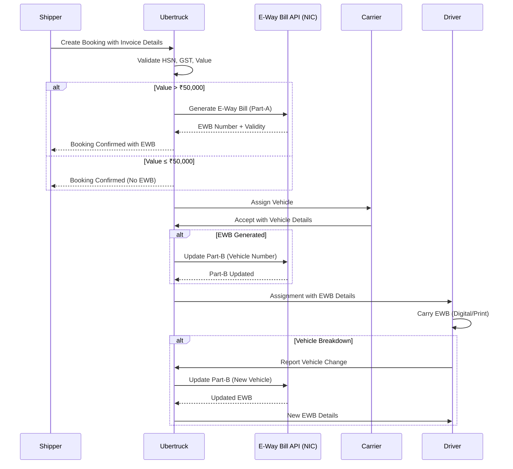

# E-Way Bill Integration Workflow
## Complete GST E-Way Bill System Implementation for Ubertruck MVP
### Version 1.0 | Date: February 2024

---

## Executive Summary

This document provides comprehensive E-Way Bill integration specifications addressing the critical regulatory gap identified in the audit, where absence of E-Way Bill workflow poses major legal risk with potential 100% tax penalties for non-compliance.

## 1. Regulatory Context and Requirements

### 1.1 Legal Framework

```yaml
GST Act Section 68:
  Mandate: Electronic Way Bill required for goods movement
  Threshold: Consignment value > ₹50,000
  Applicability: Inter-state and intra-state movement

Penalties for Non-Compliance:
  Vehicle Detention: Goods and vehicle can be detained
  Monetary Penalty: 100% of tax amount or ₹10,000 (whichever higher)
  Legal Action: Prosecution under GST Act

Ubertruck Specific Requirements:
  Average Cargo Value: ₹75,000 - ₹500,000 (always above threshold)
  Cargo Types: Industrial goods, minerals, construction materials
  Distance: 50-200 km (Nalgonda-Miryalguda corridor)
  Validity: 1 day per 100km (minimum 1 day for our routes)
```

### 1.2 E-Way Bill Components

```yaml
Part-A (Generation by Shipper):
  - Invoice/Bill details
  - Goods description with HSN code
  - Value and quantity
  - Transport type (Road)
  - Approximate distance

Part-B (Update by Transporter):
  - Vehicle number
  - Transport document number
  - Generated after vehicle assignment
  - Can be updated multiple times (vehicle change)
```

## 2. Integration Architecture

### 2.1 System Overview



### 2.2 Technical Architecture

```yaml
E-Way Bill Service Components:
  API Gateway:
    - NIC E-Way Bill API endpoints
    - Authentication via GSP (GST Suvidha Provider)
    - Rate limiting: 100 requests/minute

  Microservice: Payment Service Extension
    Port: 3005
    Responsibilities:
      - E-Way Bill generation
      - Part-B updates
      - Validity tracking
      - Compliance reporting

  Database: compliance.eway_bills table
    - Store all generated EWBs
    - Track updates and validity
    - Audit trail maintenance

  Queue: Redis for retry mechanism
    - Failed generation attempts
    - Part-B update queue
    - Expiry notifications
```

## 3. API Integration Specifications

### 3.1 NIC E-Way Bill API Endpoints

```yaml
Base URLs:
  Production: https://api.mastergst.com/ewaybillapi/v1.03
  Sandbox: https://sandbox.mastergst.com/ewaybillapi/v1.03

Authentication:
  Method: OAuth 2.0
  GSP Credentials:
    - Username: GSTIN of transporter
    - Password: Encrypted password
    - Client ID: Provided by GSP
    - Client Secret: Provided by GSP

Key Endpoints:
  AUTH: /authenticate
  GENERATE: /ewayapi/genewaybill
  UPDATE_VEHICLE: /ewayapi/updatevehicle
  CANCEL: /ewayapi/canewb
  EXTEND: /ewayapi/extendewaybill
  GET_DETAILS: /ewayapi/getewaybill
```

### 3.2 Request/Response Schemas

```typescript
// E-Way Bill Generation Request (Part-A)
interface EWayBillGenerationRequest {
  supplyType: 'O' | 'I';           // Outward/Inward
  subSupplyType: string;            // 'Supply', 'Export', 'Job Work'
  subSupplyDesc?: string;           // Description if 'Others'
  docType: 'INV' | 'BIL' | 'BOE' | 'CHL' | 'OTH';
  docNo: string;                    // Invoice number
  docDate: string;                  // DD/MM/YYYY format

  fromGstin?: string;               // Shipper GSTIN (if registered)
  fromTrdName: string;              // Shipper trade name
  fromAddr1: string;                // Address line 1
  fromAddr2?: string;               // Address line 2
  fromPlace: string;                // City/Place
  fromPincode: string;              // 6-digit pincode
  fromStateCode: string;            // State code (36 for Telangana)

  toGstin?: string;                 // Receiver GSTIN (if registered)
  toTrdName: string;                // Receiver trade name
  toAddr1: string;
  toAddr2?: string;
  toPlace: string;
  toPincode: string;
  toStateCode: string;

  transactionType: number;          // 1: Regular, 2: Bill To-Ship To
  dispatchFromGSTIN?: string;       // If different from supplier
  shipToGSTIN?: string;             // If different from recipient

  totalValue: number;               // Assessable value
  cgstValue?: number;               // CGST amount
  sgstValue?: number;               // SGST amount
  igstValue?: number;               // IGST amount
  cessValue?: number;               // Cess amount
  cessNonAdvolValue?: number;       // Cess non-ad valorem
  totInvValue: number;              // Total invoice value

  transporterId?: string;           // Transporter GSTIN
  transporterName?: string;         // Transporter name
  transDocNo?: string;              // Transport document number
  transMode: '1' | '2' | '3' | '4'; // 1: Road, 2: Rail, 3: Air, 4: Ship
  transDistance: string;            // Distance in KM
  transDocDate?: string;            // Transport document date
  vehicleNo?: string;               // Vehicle number (Part-B)
  vehicleType: 'R' | 'O';          // Regular/Over Dimensional Cargo

  itemList: Array<{
    productName: string;
    productDesc?: string;
    hsnCode: string;                // 4-8 digit HSN code
    quantity: number;
    qtyUnit: string;                 // Unit of measure
    cgstRate?: number;
    sgstRate?: number;
    igstRate?: number;
    cessRate?: number;
    cessNonAdvol?: number;
    taxableAmount: number;
  }>;
}

// E-Way Bill Generation Response
interface EWayBillGenerationResponse {
  success: boolean;
  message?: string;
  result?: {
    ewayBillNo: string;              // 12-digit E-Way Bill number
    ewayBillDate: string;            // Generation date
    validFrom: string;               // Valid from date-time
    validUpto: string;               // Valid until date-time
    genMode: string;                 // Generation mode
    status: string;                  // 'ACTIVE'
    noOfItems: number;
    totInvValue: number;
    hsnCode: string;
    alert?: string;                  // Any warnings
  };
  error?: {
    error_cd: string;
    message: string;
  };
}

// Part-B Vehicle Update Request
interface VehicleUpdateRequest {
  ewbNo: string;                    // E-Way Bill number
  vehicleNo: string;                // New vehicle number
  fromPlace: string;                // Current location
  fromState: string;                // Current state code
  reasonCode: string;               // Reason for change
  reasonRem?: string;               // Remarks
  transDocNo?: string;              // Updated transport doc
  transDocDate?: string;            // Updated transport date
  transMode: '1' | '2' | '3' | '4';
  vehicleType: 'R' | 'O';
  fromPincode: string;
}
```

## 4. Business Process Workflows

### 4.1 Booking Creation with E-Way Bill

```typescript
// Enhanced booking creation flow
async function createBookingWithEWayBill(bookingData: BookingRequest): Promise<BookingResponse> {
  try {
    // Step 1: Validate booking data
    validateBookingData(bookingData);

    // Step 2: Check E-Way Bill requirement
    const requiresEWB = bookingData.invoiceValue > 50000;

    if (requiresEWB) {
      // Step 3: Validate E-Way Bill specific fields
      if (!bookingData.hsnCode || !bookingData.invoiceNumber) {
        throw new ValidationError('HSN code and invoice number required for E-Way Bill');
      }

      // Step 4: Generate E-Way Bill (Part-A)
      const ewbRequest = mapToEWayBillRequest(bookingData);
      const ewbResponse = await generateEWayBill(ewbRequest);

      if (!ewbResponse.success) {
        // Store booking as draft if EWB fails
        const draftBooking = await saveDraftBooking(bookingData);

        // Queue for retry
        await queueEWayBillGeneration(draftBooking.id, ewbRequest);

        return {
          ...draftBooking,
          status: 'PENDING_EWB',
          message: 'Booking created. E-Way Bill generation pending.'
        };
      }

      // Step 5: Create booking with EWB
      const booking = await createBooking({
        ...bookingData,
        ewayBillNumber: ewbResponse.result.ewayBillNo,
        ewayBillValidUpto: ewbResponse.result.validUpto
      });

      // Step 6: Store E-Way Bill details
      await storeEWayBillDetails(booking.id, ewbResponse.result);

      return booking;
    } else {
      // Create booking without E-Way Bill
      return await createBooking(bookingData);
    }

  } catch (error) {
    logger.error('Booking creation failed', { error, bookingData });
    throw error;
  }
}

// Retry mechanism for failed E-Way Bill generation
async function retryEWayBillGeneration(): Promise<void> {
  const pendingEWBs = await getPendingEWayBills();

  for (const pending of pendingEWBs) {
    try {
      const ewbResponse = await generateEWayBill(pending.requestData);

      if (ewbResponse.success) {
        await updateBookingWithEWB(pending.bookingId, ewbResponse.result);
        await notifyShipper(pending.bookingId, 'EWB_GENERATED');
      } else if (pending.retryCount >= 3) {
        await notifyShipper(pending.bookingId, 'EWB_GENERATION_FAILED');
        await flagForManualIntervention(pending.bookingId);
      } else {
        await incrementRetryCount(pending.id);
      }
    } catch (error) {
      logger.error('EWB retry failed', { error, pendingId: pending.id });
    }
  }
}
```

### 4.2 Vehicle Assignment and Part-B Update

```typescript
async function assignVehicleWithPartB(
  bookingId: string,
  vehicleId: string,
  driverId?: string
): Promise<void> {
  const booking = await getBooking(bookingId);
  const vehicle = await getVehicle(vehicleId);

  // Step 1: Assign vehicle in system
  await assignVehicleToBooking(bookingId, vehicleId, driverId);

  // Step 2: Update Part-B if EWB exists
  if (booking.ewayBillNumber) {
    try {
      const updateRequest: VehicleUpdateRequest = {
        ewbNo: booking.ewayBillNumber,
        vehicleNo: vehicle.registrationNumber,
        fromPlace: booking.pickupLocation.city,
        fromState: '36', // Telangana
        reasonCode: '1', // Original vehicle assignment
        transMode: '1',  // Road
        vehicleType: vehicle.capacity > 15 ? 'O' : 'R',
        fromPincode: booking.pickupLocation.pincode
      };

      const response = await updateEWayBillVehicle(updateRequest);

      if (response.success) {
        await updateBookingPartB({
          bookingId,
          vehicleNumber: vehicle.registrationNumber,
          partBUpdatedAt: new Date(),
          ewayBillStatus: 'ACTIVE'
        });

        // Send EWB to driver
        await sendEWayBillToDriver(driverId || vehicle.defaultDriverId, {
          ewbNumber: booking.ewayBillNumber,
          validUpto: response.result.validUpto,
          qrCode: response.result.qrCode
        });
      } else {
        // Part-B update failed - critical for compliance
        await alertComplianceTeam(bookingId, 'PART_B_UPDATE_FAILED');
        throw new ComplianceError('Vehicle update for E-Way Bill failed');
      }
    } catch (error) {
      logger.error('Part-B update failed', { error, bookingId, vehicleId });

      // Allow assignment but flag for manual update
      await flagForManualPartBUpdate(bookingId, vehicleId);
    }
  }
}
```

### 4.3 Vehicle Breakdown Handling

```yaml
Vehicle Breakdown Workflow:
  Detection:
    - Driver reports breakdown via mobile app
    - Status: IN_TRANSIT → VEHICLE_BREAKDOWN

  Assessment:
    - Estimated repair time
    - Decision: Repair vs Replace vehicle

  If Replace Vehicle:
    1. Find Alternative:
       - Search nearby available vehicles
       - Consider capacity match
       - Check driver availability

    2. Update E-Way Bill:
       - Reason Code: 1 (Breakdown)
       - New vehicle number
       - Current location (breakdown point)

    3. Coordinate Transfer:
       - Direct original driver to wait
       - Dispatch new vehicle/driver
       - Transfer cargo and documents

    4. Update Systems:
       - Update booking assignment
       - Notify shipper of change
       - Log incident for records

  If Repair:
    1. Check E-Way Bill validity
    2. If expiring soon, apply for extension
    3. Update status to DELAYED
    4. Notify stakeholders
```

## 5. Implementation Details

### 5.1 Database Schema for E-Way Bill

```sql
-- Already defined in compliance.eway_bills table
-- Additional fields for complete implementation

ALTER TABLE compliance.eway_bills ADD COLUMN IF NOT EXISTS
  generation_mode VARCHAR(20) DEFAULT 'API',           -- API/MANUAL/BULK
  generation_attempts INTEGER DEFAULT 1,               -- Retry count
  part_b_attempts INTEGER DEFAULT 0,                   -- Part-B retry count
  cancellation_reason VARCHAR(200),                    -- If cancelled
  cancelled_at TIMESTAMP,                              -- Cancellation time
  extension_count INTEGER DEFAULT 0,                   -- Times extended
  last_extended_at TIMESTAMP,                          -- Last extension
  consolidated_ewb_no VARCHAR(15),                     -- If part of consolidated
  checkpost_verified BOOLEAN DEFAULT false,            -- Checkpost verification
  verification_details JSONB,                          -- Verification records
  compliance_status VARCHAR(20) DEFAULT 'PENDING',     -- PENDING/COMPLIANT/VIOLATION
  violation_details TEXT,                              -- Any violations noted
  archived BOOLEAN DEFAULT false,                      -- After completion
  archived_at TIMESTAMP;

-- Index for compliance monitoring
CREATE INDEX idx_ewb_compliance_status
  ON compliance.eway_bills(compliance_status, valid_upto)
  WHERE status = 'ACTIVE';

-- Index for expiry tracking
CREATE INDEX idx_ewb_expiring
  ON compliance.eway_bills(valid_upto)
  WHERE status = 'ACTIVE' AND valid_upto > CURRENT_TIMESTAMP;
```

### 5.2 Service Implementation

```typescript
// E-Way Bill Service
export class EWayBillService {
  private readonly gspClient: GSPClient;
  private readonly repository: EWayBillRepository;
  private readonly notificationService: NotificationService;

  constructor() {
    this.gspClient = new GSPClient({
      baseUrl: process.env.GSP_BASE_URL,
      clientId: process.env.GSP_CLIENT_ID,
      clientSecret: process.env.GSP_CLIENT_SECRET,
      gstin: process.env.TRANSPORTER_GSTIN
    });
  }

  async generateEWayBill(data: EWayBillGenerationRequest): Promise<EWayBillResponse> {
    // Authenticate with GSP
    const token = await this.gspClient.authenticate();

    // Add transporter details
    data.transporterId = process.env.TRANSPORTER_GSTIN;
    data.transporterName = process.env.TRANSPORTER_NAME;

    try {
      // Call E-Way Bill API
      const response = await this.gspClient.post('/ewayapi/genewaybill', {
        headers: {
          'Authorization': `Bearer ${token}`,
          'gstin': data.fromGstin || process.env.TRANSPORTER_GSTIN,
          'Content-Type': 'application/json'
        },
        body: data
      });

      if (response.success) {
        // Store in database
        await this.repository.saveEWayBill({
          ewayBillNumber: response.result.ewayBillNo,
          bookingId: data.transDocNo,
          generationDate: new Date(),
          validFrom: new Date(response.result.validFrom),
          validUpto: new Date(response.result.validUpto),
          status: 'ACTIVE',
          hsnCode: data.itemList[0].hsnCode,
          invoiceNumber: data.docNo,
          invoiceValue: data.totInvValue,
          distance: parseInt(data.transDistance)
        });

        // Schedule expiry notification
        await this.scheduleExpiryNotification(
          response.result.ewayBillNo,
          response.result.validUpto
        );
      }

      return response;

    } catch (error) {
      logger.error('E-Way Bill generation failed', { error, data });

      // Queue for retry if network issue
      if (this.isRetriableError(error)) {
        await this.queueForRetry(data);
      }

      throw error;
    }
  }

  async updateVehicleDetails(
    ewbNumber: string,
    vehicleNumber: string,
    reasonCode: string
  ): Promise<void> {
    const ewb = await this.repository.getEWayBill(ewbNumber);

    if (!ewb || ewb.status !== 'ACTIVE') {
      throw new Error('Invalid or inactive E-Way Bill');
    }

    const request: VehicleUpdateRequest = {
      ewbNo: ewbNumber,
      vehicleNo: vehicleNumber,
      fromPlace: ewb.currentLocation || 'Nalgonda',
      fromState: '36',
      reasonCode,
      transMode: '1',
      vehicleType: 'R',
      fromPincode: ewb.currentPincode || '508001'
    };

    const response = await this.gspClient.post('/ewayapi/updatevehicle', {
      body: request
    });

    if (response.success) {
      await this.repository.updatePartB(ewbNumber, {
        vehicleNumber,
        partBUpdatedAt: new Date(),
        partBAttempts: ewb.partBAttempts + 1
      });
    }
  }

  async checkExpiring(): Promise<void> {
    // Find E-Way Bills expiring in next 2 hours
    const expiring = await this.repository.getExpiringEWayBills(2);

    for (const ewb of expiring) {
      const booking = await getBooking(ewb.bookingId);

      // Notify driver and ops team
      await this.notificationService.sendUrgentNotification({
        type: 'EWB_EXPIRING',
        bookingId: ewb.bookingId,
        ewbNumber: ewb.ewayBillNumber,
        expiresAt: ewb.validUpto,
        recipients: [
          booking.assignedDriverId,
          'operations-team'
        ]
      });

      // Check if extension needed
      if (this.shouldExtend(booking, ewb)) {
        await this.extendEWayBill(ewb.ewayBillNumber);
      }
    }
  }

  private shouldExtend(booking: Booking, ewb: EWayBill): boolean {
    // Extension logic based on delivery status
    const remainingDistance = booking.distance - booking.coveredDistance;
    const remainingTime = ewb.validUpto.getTime() - Date.now();
    const averageSpeed = 30; // km/hr for trucks

    const timeNeeded = (remainingDistance / averageSpeed) * 60 * 60 * 1000;

    return timeNeeded > remainingTime && ewb.extensionCount < 1;
  }
}
```

## 6. HSN Code Management

### 6.1 Common HSN Codes for Cargo

```typescript
// HSN Master for common cargo types
const HSN_MASTER = {
  // Construction Materials
  'CEMENT': '2523',           // Portland cement
  'SAND': '2505',             // Natural sand
  'STONES': '2516',           // Granite, sandstone
  'BRICKS': '6904',           // Ceramic bricks
  'STEEL_BARS': '7214',       // Iron/steel bars

  // Agricultural Products
  'RICE': '1006',             // Rice
  'WHEAT': '1001',            // Wheat
  'PULSES': '0713',           // Dried legumes
  'COTTON': '5201',           // Cotton, not carded
  'VEGETABLES': '0701-0714',  // Fresh vegetables

  // Industrial Goods
  'MACHINERY': '8429',        // Earth moving machinery
  'CHEMICALS': '2801-2853',   // Industrial chemicals
  'TEXTILES': '5007-5113',    // Textile materials
  'ELECTRONICS': '8517-8543', // Electronic goods
  'FURNITURE': '9401-9403',   // Furniture

  // Minerals
  'COAL': '2701',            // Coal
  'IRON_ORE': '2601',        // Iron ores
  'LIMESTONE': '2521',       // Limestone

  // General Freight
  'GENERAL_CARGO': '9980',   // Other goods transport services
  'CONTAINERS': '8609'       // Freight containers
};

// Validation and auto-suggestion
function getHSNCode(cargoType: string, description: string): string {
  // Try exact match
  if (HSN_MASTER[cargoType]) {
    return HSN_MASTER[cargoType];
  }

  // Fuzzy match on description
  const matches = findBestHSNMatch(description);
  if (matches.length > 0) {
    return matches[0].code;
  }

  // Default for transport service
  return '996511'; // Goods transport services
}
```

### 6.2 HSN Validation Rules

```typescript
interface HSNValidation {
  validateHSN(code: string): ValidationResult;
  getGSTRate(hsnCode: string): GSTRates;
  isExempted(hsnCode: string): boolean;
}

class HSNValidator implements HSNValidation {
  validateHSN(code: string): ValidationResult {
    // HSN must be 4-8 digits
    if (!/^\d{4,8}$/.test(code)) {
      return {
        valid: false,
        error: 'HSN code must be 4-8 digits'
      };
    }

    // Check against master list
    const validHSN = this.isValidHSNCode(code);
    if (!validHSN) {
      return {
        valid: false,
        error: 'Invalid HSN code. Please verify.',
        suggestion: this.getSimilarHSN(code)
      };
    }

    return { valid: true };
  }

  getGSTRate(hsnCode: string): GSTRates {
    // Simplified GST rates for common goods
    const rates = {
      '996511': { cgst: 9, sgst: 9, igst: 18 }, // Transport services
      '2523': { cgst: 14, sgst: 14, igst: 28 },  // Cement
      '0701-0714': { cgst: 0, sgst: 0, igst: 0 }, // Fresh vegetables (exempt)
      // ... more rates
    };

    return rates[hsnCode] || { cgst: 9, sgst: 9, igst: 18 };
  }

  isExempted(hsnCode: string): boolean {
    const exemptedHSN = ['0701', '0702', '0703']; // Fresh vegetables
    return exemptedHSN.some(code => hsnCode.startsWith(code));
  }
}
```

## 7. Compliance Monitoring

### 7.1 Real-time Compliance Dashboard

```yaml
Compliance Metrics:
  E-Way Bill Generation:
    - Success rate: >95% target
    - Average generation time: <30 seconds
    - Retry success rate: >90%
    - Manual interventions: <5%

  Part-B Updates:
    - Update success rate: >98%
    - Average update time: <10 seconds
    - Vehicle changes tracked: 100%

  Validity Management:
    - Bills expiring in 2 hours: Alert
    - Expired bills in transit: Critical
    - Extension success rate: >95%
    - Checkpost violations: 0 tolerance

  Compliance Score:
    Formula: (Generated × 0.3) + (PartB × 0.3) + (Valid × 0.4)
    Target: >95%
    Current: [Real-time calculation]
```

### 7.2 Compliance Monitoring Queries

```sql
-- Daily compliance report
WITH compliance_metrics AS (
  SELECT
    DATE(generation_date) as date,
    COUNT(*) as total_bookings,
    COUNT(eway_bill_number) as ewb_generated,
    COUNT(*) FILTER (WHERE part_b_updated = true) as part_b_updated,
    COUNT(*) FILTER (WHERE status = 'EXPIRED' AND booking_status != 'COMPLETED') as violations,
    AVG(generation_attempts) as avg_attempts,
    COUNT(*) FILTER (WHERE generation_mode = 'MANUAL') as manual_generated
  FROM compliance.eway_bills e
  JOIN booking.bookings b ON e.booking_id = b.id
  WHERE generation_date >= CURRENT_DATE - INTERVAL '30 days'
  GROUP BY DATE(generation_date)
)
SELECT
  date,
  total_bookings,
  ewb_generated,
  ROUND(100.0 * ewb_generated / NULLIF(total_bookings, 0), 2) as generation_rate,
  part_b_updated,
  ROUND(100.0 * part_b_updated / NULLIF(ewb_generated, 0), 2) as part_b_rate,
  violations,
  manual_generated,
  ROUND(
    (ewb_generated::FLOAT / NULLIF(total_bookings, 0) * 0.3) +
    (part_b_updated::FLOAT / NULLIF(ewb_generated, 0) * 0.3) +
    ((ewb_generated - violations)::FLOAT / NULLIF(ewb_generated, 0) * 0.4) * 100,
    2
  ) as compliance_score
FROM compliance_metrics
ORDER BY date DESC;

-- Identify non-compliant bookings
SELECT
  b.booking_number,
  b.shipper_name,
  b.invoice_value,
  b.status as booking_status,
  e.eway_bill_number,
  e.status as ewb_status,
  e.valid_upto,
  e.compliance_status,
  e.violation_details,
  CASE
    WHEN b.invoice_value > 50000 AND e.eway_bill_number IS NULL THEN 'MISSING_EWB'
    WHEN e.status = 'EXPIRED' AND b.status IN ('IN_TRANSIT', 'PICKUP_STARTED') THEN 'EXPIRED_IN_TRANSIT'
    WHEN e.part_b_updated = false AND b.status != 'CREATED' THEN 'MISSING_PART_B'
    ELSE 'COMPLIANT'
  END as issue_type
FROM booking.bookings b
LEFT JOIN compliance.eway_bills e ON b.id = e.booking_id
WHERE b.created_at >= CURRENT_DATE - INTERVAL '7 days'
  AND (
    (b.invoice_value > 50000 AND e.eway_bill_number IS NULL) OR
    (e.status = 'EXPIRED' AND b.status IN ('IN_TRANSIT', 'PICKUP_STARTED')) OR
    (e.part_b_updated = false AND b.status != 'CREATED')
  );
```

## 8. Exception Handling

### 8.1 Error Scenarios and Recovery

| Error Scenario | Impact | Recovery Strategy | SLA |
|----------------|--------|-------------------|-----|
| GSP API Down | Cannot generate EWB | Queue for retry, allow booking as draft | 4 hours |
| Invalid GSTIN | Generation fails | Validate offline, request correction | 30 min |
| HSN Code Invalid | Generation fails | Suggest valid codes, manual override | Immediate |
| Network Timeout | Partial processing | Idempotent retry with same request ID | 5 min |
| Part-B Update Fails | Compliance risk | Manual update via portal, SMS to driver | 1 hour |
| EWB Expires in Transit | Legal violation | Immediate extension or manual generation | 30 min |
| Vehicle Breakdown | Part-B invalid | Update with new vehicle immediately | 15 min |
| Duplicate Generation | Wastage | Check existing before generation | Prevention |

### 8.2 Manual Fallback Procedures

```yaml
Manual E-Way Bill Generation:
  Trigger: API failure for >2 hours

  Process:
    1. Operations team alerted
    2. Login to E-Way Bill portal
    3. Generate manually using booking details
    4. Enter EWB number in Ubertruck system
    5. Send EWB PDF to driver via WhatsApp
    6. Update compliance.eway_bills table

  Tracking:
    - Log manual generation reason
    - Track time to resolution
    - Daily reconciliation report

Bulk Upload Process:
  For: High volume periods

  Steps:
    1. Export bookings to Excel template
    2. Upload to E-Way Bill portal
    3. Download generated EWBs
    4. Import back to system
    5. Match and update bookings
    6. Send notifications
```

## 9. Testing Strategy

### 9.1 Test Scenarios

```typescript
describe('E-Way Bill Integration Tests', () => {
  describe('Generation Tests', () => {
    test('Generate EWB for value > 50000', async () => {
      const booking = createTestBooking({ invoiceValue: 75000 });
      const result = await generateEWayBill(booking);

      expect(result.success).toBe(true);
      expect(result.ewayBillNumber).toMatch(/^\d{12}$/);
      expect(result.validUpto).toBeAfter(new Date());
    });

    test('Skip EWB for value < 50000', async () => {
      const booking = createTestBooking({ invoiceValue: 25000 });
      const result = await createBooking(booking);

      expect(result.ewayBillNumber).toBeNull();
      expect(result.status).toBe('CREATED');
    });

    test('Retry on network failure', async () => {
      mockGSPClient.failTimes(2);
      const booking = createTestBooking({ invoiceValue: 100000 });

      const result = await generateEWayBillWithRetry(booking);

      expect(result.attempts).toBe(3);
      expect(result.success).toBe(true);
    });
  });

  describe('Part-B Update Tests', () => {
    test('Update vehicle after assignment', async () => {
      const ewb = await createTestEWayBill();
      const vehicle = createTestVehicle();

      const result = await updatePartB(ewb.number, vehicle.regNumber);

      expect(result.success).toBe(true);
      expect(result.vehicleNumber).toBe(vehicle.regNumber);
    });

    test('Handle vehicle breakdown', async () => {
      const booking = await createTestBookingInTransit();
      const newVehicle = createTestVehicle();

      const result = await handleVehicleBreakdown(
        booking.id,
        newVehicle.id,
        'BREAKDOWN'
      );

      expect(result.partBUpdated).toBe(true);
      expect(result.reasonCode).toBe('1');
    });
  });

  describe('Compliance Tests', () => {
    test('Alert on expiring EWB', async () => {
      const ewb = createTestEWayBill({
        validUpto: addHours(new Date(), 1)
      });

      await checkExpiringEWayBills();

      expect(notificationService.sent).toContainEqual({
        type: 'EWB_EXPIRING',
        ewbNumber: ewb.number
      });
    });

    test('Prevent expired EWB in transit', async () => {
      const booking = createTestBooking({
        ewbValidUpto: subHours(new Date(), 1),
        status: 'IN_TRANSIT'
      });

      const violations = await checkComplianceViolations();

      expect(violations).toContainEqual({
        bookingId: booking.id,
        type: 'EXPIRED_IN_TRANSIT'
      });
    });
  });
});
```

### 9.2 Load Testing

```yaml
Load Test Scenarios:
  Bulk Generation:
    Concurrent Requests: 100
    Duration: 5 minutes
    Expected Success Rate: >95%
    Average Response Time: <2 seconds

  Part-B Updates:
    Concurrent Updates: 50
    Different EWBs: Yes
    Expected Success Rate: >98%
    Average Response Time: <1 second

  Validity Checks:
    Frequency: Every 5 minutes
    Number of EWBs: 10,000
    Query Performance: <500ms
    Alert Latency: <30 seconds
```

## 10. Rollout Plan

### 10.1 Phased Implementation

```yaml
Phase 1 - Development (Week 1):
  - GSP integration setup
  - Database schema implementation
  - Core generation logic
  - Basic testing

Phase 2 - Integration (Week 2):
  - Booking flow integration
  - Part-B update mechanism
  - Notification system
  - Error handling

Phase 3 - Testing (Week 3):
  - UAT with test GSP credentials
  - Load testing
  - Compliance validation
  - Manual fallback procedures

Phase 4 - Pilot (Week 4):
  - 10% traffic routing
  - Monitor compliance score
  - Gather driver feedback
  - Fine-tune retry logic

Phase 5 - Full Rollout (Week 5):
  - 100% traffic
  - Compliance monitoring dashboard
  - Training completion
  - Go-live announcement
```

### 10.2 Training Requirements

```yaml
Driver Training:
  Topics:
    - E-Way Bill importance
    - Digital copy on phone
    - Checkpost procedures
    - Breakdown reporting
  Format: Video + Quiz
  Duration: 30 minutes
  Completion Required: Yes

Operations Team:
  Topics:
    - Manual generation process
    - Portal navigation
    - Compliance monitoring
    - Exception handling
  Format: Hands-on workshop
  Duration: 2 hours
  Certification: Required

Support Team:
  Topics:
    - Common EWB issues
    - Troubleshooting guide
    - Escalation matrix
    - Customer communication
  Format: Documentation + Q&A
  Duration: 1 hour
```

---

*This E-Way Bill Integration Workflow must be implemented before production launch to ensure GST compliance. Non-compliance can result in vehicle detention and penalties up to ₹10,000 per incident.*