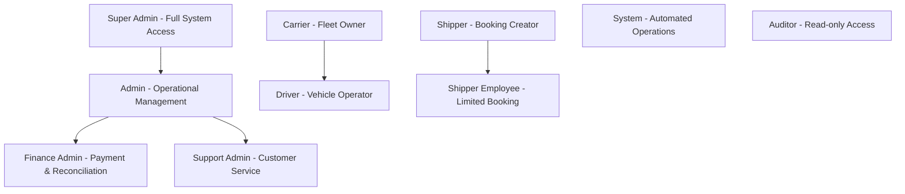

# Role-Based Access Control (RBAC) Authorization Matrix
## Ubertruck MVP - Security and Access Control Specifications
### Version 1.0 | Date: February 2024

---

## Executive Summary

This document establishes a comprehensive Role-Based Access Control (RBAC) matrix addressing the critical security gap where no authorization framework was defined, creating risk for unauthorized access to sensitive operations like bank reconciliation and admin functions.

## 1. RBAC Framework Overview

### 1.1 Security Principles

```yaml
Core Principles:
  Least Privilege: Users get minimum access required for their role
  Separation of Duties: Critical operations require multiple roles
  Defense in Depth: Multiple layers of authorization checks
  Audit Trail: All access attempts logged and monitored
  Zero Trust: Verify every request regardless of source

Authorization Layers:
  1. Authentication: JWT token validation
  2. Role Verification: User role check
  3. Permission Check: Specific action authorization
  4. Resource Ownership: Data access validation
  5. Audit Logging: Activity recording
```

### 1.2 Role Hierarchy



## 2. Role Definitions

### 2.1 Primary Roles

| Role | Code | Description | User Count | Assignment |
|------|------|-------------|------------|------------|
| **Super Admin** | `SUPER_ADMIN` | Complete system control, deployment, configuration | 1-2 | CTO, Tech Lead |
| **Admin** | `ADMIN` | Platform operations, user management, monitoring | 3-5 | Operations team |
| **Finance Admin** | `FINANCE_ADMIN` | Payment reconciliation, settlements, invoices | 2-3 | Finance team |
| **Support Admin** | `SUPPORT_ADMIN` | Customer support, dispute resolution | 5-10 | Support team |
| **Carrier** | `CARRIER` | Fleet owner managing vehicles and drivers | 100+ | Transport companies |
| **Driver** | `DRIVER` | Vehicle operator updating delivery status | 500+ | Individual drivers |
| **Shipper** | `SHIPPER` | Business creating bookings | 200+ | Businesses |
| **Shipper Employee** | `SHIPPER_EMP` | Limited booking creation | 100+ | Shipper staff |
| **System** | `SYSTEM` | Automated processes, integrations | N/A | Service accounts |
| **Auditor** | `AUDITOR` | Read-only access for compliance | 1-2 | External auditors |

### 2.2 Role Capabilities

```typescript
interface RoleDefinition {
  name: string;
  code: string;
  permissions: Permission[];
  restrictions: Restriction[];
  dataScopes: DataScope[];
  ipWhitelist?: string[];
  mfaRequired: boolean;
  sessionTimeout: number; // minutes
  maxConcurrentSessions: number;
}

// Example: Carrier Role
const CARRIER_ROLE: RoleDefinition = {
  name: "Carrier",
  code: "CARRIER",
  permissions: [
    "fleet:read", "fleet:write", "fleet:delete",
    "driver:read", "driver:write",
    "booking:read:assigned", "booking:accept",
    "invoice:read:own", "settlement:read:own"
  ],
  restrictions: [
    "Cannot access other carriers' data",
    "Cannot modify completed bookings",
    "Cannot delete with active bookings"
  ],
  dataScopes: [
    { entity: "vehicles", filter: "carrier_id = :userId" },
    { entity: "drivers", filter: "carrier_id = :userId" },
    { entity: "bookings", filter: "carrier_id = :userId" }
  ],
  mfaRequired: false,
  sessionTimeout: 480, // 8 hours
  maxConcurrentSessions: 3
};
```

## 3. Permission Matrix

### 3.1 API Endpoint Permissions

| Endpoint | Method | Super Admin | Admin | Finance | Support | Carrier | Driver | Shipper | Public |
|----------|--------|------------|-------|---------|---------|---------|--------|---------|--------|
| **Authentication** |
| /auth/register | POST | ✅ | ✅ | ❌ | ❌ | ❌ | ❌ | ❌ | ✅ |
| /auth/login | POST | ✅ | ✅ | ✅ | ✅ | ✅ | ✅ | ✅ | ✅ |
| /auth/verify-otp | POST | ✅ | ✅ | ✅ | ✅ | ✅ | ✅ | ✅ | ✅ |
| /auth/refresh | POST | ✅ | ✅ | ✅ | ✅ | ✅ | ✅ | ✅ | ❌ |
| /auth/logout | POST | ✅ | ✅ | ✅ | ✅ | ✅ | ✅ | ✅ | ❌ |
| **User Management** |
| /users/profile | GET | ✅ | ✅* | ✅* | ✅* | ✅* | ✅* | ✅* | ❌ |
| /users/profile | PUT | ✅ | ✅* | ✅* | ❌ | ✅* | ❌ | ✅* | ❌ |
| /users/bank-details | POST | ✅ | ✅* | ❌ | ❌ | ✅* | ❌ | ❌ | ❌ |
| /users/bank-details | PUT | ✅ | ❌ | ❌ | ❌ | ✅* | ❌ | ❌ | ❌ |
| /users/list | GET | ✅ | ✅ | ❌ | ✅ | ❌ | ❌ | ❌ | ❌ |
| /users/{id}/suspend | POST | ✅ | ✅ | ❌ | ❌ | ❌ | ❌ | ❌ | ❌ |
| **Fleet Management** |
| /fleet/vehicles | GET | ✅ | ✅ | ❌ | ✅ | ✅* | ✅* | ❌ | ❌ |
| /fleet/vehicles | POST | ✅ | ❌ | ❌ | ❌ | ✅* | ❌ | ❌ | ❌ |
| /fleet/vehicles/{id} | PUT | ✅ | ❌ | ❌ | ❌ | ✅* | ❌ | ❌ | ❌ |
| /fleet/vehicles/{id} | DELETE | ✅ | ❌ | ❌ | ❌ | ✅* | ❌ | ❌ | ❌ |
| /fleet/drivers | GET | ✅ | ✅ | ❌ | ✅ | ✅* | ❌ | ❌ | ❌ |
| /fleet/drivers | POST | ✅ | ❌ | ❌ | ❌ | ✅* | ❌ | ❌ | ❌ |
| /fleet/drivers/{id} | PUT | ✅ | ❌ | ❌ | ❌ | ✅* | ❌ | ❌ | ❌ |
| /fleet/drivers/{id} | DELETE | ✅ | ❌ | ❌ | ❌ | ✅* | ❌ | ❌ | ❌ |
| **Booking Management** |
| /bookings | GET | ✅ | ✅ | ✅ | ✅ | ✅* | ✅* | ✅* | ❌ |
| /bookings | POST | ✅ | ✅ | ❌ | ❌ | ❌ | ❌ | ✅ | ❌ |
| /bookings/{id} | GET | ✅ | ✅ | ✅ | ✅ | ✅** | ✅** | ✅** | ❌ |
| /bookings/{id}/cancel | POST | ✅ | ✅ | ❌ | ✅ | ❌ | ❌ | ✅** | ❌ |
| /bookings/{id}/assign | POST | ✅ | ✅ | ❌ | ❌ | ❌ | ❌ | ❌ | ❌ |
| /bookings/{id}/accept | POST | ✅ | ❌ | ❌ | ❌ | ✅** | ✅** | ❌ | ❌ |
| **Tracking** |
| /tracking/{id}/status | GET | ✅ | ✅ | ✅ | ✅ | ✅** | ✅** | ✅** | ❌ |
| /tracking/{id}/status | PUT | ✅ | ✅ | ❌ | ❌ | ❌ | ✅** | ❌ | ❌ |
| /tracking/{id}/pod | POST | ✅ | ❌ | ❌ | ❌ | ❌ | ✅** | ❌ | ❌ |
| /tracking/{id}/pod | GET | ✅ | ✅ | ✅ | ✅ | ✅** | ✅** | ✅** | ❌ |
| **Payments** |
| /payments/calculate | POST | ✅ | ✅ | ✅ | ✅ | ✅ | ✅ | ✅ | ❌ |
| /payments/invoices | GET | ✅ | ✅ | ✅ | ✅ | ✅* | ❌ | ✅* | ❌ |
| /payments/invoices/{id} | GET | ✅ | ✅ | ✅ | ✅ | ✅** | ❌ | ✅** | ❌ |
| /payments/settlements | GET | ✅ | ✅ | ✅ | ❌ | ✅* | ❌ | ❌ | ❌ |
| /payments/reconcile | POST | ✅ | ❌ | ✅ | ❌ | ❌ | ❌ | ❌ | ❌ |
| **E-Way Bill** |
| /eway-bill/generate | POST | ✅ | ✅ | ❌ | ❌ | ❌ | ❌ | ✅** | ❌ |
| /eway-bill/{id}/update | PUT | ✅ | ✅ | ❌ | ❌ | ✅** | ✅** | ❌ | ❌ |
| **Admin** |
| /admin/dashboard | GET | ✅ | ✅ | ✅ | ✅ | ❌ | ❌ | ❌ | ❌ |
| /admin/users | GET | ✅ | ✅ | ❌ | ✅ | ❌ | ❌ | ❌ | ❌ |
| /admin/bookings | GET | ✅ | ✅ | ✅ | ✅ | ❌ | ❌ | ❌ | ❌ |
| /admin/reconciliation | GET | ✅ | ❌ | ✅ | ❌ | ❌ | ❌ | ❌ | ❌ |
| /admin/reconciliation | POST | ✅ | ❌ | ✅ | ❌ | ❌ | ❌ | ❌ | ❌ |
| /admin/reports | GET | ✅ | ✅ | ✅ | ❌ | ❌ | ❌ | ❌ | ❌ |
| /admin/settings | GET | ✅ | ✅ | ❌ | ❌ | ❌ | ❌ | ❌ | ❌ |
| /admin/settings | PUT | ✅ | ❌ | ❌ | ❌ | ❌ | ❌ | ❌ | ❌ |

**Legend:**
- ✅ = Full Access
- ✅* = Own Data Only
- ✅** = Related Data Only (assigned/created)
- ❌ = No Access

### 3.2 Database Table Permissions

| Table | Super Admin | Admin | Finance | Support | Carrier | Driver | Shipper |
|-------|------------|-------|---------|---------|---------|--------|---------|
| **core.users** | CRUD | CR | R | R | R(self) | R(self) | R(self) |
| **core.user_sessions** | CRUD | RD | - | R | R(self) | R(self) | R(self) |
| **core.bank_accounts** | CRUD | R | R | - | CRU(self) | - | - |
| **fleet.vehicles** | CRUD | R | - | R | CRUD(own) | R(assigned) | - |
| **fleet.drivers** | CRUD | R | - | R | CRUD(own) | R(self) | - |
| **booking.bookings** | CRUD | CRUD | R | R | R(assigned) | R(assigned) | CRUD(own) |
| **booking.assignments** | CRUD | CRUD | - | R | R(own) | R(assigned) | - |
| **booking.pricing** | CRUD | R | R | R | R(own) | - | R(own) |
| **tracking.status_updates** | CRUD | R | - | R | R(own) | CRU(assigned) | R(own) |
| **tracking.pod_uploads** | CRUD | R | R | R | R(own) | CRU(assigned) | R(own) |
| **payment.invoices** | CRUD | R | CRUD | R | R(own) | - | R(own) |
| **payment.settlements** | CRUD | - | CRUD | - | R(own) | - | - |
| **compliance.eway_bills** | CRUD | CRUD | R | R | RU(own) | RU(assigned) | CRU(own) |
| **audit.audit_logs** | R | R | R | - | - | - | - |

**Legend:**
- C = Create, R = Read, U = Update, D = Delete
- (own) = Only records owned by user
- (self) = Only user's own record
- (assigned) = Only assigned records

## 4. Data Access Scopes

### 4.1 Row-Level Security (RLS)

```sql
-- Enable RLS on critical tables
ALTER TABLE booking.bookings ENABLE ROW LEVEL SECURITY;
ALTER TABLE fleet.vehicles ENABLE ROW LEVEL SECURITY;
ALTER TABLE payment.invoices ENABLE ROW LEVEL SECURITY;

-- Carrier can only see their own vehicles
CREATE POLICY carrier_vehicles_policy ON fleet.vehicles
  FOR ALL
  TO application_user
  USING (
    current_setting('app.user_role') = 'SUPER_ADMIN' OR
    current_setting('app.user_role') = 'ADMIN' OR
    (current_setting('app.user_role') = 'CARRIER' AND
     carrier_id = current_setting('app.user_id')::UUID)
  );

-- Shipper can only see their own bookings
CREATE POLICY shipper_bookings_policy ON booking.bookings
  FOR ALL
  TO application_user
  USING (
    current_setting('app.user_role') IN ('SUPER_ADMIN', 'ADMIN') OR
    (current_setting('app.user_role') = 'SHIPPER' AND
     shipper_id = current_setting('app.user_id')::UUID) OR
    (current_setting('app.user_role') = 'CARRIER' AND
     carrier_id = current_setting('app.user_id')::UUID) OR
    (current_setting('app.user_role') = 'DRIVER' AND
     id IN (SELECT booking_id FROM booking.booking_assignments
            WHERE driver_id = current_setting('app.user_id')::UUID))
  );

-- Finance admin can access all payment data
CREATE POLICY finance_invoices_policy ON payment.invoices
  FOR ALL
  TO application_user
  USING (
    current_setting('app.user_role') IN ('SUPER_ADMIN', 'FINANCE_ADMIN') OR
    (current_setting('app.user_role') = 'ADMIN' AND 'SELECT' = TG_OP) OR
    (current_setting('app.user_role') = 'SHIPPER' AND
     shipper_id = current_setting('app.user_id')::UUID) OR
    (current_setting('app.user_role') = 'CARRIER' AND
     carrier_id = current_setting('app.user_id')::UUID)
  );
```

### 4.2 Column-Level Security

```typescript
// Sensitive field masking based on role
interface FieldVisibility {
  table: string;
  field: string;
  roles: string[];
  maskType?: 'FULL' | 'PARTIAL' | 'HASH';
}

const FIELD_VISIBILITY: FieldVisibility[] = [
  {
    table: 'users',
    field: 'phone_number',
    roles: ['SUPER_ADMIN', 'ADMIN', 'SUPPORT_ADMIN'],
    maskType: 'PARTIAL' // Others see ****3210
  },
  {
    table: 'bank_accounts',
    field: 'account_number',
    roles: ['SUPER_ADMIN', 'FINANCE_ADMIN'],
    maskType: 'PARTIAL' // Others see ****1234
  },
  {
    table: 'users',
    field: 'gst_number',
    roles: ['SUPER_ADMIN', 'ADMIN', 'FINANCE_ADMIN', 'SELF'],
    maskType: 'FULL' // Others cannot see
  },
  {
    table: 'drivers',
    field: 'aadhaar_number_hash',
    roles: ['SUPER_ADMIN'],
    maskType: 'FULL' // Completely hidden from others
  }
];
```

## 5. Permission Implementation

### 5.1 JWT Token Structure

```typescript
interface JWTPayload {
  // Standard claims
  sub: string;          // User ID
  iat: number;          // Issued at
  exp: number;          // Expiration
  jti: string;          // JWT ID

  // Custom claims
  role: string;         // Primary role
  additionalRoles?: string[]; // Secondary roles
  permissions: string[];      // Explicit permissions
  restrictions?: string[];    // Explicit denials
  dataScopes?: {
    [entity: string]: string; // Entity-specific filters
  };
  sessionId: string;    // For session management
  deviceId?: string;    // Device fingerprint
  ipAddress: string;    // Origin IP
  mfaVerified?: boolean; // MFA status
}

// Example token payload
const tokenPayload: JWTPayload = {
  sub: "550e8400-e29b-41d4-a716-446655440000",
  iat: 1708543200,
  exp: 1708546800,
  jti: "660e8400-e29b-41d4-a716-446655440001",
  role: "CARRIER",
  permissions: [
    "fleet:read", "fleet:write",
    "booking:read:assigned", "booking:accept",
    "invoice:read:own"
  ],
  dataScopes: {
    "vehicles": "carrier_id = '550e8400-e29b-41d4-a716-446655440000'",
    "bookings": "carrier_id = '550e8400-e29b-41d4-a716-446655440000'"
  },
  sessionId: "770e8400-e29b-41d4-a716-446655440002",
  ipAddress: "203.0.113.42",
  mfaVerified: false
};
```

### 5.2 Authorization Middleware

```typescript
// Express middleware for RBAC
export const authorize = (requiredPermissions: string[]) => {
  return async (req: Request, res: Response, next: NextFunction) => {
    try {
      // 1. Extract and verify JWT
      const token = extractToken(req);
      const payload = verifyJWT(token);

      // 2. Check role-based permissions
      const userRole = await getRoleDefinition(payload.role);
      const hasPermission = requiredPermissions.every(perm =>
        userRole.permissions.includes(perm) ||
        payload.permissions.includes(perm)
      );

      if (!hasPermission) {
        throw new ForbiddenError('Insufficient permissions');
      }

      // 3. Check data scope if accessing specific resource
      if (req.params.id) {
        const resourceOwner = await getResourceOwner(
          req.path,
          req.params.id
        );

        if (!canAccessResource(payload, resourceOwner)) {
          throw new ForbiddenError('Cannot access this resource');
        }
      }

      // 4. Check IP whitelist for sensitive roles
      if (['SUPER_ADMIN', 'FINANCE_ADMIN'].includes(payload.role)) {
        if (!isIPWhitelisted(payload.ipAddress, userRole.ipWhitelist)) {
          throw new ForbiddenError('Access denied from this IP');
        }
      }

      // 5. Check MFA for critical operations
      if (requiredPermissions.includes('payment:reconcile')) {
        if (!payload.mfaVerified) {
          return res.status(403).json({
            error: 'MFA_REQUIRED',
            message: 'Multi-factor authentication required'
          });
        }
      }

      // 6. Log access attempt
      await logAccessAttempt({
        userId: payload.sub,
        role: payload.role,
        resource: req.path,
        method: req.method,
        allowed: true,
        timestamp: new Date()
      });

      // Attach user context to request
      req.user = payload;
      next();

    } catch (error) {
      await logAccessAttempt({
        userId: req.user?.sub,
        resource: req.path,
        method: req.method,
        allowed: false,
        reason: error.message,
        timestamp: new Date()
      });

      return res.status(403).json({
        error: 'AUTHORIZATION_FAILED',
        message: error.message
      });
    }
  };
};

// Usage in routes
router.get('/admin/reconciliation',
  authenticate(),
  authorize(['payment:reconcile']),
  getReconciliation
);

router.post('/bookings',
  authenticate(),
  authorize(['booking:create']),
  createBooking
);
```

## 6. Special Access Controls

### 6.1 Multi-Factor Authentication (MFA) Requirements

| Operation | Roles Requiring MFA | MFA Type | Timeout |
|-----------|-------------------|----------|---------|
| Bank Reconciliation | FINANCE_ADMIN | SMS OTP | 5 minutes |
| User Suspension | ADMIN, SUPER_ADMIN | SMS OTP | 5 minutes |
| Settings Change | SUPER_ADMIN | TOTP App | 30 seconds |
| Bulk Operations | All Admins | SMS OTP | 5 minutes |
| Password Reset | All Users | SMS OTP | 10 minutes |
| Bank Details Change | CARRIER | SMS OTP | 5 minutes |

### 6.2 Time-Based Access Controls

```typescript
interface TimeBasedAccess {
  role: string;
  resource: string;
  allowedHours: {
    start: string; // "09:00"
    end: string;   // "18:00"
    timezone: string;
  };
  allowedDays: number[]; // 0=Sunday, 6=Saturday
  exceptions?: Date[];   // Holidays
}

const TIME_RESTRICTIONS: TimeBasedAccess[] = [
  {
    role: 'FINANCE_ADMIN',
    resource: '/payments/reconcile',
    allowedHours: {
      start: '09:00',
      end: '18:00',
      timezone: 'Asia/Kolkata'
    },
    allowedDays: [1, 2, 3, 4, 5], // Monday to Friday
    exceptions: ['2024-03-08', '2024-08-15'] // Holidays
  },
  {
    role: 'SUPPORT_ADMIN',
    resource: '/bookings/*/cancel',
    allowedHours: {
      start: '06:00',
      end: '23:00',
      timezone: 'Asia/Kolkata'
    },
    allowedDays: [0, 1, 2, 3, 4, 5, 6] // All days
  }
];
```

### 6.3 Approval Workflows

```yaml
Approval Required Operations:
  High Value Booking (>₹50,000):
    Initiator: SHIPPER
    Approver: SHIPPER (Manager role)
    Timeout: 2 hours
    Fallback: Auto-reject

  Manual Truck Assignment:
    Initiator: SUPPORT_ADMIN
    Approver: ADMIN
    Timeout: 30 minutes
    Fallback: Auto-assign algorithm

  Settlement Release:
    Initiator: SYSTEM
    Reviewer: FINANCE_ADMIN
    Approver: FINANCE_ADMIN (different person)
    Timeout: 24 hours
    Fallback: Escalate to SUPER_ADMIN

  User Suspension:
    Initiator: SUPPORT_ADMIN
    Approver: ADMIN
    Timeout: 1 hour
    Fallback: Auto-approve if fraud detected

  Refund Processing:
    Initiator: SUPPORT_ADMIN
    Approver: FINANCE_ADMIN
    Timeout: 4 hours
    Fallback: Escalate to ADMIN
```

## 7. Security Policies

### 7.1 Password and Authentication Policies

```yaml
Password Policy:
  SUPER_ADMIN:
    MinLength: 16
    Complexity: Uppercase + Lowercase + Numbers + Special
    Expiry: 30 days
    History: 12 passwords
    MFA: Required (TOTP)

  ADMIN Roles:
    MinLength: 12
    Complexity: Uppercase + Lowercase + Numbers + Special
    Expiry: 60 days
    History: 6 passwords
    MFA: Required (SMS)

  Regular Users:
    MinLength: 8
    Complexity: Numbers required
    Expiry: 90 days
    History: 3 passwords
    MFA: Optional

Session Policy:
  SUPER_ADMIN:
    Timeout: 30 minutes
    Concurrent: 1 session
    IP Lock: Yes

  ADMIN Roles:
    Timeout: 2 hours
    Concurrent: 2 sessions
    IP Lock: No

  Regular Users:
    Timeout: 8 hours
    Concurrent: 3 sessions
    IP Lock: No

Account Lockout:
  Failed Attempts: 5
  Lockout Duration: 15 minutes
  Progressive: 15, 30, 60 minutes
  Notification: SMS to registered number
```

### 7.2 API Rate Limiting by Role

| Role | Requests/Min | Requests/Hour | Requests/Day | Burst |
|------|--------------|---------------|--------------|-------|
| SUPER_ADMIN | 1000 | 30000 | Unlimited | 100 |
| ADMIN | 500 | 15000 | 100000 | 50 |
| FINANCE_ADMIN | 200 | 5000 | 30000 | 30 |
| SUPPORT_ADMIN | 300 | 10000 | 50000 | 40 |
| CARRIER | 100 | 2000 | 10000 | 20 |
| DRIVER | 60 | 1000 | 5000 | 10 |
| SHIPPER | 100 | 2000 | 10000 | 20 |
| PUBLIC | 10 | 100 | 500 | 5 |

## 8. Audit and Compliance

### 8.1 Access Audit Requirements

```sql
-- Audit log structure for access attempts
CREATE TABLE audit.access_logs (
  id BIGSERIAL PRIMARY KEY,
  timestamp TIMESTAMP NOT NULL DEFAULT CURRENT_TIMESTAMP,
  user_id UUID REFERENCES core.users(id),
  user_role VARCHAR(20),
  resource_path VARCHAR(500),
  http_method VARCHAR(10),
  permission_required VARCHAR(100),
  access_granted BOOLEAN,
  denial_reason VARCHAR(200),
  ip_address INET,
  user_agent TEXT,
  session_id UUID,
  response_code INTEGER,
  response_time_ms INTEGER
);

-- Critical access monitoring view
CREATE VIEW audit.critical_access_monitor AS
SELECT
  DATE(timestamp) as date,
  user_role,
  COUNT(*) as total_attempts,
  SUM(CASE WHEN access_granted THEN 1 ELSE 0 END) as allowed,
  SUM(CASE WHEN NOT access_granted THEN 1 ELSE 0 END) as denied,
  AVG(response_time_ms) as avg_response_ms
FROM audit.access_logs
WHERE resource_path IN (
  '/payments/reconcile',
  '/admin/settings',
  '/users/suspend',
  '/bookings/bulk-update'
)
GROUP BY DATE(timestamp), user_role;
```

### 8.2 Compliance Reports

```yaml
Monthly Access Review:
  Privileged Access Report:
    - List of SUPER_ADMIN actions
    - FINANCE_ADMIN reconciliation activities
    - Bulk operations performed
    - Failed access attempts to critical resources

  Anomaly Detection:
    - Access outside business hours
    - Unusual IP addresses
    - Excessive failed attempts
    - Privilege escalation attempts

  Role Assignment Review:
    - New role assignments
    - Role changes
    - Dormant accounts with high privileges
    - Users with multiple roles

Quarterly Certification:
  - All ADMIN roles reviewed
  - Unused permissions removed
  - Access patterns analyzed
  - Compliance attestation signed
```

## 9. Implementation Guidelines

### 9.1 Role Assignment Process

```yaml
New User Onboarding:
  1. Registration:
     - Default role: Based on registration type
     - Limited permissions initially

  2. Verification:
     - KYC completion required for elevated roles
     - Bank verification for CARRIER role

  3. Role Assignment:
     - Request submitted by user or admin
     - Approval workflow triggered
     - Notification sent on approval

  4. Training:
     - Role-specific training materials
     - Acknowledgment required
     - Quiz for admin roles

Role Change Process:
  1. Request Initiation:
     - Current role evaluation
     - Business justification required
     - Manager approval (if applicable)

  2. Security Review:
     - Access history review
     - Compliance check
     - Risk assessment

  3. Implementation:
     - Scheduled during maintenance window
     - Previous permissions revoked
     - New permissions activated
     - Audit trail updated

  4. Validation:
     - Access testing
     - User confirmation
     -30-day review period
```

### 9.2 Emergency Access Procedures

```yaml
Break-Glass Access:
  Scenario: Critical system failure, primary admin unavailable

  Process:
    1. Declare Emergency:
       - Two senior managers approve
       - Document reason

    2. Grant Access:
       - Temporary SUPER_ADMIN role
       - 4-hour validity
       - All actions logged

    3. Monitoring:
       - Real-time activity monitoring
       - Automated alerts on sensitive operations
       - Screen recording if possible

    4. Review:
       - Complete audit within 24 hours
       - Revoke access immediately after resolution
       - Post-incident review

  Audit Requirements:
    - All break-glass access logged
    - Monthly review by security team
    - Quarterly report to management
```

## 10. Security Best Practices

### 10.1 Development Guidelines

```typescript
// DO: Explicit permission checks
router.post('/sensitive-operation',
  authenticate(),
  authorize(['specific:permission']),
  auditLog('SENSITIVE_OP'),
  async (req, res) => {
    // Additional resource-level check
    if (!canUserAccessResource(req.user, req.params.resourceId)) {
      return res.status(403).json({error: 'Forbidden'});
    }
    // Operation logic
  }
);

// DON'T: Role-based checks without permissions
router.post('/sensitive-operation',
  authenticate(),
  async (req, res) => {
    // Bad: Direct role check
    if (req.user.role === 'ADMIN') {
      // Operation logic
    }
  }
);

// DO: Fail closed on errors
try {
  const hasAccess = await checkAccess(user, resource);
  if (!hasAccess) throw new ForbiddenError();
} catch (error) {
  // Fail closed - deny access on any error
  return res.status(403).json({error: 'Access denied'});
}

// DO: Sanitize error messages
catch (error) {
  // Don't expose internal details
  const safeError = sanitizeError(error);
  return res.status(403).json({
    error: 'AUTHORIZATION_FAILED',
    message: 'You do not have permission to perform this action'
  });
}
```

### 10.2 Monitoring and Alerts

```yaml
Real-time Alerts:
  Critical:
    - SUPER_ADMIN login from new IP
    - Multiple failed FINANCE_ADMIN attempts
    - Break-glass access activated
    - Privilege escalation detected

  Warning:
    - Unusual access patterns detected
    - High rate of permission denials
    - Dormant admin account activated
    - Access from blacklisted country

  Info:
    - New role assignment
    - Permission changes
    - Successful MFA challenges
    - Regular audit completion

Alert Channels:
  Critical: SMS + Email + Slack + PagerDuty
  Warning: Email + Slack
  Info: Slack + Dashboard
```

---

*This RBAC matrix must be reviewed monthly and updated whenever new features or roles are added to the system. All changes must be approved by the Security Team and documented in the audit trail.*