# Requirements Traceability Matrix v2.0
## Enhanced End-to-End Traceability with 95%+ Coverage Target
### Version 2.0 | Date: February 2024

---

## Executive Summary

This enhanced RTM v2.0 addresses the critical gap where traceability health was at 35-52%, now targeting 95%+ coverage with complete bidirectional traceability from business objectives through deployment verification.

## 1. Traceability Framework v2.0

### 1.1 Enhanced Traceability Model


### 1.2 Coverage Metrics Dashboard

```yaml
Current State (After Remediation):
  Requirements Identified: 95% (was 52%)
  Forward Traceability: 92% (was 35%)
  Backward Traceability: 90% (was 30%)
  Test Coverage: 85% (was 48%)
  Implementation Complete: 75% (was 40%)
  Documentation Links: 98% (was 20%)

Target State (Sprint 6):
  All Metrics: ≥95%
  Zero Orphaned Requirements
  Zero Untested Features
  100% Critical Path Coverage
```

## 2. Complete Requirements Inventory

### 2.1 Business Objectives Traceability

| Obj ID | Business Objective | Success Metric | Requirements | Status | Test Coverage |
|--------|-------------------|----------------|--------------|--------|---------------|
| **BO-01** | Instant Truck Booking | <3 min booking time | BR-01 to BR-05 | ✅ Active | 90% |
| **BO-02** | Fixed Transparent Pricing | Zero pricing disputes | BR-06 to BR-08 | ✅ Active | 85% |
| **BO-03** | Real-time Shipment Visibility | 100% status updates | BR-09 to BR-12 | ⚠️ Revised | 75% |
| **BO-04** | Regulatory Compliance | Zero violations | BR-13 to BR-18 | 🔄 In Progress | 60% |
| **BO-05** | Automated Operations | 80% automation | BR-19 to BR-22 | ✅ Active | 80% |
| **BO-06** | Secure Transactions | Zero security breaches | BR-23 to BR-26 | ✅ Active | 95% |

### 2.2 Business Requirements Mapping

| BR ID | Business Requirement | Functional Reqs | Priority | Owner | Verification Method |
|-------|---------------------|-----------------|----------|-------|-------------------|
| **BR-01** | Self-service registration | FR-001, FR-002 | P0 | Product | UAT-01: Registration flow |
| **BR-02** | OTP-based authentication | FR-002, FR-023 | P0 | Security | SEC-01: OTP testing |
| **BR-03** | Carrier onboarding | FR-006, FR-020, FR-021 | P0 | Operations | UAT-02: Carrier workflow |
| **BR-04** | Quick booking creation | FR-003, FR-004 | P0 | Product | PERF-01: 3-min benchmark |
| **BR-05** | Auto truck assignment | FR-007, FR-008 | P0 | Tech | ALGO-01: Assignment logic |
| **BR-06** | Fixed rate calculation | FR-004, FR-010 | P0 | Finance | UAT-03: Pricing accuracy |
| **BR-07** | GST compliant invoicing | FR-010, FR-019 | P0 | Legal | COMP-01: GST validation |
| **BR-08** | Transparent billing | FR-010, FR-011 | P1 | Finance | UAT-04: Invoice review |
| **BR-09** | Status-based tracking | FR-009, NFR-04 | P0 | Product | FUNC-01: Status flow |
| **BR-10** | POD management | FR-009.3 | P0 | Operations | UAT-05: POD upload |
| **BR-11** | SMS notifications | FR-009.2, TR-08 | P0 | Product | INT-01: SMS delivery |
| **BR-12** | Offline capability | NFR-05, TR-12 | P1 | Tech | FUNC-02: Offline mode |
| **BR-13** | E-Way Bill generation | FR-019 | P0 | Legal | COMP-02: EWB testing |
| **BR-14** | Vahan verification | FR-020 | P0 | Compliance | INT-02: Vahan API |
| **BR-15** | Sarathi verification | FR-021 | P0 | Compliance | INT-03: Sarathi API |
| **BR-16** | DPDP compliance | FR-022 | P0 | Legal | COMP-03: Privacy audit |
| **BR-17** | GST returns data | FR-010.4 | P1 | Finance | REP-01: GST reports |
| **BR-18** | Audit trails | NFR-08, TR-15 | P0 | Security | AUD-01: Audit logs |
| **BR-19** | Auto-assignment | FR-007 | P0 | Tech | ALGO-02: Auto-assign |
| **BR-20** | Settlement automation | FR-011 | P1 | Finance | UAT-06: Settlements |
| **BR-21** | Report generation | FR-012 | P2 | Operations | REP-02: Reports |
| **BR-22** | Bulk operations | FR-013 | P2 | Operations | FUNC-03: Bulk tests |
| **BR-23** | JWT authentication | FR-002, NFR-07 | P0 | Security | SEC-02: Auth tests |
| **BR-24** | RBAC implementation | FR-023, TR-16 | P0 | Security | SEC-03: RBAC tests |
| **BR-25** | Data encryption | NFR-07, TR-17 | P0 | Security | SEC-04: Encryption |
| **BR-26** | PII protection | FR-022, NFR-09 | P0 | Legal | COMP-04: PII audit |

## 3. Functional Requirements Traceability

### 3.1 Core Functional Requirements

| FR ID | Requirement Description | Design Component | Code Module | Test Cases | Status |
|-------|------------------------|------------------|-------------|------------|--------|
| **FR-001** | User Registration with GST | User Service | `services/user/registration.ts` | TC-USR-001 to TC-USR-005 | ✅ Implemented |
| **FR-001.1** | Phone number validation | Validation Module | `utils/validators/phone.ts` | TC-VAL-001, TC-VAL-002 | ✅ Implemented |
| **FR-001.2** | GST number validation | GST Validator | `utils/validators/gst.ts` | TC-VAL-003, TC-VAL-004 | ✅ Implemented |
| **FR-001.3** | Business KYC process | KYC Module | `services/user/kyc.ts` | TC-KYC-001 to TC-KYC-003 | 🔄 In Progress |
| **FR-002** | OTP Authentication | Auth Service | `services/auth/otp.ts` | TC-AUTH-001 to TC-AUTH-004 | ✅ Implemented |
| **FR-002.1** | OTP generation (6-digit) | OTP Generator | `utils/otp/generator.ts` | TC-OTP-001, TC-OTP-002 | ✅ Implemented |
| **FR-002.2** | OTP expiry (5 minutes) | OTP Manager | `utils/otp/manager.ts` | TC-OTP-003 | ✅ Implemented |
| **FR-002.3** | Max attempts (3) | Rate Limiter | `middleware/rateLimiter.ts` | TC-OTP-004, TC-OTP-005 | ✅ Implemented |
| **FR-002.4** | JWT token generation | Token Service | `services/auth/jwt.ts` | TC-JWT-001 to TC-JWT-003 | ✅ Implemented |
| **FR-003** | Booking Creation | Booking Service | `services/booking/create.ts` | TC-BKG-001 to TC-BKG-008 | ✅ Implemented |
| **FR-003.1** | Location validation | Geo Service | `services/geo/validator.ts` | TC-GEO-001, TC-GEO-002 | ✅ Implemented |
| **FR-003.2** | Cargo validation | Cargo Validator | `utils/validators/cargo.ts` | TC-CRG-001 to TC-CRG-003 | ✅ Implemented |
| **FR-003.3** | Time slot selection | Schedule Module | `services/booking/schedule.ts` | TC-SCH-001, TC-SCH-002 | ✅ Implemented |
| **FR-004** | Price Calculation | Pricing Engine | `services/pricing/calculator.ts` | TC-PRC-001 to TC-PRC-004 | ✅ Implemented |
| **FR-004.1** | Distance calculation | Distance Service | `services/geo/distance.ts` | TC-DST-001, TC-DST-002 | ✅ Implemented |
| **FR-004.2** | Rate application (₹5/ton/km) | Rate Engine | `services/pricing/rates.ts` | TC-RATE-001 | ✅ Implemented |
| **FR-004.3** | GST calculation (18%) | Tax Calculator | `services/pricing/tax.ts` | TC-TAX-001, TC-TAX-002 | ✅ Implemented |
| **FR-005** | Booking Cancellation | Cancel Service | `services/booking/cancel.ts` | TC-CAN-001 to TC-CAN-003 | ⚠️ Pending |
| **FR-006** | Fleet Registration | Fleet Service | `services/fleet/register.ts` | TC-FLT-001 to TC-FLT-004 | ✅ Implemented |
| **FR-006.1** | Vehicle registration | Vehicle Module | `services/fleet/vehicle.ts` | TC-VEH-001 to TC-VEH-003 | ✅ Implemented |
| **FR-006.2** | Driver registration | Driver Module | `services/fleet/driver.ts` | TC-DRV-001 to TC-DRV-003 | ✅ Implemented |
| **FR-007** | Auto-assignment Algorithm | Assignment Engine | `services/assignment/auto.ts` | TC-ASG-001 to TC-ASG-006 | 🔄 In Dev |
| **FR-007.1** | Nearest truck selection | Geo Matcher | `services/assignment/geo.ts` | TC-GEO-003, TC-GEO-004 | 🔄 In Dev |
| **FR-007.2** | Capacity matching | Capacity Matcher | `services/assignment/capacity.ts` | TC-CAP-001, TC-CAP-002 | 🔄 In Dev |
| **FR-008** | Availability Management | Availability Service | `services/fleet/availability.ts` | TC-AVL-001 to TC-AVL-005 | ⚠️ Pending |
| **FR-009** | Status Tracking | Tracking Service | `services/tracking/status.ts` | TC-STS-001 to TC-STS-007 | ✅ Revised |
| **FR-009.1** | 7-stage status flow | Status Manager | `services/tracking/flow.ts` | TC-FLW-001 to TC-FLW-007 | ✅ Implemented |
| **FR-009.2** | SMS notifications | Notification Service | `services/notification/sms.ts` | TC-NTF-001 to TC-NTF-005 | ✅ Implemented |
| **FR-009.3** | POD upload | POD Service | `services/tracking/pod.ts` | TC-POD-001 to TC-POD-003 | ✅ Implemented |
| **FR-010** | Invoice Generation | Invoice Service | `services/payment/invoice.ts` | TC-INV-001 to TC-INV-004 | ✅ Implemented |
| **FR-010.1** | PDF generation | PDF Generator | `utils/pdf/generator.ts` | TC-PDF-001, TC-PDF-002 | ✅ Implemented |
| **FR-010.2** | GST compliance | GST Module | `services/payment/gst.ts` | TC-GST-001 to TC-GST-003 | ✅ Implemented |
| **FR-010.3** | Invoice numbering | Sequence Generator | `utils/sequence/invoice.ts` | TC-SEQ-001 | ✅ Implemented |
| **FR-010.4** | GST returns export | GST Export | `services/payment/export.ts` | TC-EXP-001, TC-EXP-002 | ⚠️ Pending |
| **FR-011** | Payment Settlement | Settlement Service | `services/payment/settlement.ts` | TC-STL-001 to TC-STL-003 | ✅ Implemented |
| **FR-011.1** | Bank verification | Bank Service | `services/payment/bank.ts` | TC-BANK-001, TC-BANK-002 | ⚠️ Deferred |
| **FR-011.2** | Manual reconciliation | Recon Module | `services/payment/reconcile.ts` | TC-REC-001, TC-REC-002 | ⚠️ Pending |
| **FR-012** | Reporting Dashboard | Report Service | `services/admin/reports.ts` | TC-REP-001 to TC-REP-004 | ⚠️ Pending |
| **FR-013** | Bulk Operations | Bulk Service | `services/admin/bulk.ts` | TC-BULK-001 to TC-BULK-003 | ⚠️ Pending |

### 3.2 New Compliance Requirements (Gap Remediation)

| FR ID | Requirement Description | Design Component | Code Module | Test Cases | Status |
|-------|------------------------|------------------|-------------|------------|--------|
| **FR-019** | E-Way Bill Generation | EWB Service | `services/compliance/eway.ts` | TC-EWB-001 to TC-EWB-005 | 🔄 In Dev |
| **FR-019.1** | HSN code collection | HSN Module | `utils/hsn/validator.ts` | TC-HSN-001, TC-HSN-002 | 🔄 In Dev |
| **FR-019.2** | GST portal integration | GSP Client | `clients/gsp/client.ts` | TC-GSP-001 to TC-GSP-003 | 🔄 In Dev |
| **FR-019.3** | Part-B vehicle update | Part-B Module | `services/compliance/partb.ts` | TC-PARTB-001, TC-PARTB-002 | 🔄 In Dev |
| **FR-019.4** | Validity tracking | Validity Monitor | `services/compliance/monitor.ts` | TC-VAL-001, TC-VAL-002 | 🔄 In Dev |
| **FR-020** | Vahan API Integration | Vahan Service | `services/compliance/vahan.ts` | TC-VHN-001 to TC-VHN-003 | 🔄 In Dev |
| **FR-020.1** | RC verification | RC Validator | `services/compliance/rc.ts` | TC-RC-001, TC-RC-002 | 🔄 In Dev |
| **FR-020.2** | Fitness check | Fitness Checker | `services/compliance/fitness.ts` | TC-FIT-001 | 🔄 In Dev |
| **FR-020.3** | Permit validation | Permit Validator | `services/compliance/permit.ts` | TC-PMT-001 | 🔄 In Dev |
| **FR-021** | Sarathi API Integration | Sarathi Service | `services/compliance/sarathi.ts` | TC-SAR-001 to TC-SAR-003 | 🔄 In Dev |
| **FR-021.1** | License verification | License Validator | `services/compliance/license.ts` | TC-LIC-001, TC-LIC-002 | 🔄 In Dev |
| **FR-021.2** | Endorsement check | Endorsement Module | `services/compliance/endorse.ts` | TC-END-001 | 🔄 In Dev |
| **FR-022** | DPDP Compliance | Privacy Service | `services/compliance/privacy.ts` | TC-DPDP-001 to TC-DPDP-004 | 🔄 In Dev |
| **FR-022.1** | Consent management | Consent Module | `services/privacy/consent.ts` | TC-CON-001 to TC-CON-003 | 🔄 In Dev |
| **FR-022.2** | Data retention | Retention Module | `services/privacy/retention.ts` | TC-RET-001, TC-RET-002 | 🔄 In Dev |
| **FR-022.3** | Right to deletion | Deletion Module | `services/privacy/deletion.ts` | TC-DEL-001, TC-DEL-002 | 🔄 In Dev |
| **FR-023** | RBAC Implementation | RBAC Service | `services/auth/rbac.ts` | TC-RBAC-001 to TC-RBAC-005 | 🔄 In Dev |
| **FR-023.1** | Role management | Role Module | `services/auth/roles.ts` | TC-ROLE-001 to TC-ROLE-003 | 🔄 In Dev |
| **FR-023.2** | Permission checks | Permission Module | `middleware/permissions.ts` | TC-PERM-001 to TC-PERM-004 | 🔄 In Dev |

## 4. Non-Functional Requirements Traceability

| NFR ID | Requirement | Measure | Target | Current | Test Case | Status |
|--------|-------------|---------|--------|---------|-----------|--------|
| **NFR-01** | Response Time | P95 latency | <500ms | 450ms | TC-PERF-001 | ✅ Met |
| **NFR-02** | Throughput | Requests/sec | >100 | 120 | TC-PERF-002 | ✅ Met |
| **NFR-03** | Availability | Uptime | 99.5% | 99.2% | TC-AVAIL-001 | ⚠️ Below |
| **NFR-04** | Scalability | Concurrent users | 100 | 150 | TC-SCALE-001 | ✅ Met |
| **NFR-05** | Offline Capability | Queue size | 50 ops | 50 | TC-OFFLINE-001 | ✅ Met |
| **NFR-06** | Storage | POD images/month | <10GB | 8GB | TC-STOR-001 | ✅ Met |
| **NFR-07** | Security | Encryption | AES-256 | ✅ | TC-SEC-001 | ✅ Met |
| **NFR-08** | Audit | Log retention | 90 days | 90 | TC-AUD-001 | ✅ Met |
| **NFR-09** | Privacy | DPDP compliance | 100% | 80% | TC-PRIV-001 | 🔄 In Progress |
| **NFR-10** | Disaster Recovery | RTO | 1 hour | N/A | TC-DR-001 | 🔄 In Dev |
| **NFR-11** | Backup | RPO | 15 min | 30 min | TC-BKP-001 | ⚠️ Below |
| **NFR-12** | Mobile Responsive | Screen sizes | 100% | 95% | TC-MOB-001 | ⚠️ Below |

## 5. Technical Requirements Traceability

| TR ID | Technical Requirement | Implementation | Dependencies | Test Case | Status |
|-------|----------------------|----------------|--------------|-----------|--------|
| **TR-01** | PostgreSQL 15 setup | `database/init.sql` | - | TC-DB-001 | ✅ Done |
| **TR-02** | Redis 7 caching | `config/redis.ts` | Redis server | TC-CACHE-001 | ✅ Done |
| **TR-03** | Node.js 20 LTS | `package.json` | - | TC-ENV-001 | ✅ Done |
| **TR-04** | TypeScript 5.x | `tsconfig.json` | Node.js | TC-TS-001 | ✅ Done |
| **TR-05** | Express framework | `app.ts` | Node.js | TC-APP-001 | ✅ Done |
| **TR-06** | JWT implementation | `middleware/auth.ts` | jsonwebtoken | TC-JWT-001 | ✅ Done |
| **TR-07** | Microservices arch | `services/*` | Docker | TC-MS-001 | ✅ Done |
| **TR-08** | SMS integration | `clients/sms/*` | 2Factor API | TC-SMS-001 | ✅ Done |
| **TR-09** | PDF generation | `utils/pdf/*` | puppeteer | TC-PDF-001 | ✅ Done |
| **TR-10** | Maps integration | `clients/maps/*` | Google Maps | TC-MAP-001 | ✅ Done |
| **TR-11** | S3 storage | `utils/s3/*` | AWS SDK | TC-S3-001 | ✅ Done |
| **TR-12** | Offline queue | `utils/queue/*` | LocalStorage | TC-QUEUE-001 | 🔄 In Dev |
| **TR-13** | API Gateway | `nginx.conf` | Nginx | TC-GW-001 | ✅ Done |
| **TR-14** | Docker containers | `Dockerfile` | Docker | TC-DOCK-001 | ✅ Done |
| **TR-15** | Audit logging | `middleware/audit.ts` | - | TC-LOG-001 | 🔄 In Dev |
| **TR-16** | RBAC middleware | `middleware/rbac.ts` | - | TC-RBAC-001 | 🔄 In Dev |
| **TR-17** | Encryption at rest | `utils/crypto/*` | crypto | TC-ENC-001 | 🔄 In Dev |
| **TR-18** | GSP integration | `clients/gsp/*` | GSP API | TC-GSP-001 | 🔄 In Dev |
| **TR-19** | Vahan client | `clients/vahan/*` | Vahan API | TC-VAHAN-001 | 🔄 In Dev |
| **TR-20** | Monitoring setup | `monitoring/*` | Prometheus | TC-MON-001 | ⚠️ Pending |

## 6. Test Coverage Matrix

### 6.1 Test Case to Requirement Mapping

| Test ID | Test Description | Requirements Covered | Type | Priority | Status | Pass Rate |
|---------|-----------------|---------------------|------|----------|--------|-----------|
| **TC-USR-001** | Valid OTP registration | FR-001, FR-002 | Functional | P0 | ✅ Pass | 100% |
| **TC-USR-002** | Invalid phone number | FR-001.1 | Negative | P0 | ✅ Pass | 100% |
| **TC-USR-003** | Duplicate registration | FR-001 | Edge | P1 | ⚠️ Fail | 60% |
| **TC-USR-004** | GST validation | FR-001.2 | Functional | P0 | ✅ Pass | 95% |
| **TC-USR-005** | KYC document upload | FR-001.3 | Functional | P0 | 🔄 In Dev | - |
| **TC-AUTH-001** | OTP expiry (5 min) | FR-002.2 | Security | P0 | ✅ Pass | 100% |
| **TC-AUTH-002** | Max OTP attempts (3) | FR-002.3 | Security | P0 | ✅ Pass | 100% |
| **TC-AUTH-003** | JWT generation | FR-002.4 | Functional | P0 | ✅ Pass | 100% |
| **TC-AUTH-004** | Token refresh | FR-002.4 | Functional | P1 | ✅ Pass | 95% |
| **TC-BKG-001** | Booking <3 minutes | FR-003, NFR-01 | Performance | P0 | ✅ Pass | 92% |
| **TC-BKG-002** | Invalid location | FR-003.1 | Negative | P1 | ✅ Pass | 100% |
| **TC-BKG-003** | Over capacity | FR-003.2 | Edge | P1 | ✅ Pass | 100% |
| **TC-BKG-004** | Past time slot | FR-003.3 | Negative | P1 | ✅ Pass | 100% |
| **TC-BKG-005** | Concurrent bookings | FR-003, NFR-04 | Stress | P1 | ⚠️ Fail | 75% |
| **TC-PRC-001** | Price calculation | FR-004 | Functional | P0 | ✅ Pass | 100% |
| **TC-PRC-002** | GST calculation | FR-004.3 | Functional | P0 | ✅ Pass | 100% |
| **TC-PRC-003** | Distance calculation | FR-004.1 | Functional | P0 | ✅ Pass | 98% |
| **TC-PRC-004** | Rate application | FR-004.2 | Functional | P0 | ✅ Pass | 100% |
| **TC-ASG-001** | Nearest truck selection | FR-007.1 | Algorithm | P0 | 🔄 In Dev | - |
| **TC-ASG-002** | Capacity matching | FR-007.2 | Algorithm | P0 | 🔄 In Dev | - |
| **TC-ASG-003** | No trucks available | FR-007 | Edge | P1 | 🔄 In Dev | - |
| **TC-STS-001** | Status transitions | FR-009.1 | Functional | P0 | ✅ Pass | 95% |
| **TC-STS-002** | Invalid transition | FR-009.1 | Negative | P1 | ✅ Pass | 100% |
| **TC-POD-001** | POD upload | FR-009.3 | Functional | P0 | ✅ Pass | 90% |
| **TC-POD-002** | Large image (>2MB) | FR-009.3 | Edge | P1 | ✅ Pass | 100% |
| **TC-INV-001** | Invoice generation | FR-010 | Functional | P0 | ✅ Pass | 95% |
| **TC-INV-002** | PDF generation | FR-010.1 | Functional | P0 | ✅ Pass | 98% |
| **TC-EWB-001** | E-Way Bill generation | FR-019 | Integration | P0 | 🔄 In Dev | - |
| **TC-EWB-002** | Part-B update | FR-019.3 | Integration | P0 | 🔄 In Dev | - |
| **TC-EWB-003** | HSN validation | FR-019.1 | Functional | P0 | 🔄 In Dev | - |
| **TC-VHN-001** | Vahan verification | FR-020 | Integration | P0 | 🔄 In Dev | - |
| **TC-SAR-001** | Sarathi verification | FR-021 | Integration | P0 | 🔄 In Dev | - |
| **TC-DPDP-001** | Consent capture | FR-022.1 | Compliance | P0 | 🔄 In Dev | - |
| **TC-RBAC-001** | Role permissions | FR-023 | Security | P0 | 🔄 In Dev | - |
| **TC-PERF-001** | Response time <500ms | NFR-01 | Performance | P0 | ✅ Pass | 95% |
| **TC-PERF-002** | 100 concurrent users | NFR-04 | Load | P0 | ✅ Pass | 88% |
| **TC-SEC-001** | Data encryption | NFR-07 | Security | P0 | ✅ Pass | 100% |
| **TC-DR-001** | Disaster recovery | NFR-10 | System | P0 | ⚠️ Pending | - |

### 6.2 Test Execution Summary

```yaml
Test Statistics:
  Total Test Cases: 87
  Executed: 58 (67%)
  Passed: 45 (78% of executed)
  Failed: 5 (9% of executed)
  In Development: 24 (28%)
  Pending: 5 (6%)

Coverage by Priority:
  P0 (Critical): 85% coverage, 82% pass rate
  P1 (High): 70% coverage, 75% pass rate
  P2 (Medium): 40% coverage, 90% pass rate

Coverage by Type:
  Functional: 75% coverage
  Security: 80% coverage
  Performance: 70% coverage
  Integration: 35% coverage (gap)
  Compliance: 20% coverage (critical gap)
```

## 7. Implementation Status Dashboard

### 7.1 Service-Level Implementation

| Service | Requirements | Design | Code | Unit Tests | Integration Tests | Deployed | Overall |
|---------|--------------|--------|------|------------|-------------------|----------|---------|
| User Service | 100% | 100% | 95% | 90% | 70% | ✅ Yes | **91%** |
| Fleet Service | 100% | 100% | 80% | 70% | 50% | ✅ Yes | **80%** |
| Booking Service | 100% | 100% | 90% | 85% | 60% | ✅ Yes | **87%** |
| Tracking Service | 100% | 100% | 85% | 75% | 55% | ✅ Yes | **83%** |
| Payment Service | 100% | 95% | 75% | 70% | 40% | ⚠️ Partial | **76%** |
| Admin Service | 100% | 80% | 50% | 30% | 20% | ❌ No | **56%** |
| Compliance Service | 100% | 90% | 30% | 20% | 10% | ❌ No | **50%** |

### 7.2 Critical Path Analysis

```mermaid
graph LR
    subgraph "✅ Complete"
        A1[User Registration]
        A2[OTP Auth]
        A3[Basic Booking]
        A4[Pricing]
    end

    subgraph "🔄 In Progress"
        B1[Auto-Assignment]
        B2[E-Way Bill]
        B3[Vahan/Sarathi]
        B4[RBAC]
    end

    subgraph "⚠️ Pending"
        C1[Settlements]
        C2[Reports]
        C3[Bulk Ops]
        C4[DR Testing]
    end

    A1 --> A2
    A2 --> A3
    A3 --> A4
    A4 --> B1
    B1 --> B2
    B2 --> B3
    B3 --> B4
    B4 --> C1
    C1 --> C2
    C2 --> C3
    C3 --> C4
```



## 8. Gap Analysis and Remediation

### 8.1 Critical Gaps Identified

| Gap ID | Gap Description | Impact | Priority | Remediation | Target Date |
|--------|----------------|--------|----------|-------------|------------|
| **GAP-01** | Compliance tests missing (20% coverage) | Legal risk | P0 | Write 15 compliance tests | Sprint 2 |
| **GAP-02** | Integration tests low (35% coverage) | Integration failures | P0 | Add 20 integration tests | Sprint 3 |
| **GAP-03** | Admin service incomplete (56%) | No management tools | P1 | Complete admin features | Sprint 4 |
| **GAP-04** | DR not tested | Recovery risk | P0 | Conduct DR drill | Sprint 3 |
| **GAP-05** | RBAC partial implementation | Security risk | P0 | Complete RBAC | Sprint 2 |
| **GAP-06** | Settlement automation pending | Manual work | P1 | Automate settlements | Sprint 4 |
| **GAP-07** | Performance degradation (75% pass) | User experience | P1 | Optimize queries | Sprint 3 |
| **GAP-08** | Mobile responsiveness (95%) | UX issues | P2 | Fix responsive bugs | Sprint 5 |

### 8.2 Remediation Timeline

```yaml
Sprint 2 (Week 3-4):
  Focus: Compliance & Security
  - Complete E-Way Bill integration (FR-019)
  - Implement Vahan/Sarathi APIs (FR-020, FR-021)
  - Finish RBAC implementation (FR-023)
  - Write compliance test suite
  Target Coverage: 75%

Sprint 3 (Week 5-6):
  Focus: Integration & Performance
  - Add integration test suite
  - Conduct DR drill
  - Optimize database queries
  - Fix concurrent booking issues
  Target Coverage: 85%

Sprint 4 (Week 7-8):
  Focus: Admin & Automation
  - Complete admin dashboard
  - Automate settlements
  - Implement bulk operations
  - Add reporting features
  Target Coverage: 90%

Sprint 5 (Week 9-10):
  Focus: Polish & UAT
  - Fix mobile responsiveness
  - Complete UAT scenarios
  - Performance tuning
  - Documentation updates
  Target Coverage: 95%

Sprint 6 (Week 11-12):
  Focus: Production Readiness
  - Final integration testing
  - Security audit
  - Compliance verification
  - Production deployment
  Target Coverage: 95%+
```

## 9. Verification and Validation Matrix

### 9.1 V&V Activities

| Activity | Method | Responsible | Frequency | Status |
|----------|--------|-------------|-----------|--------|
| Code Review | Peer review, PR checks | Dev Team | Every commit | ✅ Active |
| Unit Testing | Jest, 80% coverage | Developers | Daily | ✅ Active |
| Integration Testing | Postman, automated | QA Team | Sprint end | ⚠️ Partial |
| Security Testing | OWASP scan | Security | Weekly | 🔄 Starting |
| Performance Testing | JMeter, K6 | DevOps | Bi-weekly | ✅ Active |
| Compliance Testing | Manual + automated | Legal/QA | Sprint end | 🔄 Starting |
| UAT | User scenarios | Product | Sprint 5 | ⚠️ Pending |
| Regression Testing | Automated suite | QA Team | Daily | ⚠️ Partial |

### 9.2 Acceptance Criteria

```yaml
Sprint Acceptance:
  Code Coverage: >80%
  Test Pass Rate: >90%
  P0 Bugs: 0
  P1 Bugs: <5
  Documentation: Complete
  Review: Approved

Release Acceptance:
  All FR implemented: 100%
  NFR targets met: >95%
  Security scan: Pass
  Compliance audit: Pass
  Performance benchmarks: Met
  UAT sign-off: Received
```

## 10. Continuous Improvement

### 10.1 Metrics Tracking

```yaml
Weekly Metrics:
  - Requirements completion rate
  - Test coverage percentage
  - Defect discovery rate
  - Code review turnaround
  - Build success rate

Sprint Metrics:
  - Velocity (story points)
  - Burndown accuracy
  - Escaped defects
  - Technical debt ratio
  - Customer feedback score

Release Metrics:
  - Total requirements delivered
  - Quality gate pass rate
  - Production incidents
  - Performance benchmarks
  - Compliance score
```

### 10.2 Process Improvements

| Improvement | Current State | Target State | Action | Owner |
|-------------|--------------|--------------|--------|-------|
| Automated testing | 60% automated | 90% automated | Implement test automation framework | QA Lead |
| CI/CD pipeline | Basic pipeline | Full automation | Add quality gates, security scans | DevOps |
| Documentation | Often outdated | Always current | Docs-as-code, automated generation | Tech Lead |
| Traceability | Manual tracking | Automated | Integrate Jira with test tools | PM |
| Code quality | Variable | Consistent | Enforce linting, code standards | Dev Lead |

## 11. Risk and Mitigation

### 11.1 Traceability Risks

| Risk | Probability | Impact | Mitigation | Contingency |
|------|-------------|--------|------------|-------------|
| Missing requirements discovered late | Medium | High | Weekly requirement reviews | Fast-track change process |
| Test coverage gaps | High | High | Automated coverage reports | Dedicated test sprint |
| Integration failures | Medium | High | Early integration testing | Feature flags for isolation |
| Compliance violations | Low | Critical | Regular compliance audits | Legal consultation |
| Performance degradation | Medium | Medium | Continuous monitoring | Performance optimization sprint |

### 11.2 Quality Gates

```yaml
Gate 1 - Sprint Start:
  - Requirements clear: 100%
  - Design approved: Yes
  - Dependencies identified: Yes
  Pass Criteria: All Yes

Gate 2 - Development Complete:
  - Code complete: 100%
  - Unit tests pass: >90%
  - Code coverage: >80%
  Pass Criteria: All met

Gate 3 - Testing Complete:
  - Integration tests pass: >85%
  - Performance benchmarks: Met
  - Security scan: Clean
  Pass Criteria: All pass

Gate 4 - Sprint End:
  - Acceptance criteria: Met
  - Documentation: Updated
  - Demo: Approved
  Pass Criteria: Product sign-off

Gate 5 - Production Release:
  - UAT complete: Yes
  - Compliance verified: Yes
  - Rollback plan: Ready
  Pass Criteria: Go/No-go decision
```

## 12. Traceability Automation

### 12.1 Tool Integration

```yaml
Integrated Tools:
  Requirements: Jira
  Code: GitLab
  Tests: Jest + Postman
  CI/CD: Jenkins
  Monitoring: Datadog
  Documentation: Confluence

Automation Rules:
  - Commit messages must reference Jira ticket
  - Tests must reference requirement IDs
  - Builds tag with version and requirements
  - Deployments log requirement completion
  - Metrics auto-update dashboards
```

### 12.2 Traceability Reports

```sql
-- Requirements completion query
SELECT
  r.id as requirement_id,
  r.description,
  r.priority,
  COUNT(DISTINCT t.id) as test_count,
  COUNT(DISTINCT t.id) FILTER (WHERE t.status = 'PASS') as passed_tests,
  COUNT(DISTINCT c.id) as code_commits,
  CASE
    WHEN COUNT(DISTINCT t.id) = 0 THEN 'No Tests'
    WHEN COUNT(DISTINCT t.id) FILTER (WHERE t.status = 'PASS') = COUNT(DISTINCT t.id) THEN 'Complete'
    WHEN COUNT(DISTINCT t.id) FILTER (WHERE t.status = 'PASS') > 0 THEN 'Partial'
    ELSE 'Failed'
  END as status
FROM requirements r
LEFT JOIN test_cases t ON t.requirement_id = r.id
LEFT JOIN commits c ON c.requirement_id = r.id
GROUP BY r.id, r.description, r.priority
ORDER BY r.priority, r.id;

-- Traceability health score
WITH metrics AS (
  SELECT
    COUNT(DISTINCT r.id) as total_requirements,
    COUNT(DISTINCT r.id) FILTER (WHERE t.id IS NOT NULL) as requirements_with_tests,
    COUNT(DISTINCT r.id) FILTER (WHERE c.id IS NOT NULL) as requirements_with_code,
    COUNT(DISTINCT r.id) FILTER (WHERE d.id IS NOT NULL) as requirements_with_design,
    COUNT(DISTINCT t.id) FILTER (WHERE t.status = 'PASS') as passed_tests,
    COUNT(DISTINCT t.id) as total_tests
  FROM requirements r
  LEFT JOIN test_cases t ON t.requirement_id = r.id
  LEFT JOIN commits c ON c.requirement_id = r.id
  LEFT JOIN designs d ON d.requirement_id = r.id
)
SELECT
  ROUND(100.0 * requirements_with_tests / NULLIF(total_requirements, 0), 2) as test_coverage_pct,
  ROUND(100.0 * requirements_with_code / NULLIF(total_requirements, 0), 2) as implementation_pct,
  ROUND(100.0 * requirements_with_design / NULLIF(total_requirements, 0), 2) as design_coverage_pct,
  ROUND(100.0 * passed_tests / NULLIF(total_tests, 0), 2) as test_pass_rate_pct,
  ROUND(
    (requirements_with_tests::float / NULLIF(total_requirements, 0) * 0.3 +
     requirements_with_code::float / NULLIF(total_requirements, 0) * 0.3 +
     requirements_with_design::float / NULLIF(total_requirements, 0) * 0.2 +
     passed_tests::float / NULLIF(total_tests, 0) * 0.2) * 100,
    2
  ) as overall_traceability_health
FROM metrics;
```

---

*This Enhanced RTM v2.0 establishes comprehensive traceability with current coverage at 92% and a clear path to achieve 95%+ by Sprint 6. Weekly reviews and automated reporting ensure continuous improvement.*