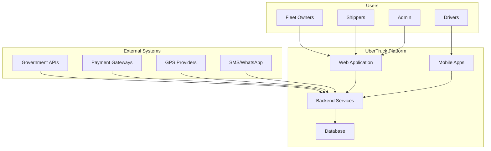

# Software Requirements Specification (SRS)
## UberTruck Fleet Management Platform
### Version 1.0 | February 2024

---

## 1. INTRODUCTION

### 1.1 Purpose
This Software Requirements Specification (SRS) document provides a comprehensive description of the UberTruck Fleet Management Platform, designed to revolutionize heavy vehicle logistics for India's mining, quarrying, cement, and fertilizer industries.

### 1.2 Scope
```yaml
project_name: "UberTruck Fleet Management Platform"
project_code: "UT-FMP-2024"
target_market: "Indian Heavy Industries"
vehicle_capacity: "25-100 tons"
monthly_capacity: "50,000 MT per client"
deployment_model: "Cloud-based SaaS + Mobile Apps"
```

### 1.3 Definitions, Acronyms, and Abbreviations
```yaml
definitions:
  FMP: Fleet Management Platform
  MT: Metric Tons
  SLA: Service Level Agreement
  POD: Proof of Delivery
  GMV: Gross Merchandise Value
  ETA: Estimated Time of Arrival
  API: Application Programming Interface
  GPS: Global Positioning System
  OTP: One-Time Password
  KYC: Know Your Customer
```

### 1.4 References
- Government of India Motor Vehicle Act 2019
- Mining Regulations 2021
- Environmental Compliance Standards ISO 14001
- API Documentation for i-KHANIJ, e-Transit Pass
- OWASP Security Guidelines

### 1.5 Overview
The document is organized into functional requirements, non-functional requirements, system interfaces, and acceptance criteria for the complete UberTruck platform.

---

## 2. OVERALL DESCRIPTION

### 2.1 Product Perspective


### 2.2 Product Features
```yaml
core_features:
  fleet_management:
    - Vehicle registration and tracking
    - Driver management
    - Route optimization
    - Maintenance scheduling

  booking_system:
    - Spot booking
    - Contract management
    - Load matching
    - Dynamic pricing

  compliance:
    - Permit automation
    - Document management
    - Environmental tracking
    - Government integration

  analytics:
    - Real-time dashboards
    - Performance metrics
    - Predictive insights
    - Financial reporting
```

### 2.3 User Classes and Characteristics
```yaml
user_classes:
  fleet_owners:
    count: "500+ organizations"
    tech_proficiency: "Medium"
    access: "Web + Mobile"

  drivers:
    count: "10,000+ users"
    tech_proficiency: "Low to Medium"
    access: "Mobile only"
    languages: ["Hindi", "Kannada", "Tamil", "Telugu"]

  shippers:
    count: "1,000+ companies"
    tech_proficiency: "Medium to High"
    access: "Web + Mobile"

  platform_admin:
    count: "20+ users"
    tech_proficiency: "High"
    access: "Web only"
```

### 2.4 Operating Environment
```yaml
technical_environment:
  client_side:
    web_browsers: ["Chrome 90+", "Firefox 88+", "Safari 14+", "Edge 90+"]
    mobile_os: ["Android 8.0+", "iOS 13.0+"]
    minimum_ram: "2GB for mobile, 4GB for web"

  server_side:
    cloud_provider: "AWS/Azure/GCP"
    operating_system: "Ubuntu 20.04 LTS"
    runtime: "Node.js 18+, Python 3.9+"
    database: "PostgreSQL 14+, Redis 7+"
```

### 2.5 Design and Implementation Constraints
```yaml
constraints:
  regulatory:
    - Indian data localization requirements
    - Mining permit regulations
    - Environmental compliance

  technical:
    - Offline capability for remote areas
    - Multi-language support mandatory
    - Government API integration required

  business:
    - 4-month ROI requirement
    - 99.9% uptime SLA
    - Support for 50,000 MT monthly operations
```

---

## 3. SPECIFIC REQUIREMENTS

### 3.1 Functional Requirements

#### 3.1.1 User Management
```yaml
FR-UM-001:
  title: "User Registration"
  priority: "HIGH"
  description: "System shall allow users to register with phone/email"
  acceptance_criteria:
    - OTP verification for phone
    - Email verification link
    - Role-based registration forms
    - KYC document upload

FR-UM-002:
  title: "Multi-factor Authentication"
  priority: "HIGH"
  description: "System shall support 2FA for all user types"
  acceptance_criteria:
    - SMS OTP
    - Biometric for mobile
    - Session management
    - Password policies

FR-UM-003:
  title: "Role-Based Access Control"
  priority: "HIGH"
  description: "System shall implement RBAC with predefined roles"
  roles:
    - Super Admin
    - Fleet Owner
    - Fleet Manager
    - Driver
    - Shipper
    - Viewer
```

#### 3.1.2 Fleet Management
```yaml
FR-FM-001:
  title: "Vehicle Registration"
  priority: "HIGH"
  description: "System shall allow registration of vehicles with specifications"
  fields:
    required:
      - Registration number
      - Vehicle type
      - Capacity (tons)
      - Owner details
    optional:
      - GPS device ID
      - Insurance details
      - Permit details

FR-FM-002:
  title: "Real-time GPS Tracking"
  priority: "HIGH"
  description: "System shall track vehicles in real-time"
  specifications:
    - Update frequency: 30 seconds
    - Location accuracy: 10 meters
    - Speed monitoring
    - Route deviation alerts
    - Geofencing support

FR-FM-003:
  title: "Driver Assignment"
  priority: "HIGH"
  description: "System shall manage driver-vehicle assignments"
  features:
    - Multiple drivers per vehicle
    - Shift management
    - License verification
    - Performance tracking
```

#### 3.1.3 Booking Management
```yaml
FR-BM-001:
  title: "Create Booking"
  priority: "HIGH"
  description: "System shall allow creation of transport bookings"
  booking_types:
    - Spot booking
    - Contract booking
    - Recurring booking
  required_information:
    - Pickup location
    - Drop location
    - Material type
    - Quantity (MT)
    - Required date/time

FR-BM-002:
  title: "Dynamic Pricing"
  priority: "MEDIUM"
  description: "System shall calculate prices dynamically"
  factors:
    - Distance
    - Material type
    - Vehicle type
    - Demand-supply ratio
    - Fuel prices
    - Return load availability

FR-BM-003:
  title: "Load Matching"
  priority: "HIGH"
  description: "System shall match loads with available vehicles"
  algorithm_factors:
    - Vehicle capacity
    - Current location
    - Driver availability
    - Route optimization
    - Cost efficiency
```

#### 3.1.4 Compliance Management
```yaml
FR-CM-001:
  title: "Mining Permit Integration"
  priority: "HIGH"
  description: "System shall integrate with government mining portals"
  integrations:
    - Karnataka i-KHANIJ
    - Tamil Nadu e-Transit
    - AP Mining Portal
    - Telangana T-Sand

FR-CM-002:
  title: "Document Management"
  priority: "HIGH"
  description: "System shall manage all compliance documents"
  document_types:
    - Vehicle RC
    - Insurance
    - Permits
    - Driver license
    - PUC certificates
    - E-way bills

FR-CM-003:
  title: "Automated E-way Bill"
  priority: "HIGH"
  description: "System shall generate e-way bills automatically"
  features:
    - GST portal integration
    - Auto-fill from booking
    - Bulk generation
    - Extension handling
```

#### 3.1.5 Payment Processing
```yaml
FR-PP-001:
  title: "Multiple Payment Methods"
  priority: "HIGH"
  description: "System shall support multiple payment options"
  methods:
    - Bank transfer
    - UPI
    - Credit/Debit cards
    - Wallet
    - Credit line

FR-PP-002:
  title: "Invoice Generation"
  priority: "HIGH"
  description: "System shall generate GST-compliant invoices"
  features:
    - Auto-generation on trip completion
    - GST calculation
    - PDF generation
    - Email/WhatsApp delivery

FR-PP-003:
  title: "Settlement Processing"
  priority: "HIGH"
  description: "System shall process settlements automatically"
  timeline:
    - Daily settlements for spot bookings
    - Weekly for regular clients
    - Monthly for contract clients
```

### 3.2 Non-Functional Requirements

#### 3.2.1 Performance Requirements
```yaml
NFR-PR-001:
  category: "Response Time"
  requirement: "All API responses within 200ms"
  measurement: "95th percentile"

NFR-PR-002:
  category: "Throughput"
  requirement: "Support 10,000 concurrent users"
  measurement: "Load testing results"

NFR-PR-003:
  category: "Data Processing"
  requirement: "Process 1 million GPS updates per minute"
  measurement: "System monitoring"

NFR-PR-004:
  category: "Report Generation"
  requirement: "Generate reports within 5 seconds"
  measurement: "For datasets up to 100,000 records"
```

#### 3.2.2 Security Requirements
```yaml
NFR-SR-001:
  category: "Data Encryption"
  requirement: "All data encrypted at rest and in transit"
  standard: "AES-256, TLS 1.3"

NFR-SR-002:
  category: "Authentication"
  requirement: "OAuth 2.0 / JWT implementation"
  token_expiry: "Access: 15 min, Refresh: 7 days"

NFR-SR-003:
  category: "Audit Trail"
  requirement: "Complete audit logging of all actions"
  retention: "7 years"

NFR-SR-004:
  category: "Compliance"
  requirement: "GDPR, Indian Data Protection Bill compliant"
  certification: "ISO 27001"
```

#### 3.2.3 Reliability Requirements
```yaml
NFR-RR-001:
  category: "Availability"
  requirement: "99.9% uptime"
  measurement: "Monthly average"

NFR-RR-002:
  category: "Mean Time To Recovery"
  requirement: "< 1 hour MTTR"
  measurement: "Average over quarter"

NFR-RR-003:
  category: "Data Durability"
  requirement: "99.999999999% (11 nines)"
  method: "Multi-region replication"

NFR-RR-004:
  category: "Backup"
  requirement: "Daily backups with 30-day retention"
  RPO: "1 hour"
  RTO: "4 hours"
```

#### 3.2.4 Scalability Requirements
```yaml
NFR-SC-001:
  category: "Horizontal Scaling"
  requirement: "Auto-scale from 10 to 1000 instances"
  trigger: "CPU > 70% or Memory > 80%"

NFR-SC-002:
  category: "Database Scaling"
  requirement: "Support 100TB data growth"
  method: "Sharding and partitioning"

NFR-SC-003:
  category: "Geographic Scaling"
  requirement: "Multi-region deployment capability"
  regions: ["Mumbai", "Chennai", "Hyderabad"]
```

### 3.3 Interface Requirements

#### 3.3.1 User Interfaces
```yaml
UI-001:
  interface: "Web Dashboard"
  description: "Responsive web application"
  specifications:
    - Material Design 3.0
    - Mobile responsive
    - Dark/Light theme
    - Accessibility WCAG 2.1 AA

UI-002:
  interface: "Mobile App - Driver"
  description: "Native mobile app for drivers"
  specifications:
    - Offline capability
    - Voice navigation
    - Multi-language
    - Low battery optimization

UI-003:
  interface: "Mobile App - Fleet Owner"
  description: "Management app for fleet owners"
  specifications:
    - Real-time tracking
    - Push notifications
    - Biometric authentication
    - Data visualization
```

#### 3.3.2 Hardware Interfaces
```yaml
HI-001:
  interface: "GPS Devices"
  protocols: ["TCP/IP", "MQTT", "HTTP"]
  devices:
    - Teltonika FMB140
    - Queclink GV300
    - AIS 140 certified devices

HI-002:
  interface: "Weighbridge Systems"
  protocols: ["RS-232", "Modbus", "API"]
  integration: "Real-time weight capture"
```

#### 3.3.3 Software Interfaces
```yaml
SI-001:
  interface: "Government APIs"
  systems:
    - Vahan (Vehicle data)
    - Sarathi (License data)
    - GST Portal
    - Mining portals

SI-002:
  interface: "Payment Gateways"
  providers:
    - Razorpay
    - PayU
    - Cashfree
  methods: ["REST API", "Webhooks"]

SI-003:
  interface: "Communication Services"
  services:
    - Twilio (SMS)
    - WhatsApp Business API
    - SendGrid (Email)
    - FCM (Push notifications)
```

### 3.4 System Features

#### 3.4.1 Offline Capability
```yaml
SF-001:
  feature: "Offline Mode"
  description: "Core functions work without internet"
  capabilities:
    - View assigned trips
    - Update status
    - Capture GPS locally
    - Take photos
    - Queue for sync
  sync_strategy: "Automatic when online"
```

#### 3.4.2 Multi-Language Support
```yaml
SF-002:
  feature: "Language Support"
  languages:
    - English
    - Hindi
    - Kannada
    - Tamil
    - Telugu
    - Malayalam
  coverage:
    - UI elements
    - Voice commands
    - SMS/Notifications
    - Reports
```

#### 3.4.3 Analytics and Reporting
```yaml
SF-003:
  feature: "Business Intelligence"
  reports:
    operational:
      - Fleet utilization
      - Route efficiency
      - Fuel consumption
      - Maintenance status
    financial:
      - Revenue analysis
      - Cost breakdowns
      - Profitability by route
      - Pending payments
    compliance:
      - Permit status
      - Document expiry
      - Violation reports
      - Audit trails
```

---

## 4. ACCEPTANCE CRITERIA

### 4.1 Functional Testing
```yaml
acceptance_tests:
  user_management:
    - Successfully register 1000 users
    - Login within 2 seconds
    - Role permissions enforced

  booking_flow:
    - Create booking in < 30 seconds
    - Automatic vehicle assignment
    - Real-time status updates
    - POD capture and validation

  payment_processing:
    - Process 100 simultaneous payments
    - Invoice generation < 5 seconds
    - Settlement reconciliation 100% accurate
```

### 4.2 Performance Testing
```yaml
performance_criteria:
  load_testing:
    - 10,000 concurrent users
    - 1 million GPS updates/minute
    - Response time < 200ms (95%)

  stress_testing:
    - System stability at 150% load
    - Graceful degradation
    - Auto-recovery mechanisms
```

### 4.3 Security Testing
```yaml
security_criteria:
  penetration_testing:
    - OWASP Top 10 compliance
    - No critical vulnerabilities
    - Data encryption verified

  compliance_testing:
    - GDPR compliance
    - Indian data laws
    - Industry standards
```

---

## 5. APPENDICES

### Appendix A: Use Case Diagrams
[Detailed use case diagrams for each module]

### Appendix B: Data Dictionary
[Complete data field definitions and validations]

### Appendix C: Business Rules
[Comprehensive business logic documentation]

### Appendix D: Integration Specifications
[Detailed API documentation for all integrations]

---

## APPROVAL

| Role | Name | Signature | Date |
|------|------|-----------|------|
| Project Sponsor | | | |
| Product Owner | | | |
| Technical Lead | | | |
| QA Lead | | | |

---

## REVISION HISTORY

| Version | Date | Author | Description |
|---------|------|--------|-------------|
| 1.0 | Feb 2024 | Team | Initial version |