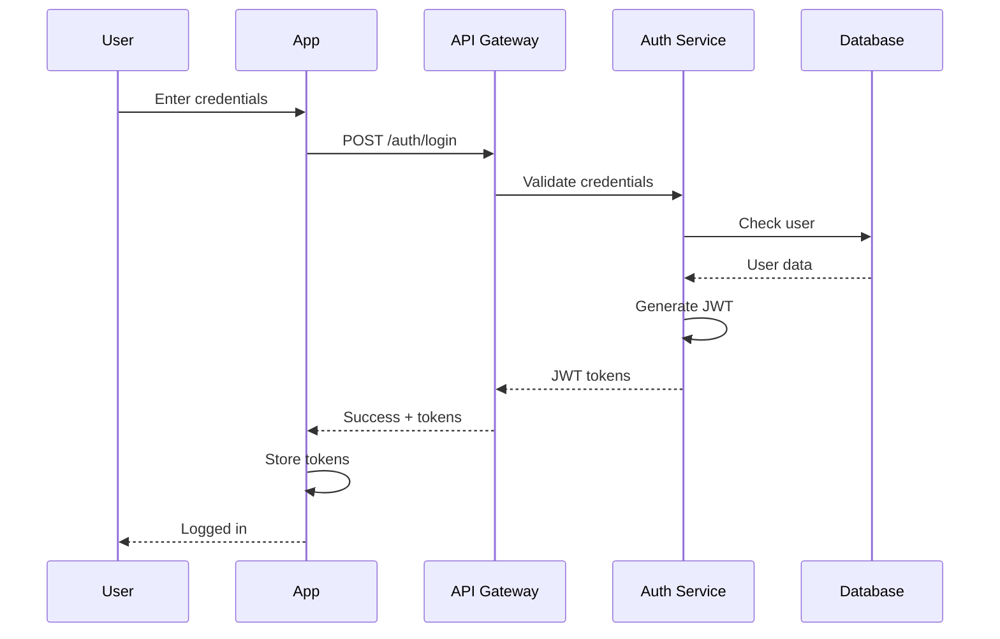

# Technical Design Document (TDD)
## UberTruck Fleet Management Platform
### Version 1.0 | February 2024

---

## 1. INTRODUCTION

### 1.1 Purpose
This Technical Design Document provides detailed technical specifications for implementing the UberTruck Fleet Management Platform, translating business requirements into technical solutions.

### 1.2 Scope
This document covers system architecture, database design, API specifications, security implementation, and deployment strategy for the UberTruck platform.

### 1.3 Target Audience
- Development Team
- System Architects
- DevOps Engineers
- QA Engineers
- Technical Managers

---

## 2. SYSTEM ARCHITECTURE

### 2.1 High-Level Architecture
```yaml
architecture_pattern: "Microservices with Event-Driven Architecture"
deployment_model: "Cloud-Native, Kubernetes-based"
communication: "REST APIs + Message Queue + WebSockets"
```

### 2.2 Detailed Architecture Diagram
```
┌─────────────────────────────────────────────────────────────────┐
│                         Load Balancer                            │
│                    (AWS ALB / CloudFlare)                        │
└──────────────────────────────┬──────────────────────────────────┘
                               │
                ┌──────────────┼──────────────┐
                │              │              │
        ┌───────────┐  ┌───────────┐  ┌───────────┐
        │  Web App  │  │Mobile APIs│  │WebSocket  │
        │  (React)  │  │(REST/GQL) │  │  Server   │
        └───────────┘  └───────────┘  └───────────┘
                               │
                ┌──────────────┼──────────────┐
                │      API Gateway (Kong)     │
                └──────────────┬──────────────┘
                               │
    ┌──────────────────────────┼──────────────────────────┐
    │                   Microservices Layer                │
    ├────────────┬─────────────┬────────────┬─────────────┤
    │   Auth     │   Fleet     │  Booking   │  Tracking   │
    │  Service   │  Service    │  Service   │  Service    │
    ├────────────┼─────────────┼────────────┼─────────────┤
    │  Payment   │ Compliance  │ Analytics  │Notification │
    │  Service   │  Service    │  Service   │  Service    │
    └────────────┴─────────────┴────────────┴─────────────┘
                               │
    ┌──────────────────────────┼──────────────────────────┐
    │                  Message Queue (RabbitMQ)            │
    └──────────────────────────┬──────────────────────────┘
                               │
    ┌──────────────────────────┼──────────────────────────┐
    │                    Data Layer                        │
    ├────────────┬─────────────┬────────────┬─────────────┤
    │PostgreSQL  │    Redis    │   S3/MinIO │Elasticsearch│
    │  Primary   │    Cache    │   Storage  │   Search    │
    └────────────┴─────────────┴────────────┴─────────────┘
```

### 2.3 Component Design

#### 2.3.1 API Gateway
```yaml
component: "API Gateway"
technology: "Kong Gateway"
responsibilities:
  - Request routing
  - Rate limiting
  - Authentication/Authorization
  - Request/Response transformation
  - API versioning

configuration:
  rate_limits:
    - public_api: "100 requests/minute"
    - authenticated_api: "1000 requests/minute"
    - premium_api: "10000 requests/minute"

  plugins:
    - jwt_authentication
    - cors
    - request_transformer
    - response_transformer
    - prometheus_monitoring
```

#### 2.3.2 Microservices Design
```yaml
auth_service:
  technology: "Node.js + Express"
  database: "PostgreSQL + Redis"
  endpoints:
    POST /auth/register
    POST /auth/login
    POST /auth/refresh
    POST /auth/logout
    GET  /auth/verify
    POST /auth/2fa/enable
    POST /auth/2fa/verify

fleet_service:
  technology: "Node.js + NestJS"
  database: "PostgreSQL"
  endpoints:
    POST   /vehicles
    GET    /vehicles
    PUT    /vehicles/:id
    DELETE /vehicles/:id
    POST   /vehicles/:id/assign-driver
    GET    /vehicles/:id/tracking
    POST   /vehicles/:id/maintenance

booking_service:
  technology: "Node.js + NestJS"
  database: "PostgreSQL"
  endpoints:
    POST   /bookings
    GET    /bookings
    PUT    /bookings/:id
    DELETE /bookings/:id
    POST   /bookings/:id/assign-vehicle
    PUT    /bookings/:id/status
    POST   /bookings/:id/pod

tracking_service:
  technology: "Python + FastAPI"
  database: "TimescaleDB + Redis"
  endpoints:
    POST   /tracking/update
    GET    /tracking/vehicle/:id
    GET    /tracking/booking/:id
    POST   /tracking/geofence
    GET    /tracking/history
```

### 2.4 Database Design

#### 2.4.1 Database Architecture
```yaml
primary_database:
  type: "PostgreSQL 14"
  purpose: "Transactional data"
  replication: "Master-Slave with 2 read replicas"
  backup: "Daily automated backups"

time_series_database:
  type: "TimescaleDB"
  purpose: "GPS tracking data"
  retention: "90 days hot, 2 years cold"

cache_layer:
  type: "Redis Cluster"
  purpose: "Session management, caching"
  configuration: "3 masters, 3 slaves"

search_engine:
  type: "Elasticsearch"
  purpose: "Full-text search, logs"
  cluster: "3 nodes minimum"
```

#### 2.4.2 Data Models
```sql
-- Core Domain Models

-- Organizations (Multi-tenant)
CREATE TABLE organizations (
    id UUID PRIMARY KEY DEFAULT gen_random_uuid(),
    name VARCHAR(255) NOT NULL,
    type VARCHAR(50) NOT NULL,
    subscription_tier VARCHAR(50),
    settings JSONB DEFAULT '{}',
    created_at TIMESTAMPTZ DEFAULT NOW(),
    updated_at TIMESTAMPTZ DEFAULT NOW()
);

-- Users with Multi-tenancy
CREATE TABLE users (
    id UUID PRIMARY KEY DEFAULT gen_random_uuid(),
    organization_id UUID REFERENCES organizations(id),
    email VARCHAR(255),
    phone VARCHAR(20) NOT NULL UNIQUE,
    password_hash VARCHAR(255),
    role VARCHAR(50) NOT NULL,
    profile JSONB DEFAULT '{}',
    is_active BOOLEAN DEFAULT true,
    created_at TIMESTAMPTZ DEFAULT NOW(),

    INDEX idx_users_org (organization_id),
    INDEX idx_users_phone (phone),
    INDEX idx_users_role (role)
);

-- Vehicles with Performance Metrics
CREATE TABLE vehicles (
    id UUID PRIMARY KEY DEFAULT gen_random_uuid(),
    organization_id UUID REFERENCES organizations(id),
    registration_number VARCHAR(20) UNIQUE NOT NULL,
    vehicle_type VARCHAR(50) NOT NULL,
    capacity_tons DECIMAL(6,2),
    current_status VARCHAR(50) DEFAULT 'available',
    current_location GEOGRAPHY(POINT, 4326),
    metrics JSONB DEFAULT '{}',
    created_at TIMESTAMPTZ DEFAULT NOW(),

    INDEX idx_vehicles_org (organization_id),
    INDEX idx_vehicles_status (current_status),
    INDEX idx_vehicles_location USING GIST(current_location)
);

-- Optimized Bookings Table
CREATE TABLE bookings (
    id UUID PRIMARY KEY DEFAULT gen_random_uuid(),
    booking_number VARCHAR(20) UNIQUE NOT NULL,
    organization_id UUID REFERENCES organizations(id),
    vehicle_id UUID REFERENCES vehicles(id),

    pickup_location GEOGRAPHY(POINT, 4326) NOT NULL,
    dropoff_location GEOGRAPHY(POINT, 4326) NOT NULL,

    cargo_details JSONB NOT NULL,
    pricing JSONB NOT NULL,
    status VARCHAR(50) NOT NULL,

    created_at TIMESTAMPTZ DEFAULT NOW(),
    updated_at TIMESTAMPTZ DEFAULT NOW(),

    INDEX idx_bookings_org (organization_id),
    INDEX idx_bookings_status (status),
    INDEX idx_bookings_created (created_at DESC),
    INDEX idx_bookings_vehicle (vehicle_id)
) PARTITION BY RANGE (created_at);

-- Create monthly partitions for bookings
CREATE TABLE bookings_2024_02 PARTITION OF bookings
    FOR VALUES FROM ('2024-02-01') TO ('2024-03-01');

-- Tracking data in TimescaleDB
CREATE TABLE tracking_data (
    time TIMESTAMPTZ NOT NULL,
    vehicle_id UUID NOT NULL,
    location GEOGRAPHY(POINT, 4326),
    speed DECIMAL(5,2),
    heading INTEGER,
    engine_status BOOLEAN,
    fuel_level DECIMAL(5,2),
    metadata JSONB,

    PRIMARY KEY (vehicle_id, time)
);

-- Convert to hypertable for TimescaleDB
SELECT create_hypertable('tracking_data', 'time');

-- Create continuous aggregate for real-time analytics
CREATE MATERIALIZED VIEW vehicle_metrics_hourly
WITH (timescaledb.continuous) AS
SELECT
    vehicle_id,
    time_bucket('1 hour', time) AS hour,
    AVG(speed) as avg_speed,
    COUNT(*) as data_points,
    ST_MakeLine(location::geometry ORDER BY time) as route
FROM tracking_data
GROUP BY vehicle_id, hour;
```

### 2.5 API Design

#### 2.5.1 API Standards
```yaml
api_standards:
  format: "RESTful JSON API"
  versioning: "URL path versioning (/api/v1/)"
  authentication: "JWT Bearer tokens"

  response_format:
    success:
      status: "success"
      data: {}
      meta: {}

    error:
      status: "error"
      error:
        code: "ERROR_CODE"
        message: "Human readable message"
        details: {}

  http_status_codes:
    200: "OK"
    201: "Created"
    400: "Bad Request"
    401: "Unauthorized"
    403: "Forbidden"
    404: "Not Found"
    429: "Too Many Requests"
    500: "Internal Server Error"
```

#### 2.5.2 API Specifications
```typescript
// Authentication API
interface AuthAPI {
  // User Registration
  POST /api/v1/auth/register
  Request: {
    phone: string;
    email?: string;
    password: string;
    role: 'fleet_owner' | 'driver' | 'shipper';
    organization?: string;
  }
  Response: {
    user: User;
    tokens: {
      access: string;
      refresh: string;
    }
  }

  // User Login
  POST /api/v1/auth/login
  Request: {
    phone: string;
    password: string;
    otp?: string;
  }
  Response: {
    user: User;
    tokens: {
      access: string;
      refresh: string;
    }
  }
}

// Fleet Management API
interface FleetAPI {
  // Create Vehicle
  POST /api/v1/vehicles
  Headers: {
    Authorization: Bearer {token}
  }
  Request: {
    registration_number: string;
    vehicle_type: VehicleType;
    capacity_tons: number;
    gps_device_id?: string;
  }
  Response: {
    vehicle: Vehicle;
  }

  // Get Vehicles with Filtering
  GET /api/v1/vehicles
  Query: {
    status?: 'available' | 'on_trip' | 'maintenance';
    type?: VehicleType;
    page?: number;
    limit?: number;
    sort?: string;
  }
  Response: {
    vehicles: Vehicle[];
    meta: {
      total: number;
      page: number;
      pages: number;
    }
  }
}

// Booking API
interface BookingAPI {
  // Create Booking
  POST /api/v1/bookings
  Request: {
    pickup: {
      location: [longitude, latitude];
      address: string;
      date_time: ISO8601;
    };
    dropoff: {
      location: [longitude, latitude];
      address: string;
    };
    cargo: {
      type: CargoType;
      weight_tons: number;
      description?: string;
    };
    vehicle_type?: VehicleType;
  }
  Response: {
    booking: Booking;
    estimated_price: number;
    estimated_time: number;
  }

  // Real-time Tracking
  GET /api/v1/bookings/{id}/tracking
  Response: {
    booking_id: string;
    vehicle: {
      id: string;
      registration: string;
      current_location: [longitude, latitude];
      speed: number;
      eta: ISO8601;
    };
    driver: {
      name: string;
      phone: string;
      rating: number;
    };
    route: {
      completed: GeoJSON;
      remaining: GeoJSON;
    };
  }
}
```

### 2.6 Security Design

#### 2.6.1 Security Architecture
```yaml
security_layers:
  network_security:
    - WAF (Web Application Firewall)
    - DDoS protection
    - SSL/TLS encryption
    - VPN for admin access

  application_security:
    - JWT authentication
    - OAuth 2.0 for third-party
    - API rate limiting
    - Input validation
    - SQL injection prevention
    - XSS protection

  data_security:
    - Encryption at rest (AES-256)
    - Encryption in transit (TLS 1.3)
    - Database encryption
    - Sensitive data masking
    - PII tokenization

  infrastructure_security:
    - Container scanning
    - Secret management (Vault)
    - RBAC for Kubernetes
    - Network segmentation
    - Regular security patches
```

#### 2.6.2 Authentication Flow


### 2.7 Integration Design

#### 2.7.1 External Integrations
```yaml
government_apis:
  vahan_integration:
    endpoint: "https://vahan.nic.in/api/v1/"
    method: "REST API"
    authentication: "API Key"
    rate_limit: "100 requests/minute"

  gst_portal:
    endpoint: "https://api.gst.gov.in/v1/"
    method: "REST API"
    authentication: "OAuth 2.0"
    features:
      - E-way bill generation
      - GST verification
      - Invoice validation

payment_gateways:
  razorpay:
    endpoint: "https://api.razorpay.com/v1/"
    methods: ["cards", "upi", "netbanking", "wallets"]
    webhooks:
      - payment.captured
      - payment.failed
      - refund.processed

  settlement_flow:
    schedule: "T+2 days"
    split_payment: true
    escrow_support: true

gps_providers:
  teltonika:
    protocol: "TCP/IP"
    port: 5555
    format: "Codec 8"
    frequency: "30 seconds"

communication:
  twilio:
    services: ["SMS", "Voice", "WhatsApp"]
    fallback: true

  whatsapp_business:
    template_messages: true
    interactive_messages: true
    media_support: true
```

#### 2.7.2 Integration Patterns
```yaml
patterns:
  circuit_breaker:
    threshold: 5
    timeout: 30000
    reset_timeout: 60000

  retry_mechanism:
    max_attempts: 3
    backoff: "exponential"
    initial_delay: 1000

  fallback:
    cache_fallback: true
    default_values: true
    degraded_service: true

  rate_limiting:
    window: 60000
    max_requests: 100
    queue_enabled: true
```

### 2.8 Performance Design

#### 2.8.1 Caching Strategy
```yaml
caching_layers:
  cdn_cache:
    provider: "CloudFlare"
    static_assets: true
    api_responses: false
    ttl: 86400

  application_cache:
    provider: "Redis"
    session_data: true
    frequent_queries: true
    ttl: 3600

  database_cache:
    query_cache: true
    result_cache: true
    ttl: 300

cache_keys:
  user_session: "session:{user_id}"
  vehicle_status: "vehicle:{vehicle_id}:status"
  booking_details: "booking:{booking_id}"
  route_calculation: "route:{from}:{to}"
```

#### 2.8.2 Database Optimization
```yaml
optimization_techniques:
  indexing:
    - B-tree indexes for equality
    - GiST indexes for geospatial
    - GIN indexes for JSONB
    - Partial indexes for filtered queries

  partitioning:
    - Range partitioning for bookings
    - List partitioning for regions
    - Hash partitioning for users

  query_optimization:
    - Prepared statements
    - Connection pooling
    - Query plan caching
    - Materialized views

  maintenance:
    - Auto vacuum
    - Auto analyze
    - Index rebuild
    - Statistics update
```

### 2.9 Monitoring and Observability

#### 2.9.1 Monitoring Stack
```yaml
monitoring_tools:
  metrics:
    tool: "Prometheus + Grafana"
    metrics:
      - API response times
      - Database query times
      - Resource utilization
      - Business metrics

  logging:
    tool: "ELK Stack"
    log_levels: ["DEBUG", "INFO", "WARN", "ERROR", "FATAL"]
    structured_logging: true
    correlation_id: true

  tracing:
    tool: "Jaeger"
    sampling_rate: 0.1
    trace_points:
      - API endpoints
      - Database queries
      - External API calls
      - Message queue operations

  alerting:
    tool: "AlertManager"
    channels: ["Email", "Slack", "PagerDuty"]
    severity_levels: ["Critical", "Warning", "Info"]
```

#### 2.9.2 Key Metrics
```yaml
application_metrics:
  - api_request_rate
  - api_error_rate
  - api_response_time_p99
  - active_users_count
  - booking_creation_rate
  - payment_success_rate

infrastructure_metrics:
  - cpu_utilization
  - memory_utilization
  - disk_io_rate
  - network_throughput
  - pod_restart_count
  - database_connections

business_metrics:
  - daily_bookings_count
  - vehicle_utilization_rate
  - average_trip_duration
  - revenue_per_day
  - customer_satisfaction_score
```

---

## 3. DEVELOPMENT STANDARDS

### 3.1 Coding Standards
```yaml
languages:
  typescript:
    style_guide: "Airbnb"
    linter: "ESLint"
    formatter: "Prettier"

  python:
    style_guide: "PEP 8"
    linter: "Pylint"
    formatter: "Black"

naming_conventions:
  variables: "camelCase"
  constants: "UPPER_SNAKE_CASE"
  classes: "PascalCase"
  files: "kebab-case"
  database: "snake_case"

git_workflow:
  branching: "GitFlow"
  commit_format: "Conventional Commits"
  pr_reviews: "Minimum 2 approvals"
```

### 3.2 Testing Standards
```yaml
test_coverage:
  unit_tests: "80% minimum"
  integration_tests: "Required for all APIs"
  e2e_tests: "Critical user flows"

testing_tools:
  unit: ["Jest", "Mocha", "Pytest"]
  integration: ["Supertest", "Postman"]
  e2e: ["Cypress", "Playwright"]
  load: ["K6", "JMeter"]
```

---

## 4. DEPLOYMENT ARCHITECTURE

### 4.1 Container Strategy
```yaml
containerization:
  base_images:
    node: "node:18-alpine"
    python: "python:3.9-slim"
    nginx: "nginx:alpine"

  dockerfile_standards:
    - Multi-stage builds
    - Non-root user
    - Security scanning
    - Layer caching

  registry:
    provider: "AWS ECR"
    scanning: "Enabled"
    retention: "Keep last 10 versions"
```

### 4.2 Kubernetes Architecture
```yaml
kubernetes:
  cluster:
    provider: "EKS/AKS/GKE"
    version: "1.27"
    nodes:
      min: 3
      max: 50
      type: "t3.large"

  namespaces:
    - production
    - staging
    - development

  resources:
    requests:
      cpu: "100m"
      memory: "128Mi"
    limits:
      cpu: "1000m"
      memory: "1Gi"

  autoscaling:
    hpa:
      min_replicas: 2
      max_replicas: 10
      target_cpu: 70

  networking:
    ingress: "NGINX"
    service_mesh: "Istio"
    network_policies: "Enabled"
```

### 4.3 CI/CD Pipeline
```yaml
pipeline_stages:
  1_build:
    - Checkout code
    - Install dependencies
    - Run linters
    - Build application

  2_test:
    - Unit tests
    - Integration tests
    - Security scanning
    - Code coverage

  3_package:
    - Build Docker image
    - Scan vulnerabilities
    - Push to registry
    - Tag version

  4_deploy:
    - Deploy to staging
    - Run smoke tests
    - Deploy to production
    - Health checks

tools:
  ci_cd: "GitLab CI / GitHub Actions"
  artifact_storage: "S3"
  secret_management: "HashiCorp Vault"
```

---

## 5. DISASTER RECOVERY

### 5.1 Backup Strategy
```yaml
backup_policy:
  database:
    frequency: "Every 6 hours"
    retention: "30 days"
    type: "Incremental"
    storage: "S3 cross-region"

  application_data:
    frequency: "Daily"
    retention: "7 days"
    type: "Full"

  configuration:
    frequency: "On change"
    retention: "Unlimited"
    type: "Version controlled"
```

### 5.2 Recovery Procedures
```yaml
recovery_targets:
  rto: "4 hours"
  rpo: "1 hour"

recovery_procedures:
  database_failure:
    - Promote read replica
    - Restore from backup
    - Replay transaction logs

  service_failure:
    - Auto-restart pods
    - Scale horizontally
    - Fallback to cache

  region_failure:
    - DNS failover
    - Activate DR region
    - Sync data
```

---

## 6. APPENDICES

### Appendix A: Database Indexes
[Complete list of all database indexes and their purposes]

### Appendix B: API Error Codes
[Comprehensive error code dictionary]

### Appendix C: Configuration Templates
[Environment-specific configuration files]

### Appendix D: Security Checklist
[Security implementation verification checklist]

---

## APPROVAL

| Role | Name | Signature | Date |
|------|------|-----------|------|
| Technical Architect | | | |
| Development Lead | | | |
| DevOps Lead | | | |
| Security Lead | | | |

---

## REVISION HISTORY

| Version | Date | Author | Description |
|---------|------|--------|-------------|
| 1.0 | Feb 2024 | Team | Initial version |