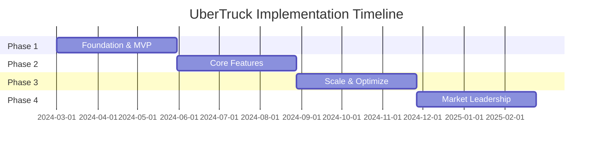

# Project Implementation Plan (PIP)
## UberTruck Fleet Management Platform
### Version 1.0 | February 2024

---

## 1. EXECUTIVE SUMMARY

### 1.1 Project Overview
```yaml
project_name: "UberTruck Fleet Management Platform"
duration: "12 months"
budget: "₹6.5 Crores"
team_size: "28 members"
methodology: "Agile Scrum with 2-week sprints"
target_launch: "Phase 1 - Month 3, Full Platform - Month 12"
expected_roi: "4.4 months post-deployment"
```

### 1.2 Key Deliverables
- Web Application for Fleet Management
- Mobile Apps (Driver & Manager)
- API Platform with 50+ endpoints
- Integration with Government Systems
- Real-time Tracking System
- Analytics Dashboard
- Documentation & Training Materials

### 1.3 Success Criteria
- 10,000 vehicles onboarded
- 50,000 MT monthly capacity handling
- 99.9% uptime achieved
- 35% cost reduction for clients
- 95% on-time delivery rate

---

## 2. PROJECT PHASES

### 2.1 Phase Overview


### 2.2 Detailed Phase Plan

#### Phase 1: Foundation & MVP (Months 1-3)
```yaml
duration: "3 months"
budget: "₹1.5 Crores"
team: "12 members"

deliverables:
  month_1:
    week_1_2:
      - Project setup and infrastructure
      - Team onboarding and training
      - Development environment setup
      - Database schema creation

    week_3_4:
      - Core authentication system
      - User management module
      - Basic vehicle registration
      - Initial API framework

  month_2:
    week_1_2:
      - GPS integration framework
      - Basic booking system
      - Driver assignment logic
      - Payment gateway integration

    week_3_4:
      - Mobile app foundation
      - Real-time tracking MVP
      - Basic reporting module
      - Initial testing framework

  month_3:
    week_1_2:
      - Karnataka mining API integration
      - Document management system
      - Basic compliance module
      - Notification service

    week_3_4:
      - MVP testing and bug fixes
      - Pilot deployment (50 vehicles)
      - User training sessions
      - Performance optimization

success_metrics:
  - 50 vehicles successfully tracked
  - 500 bookings processed
  - 95% system uptime
  - Core APIs functional
```

#### Phase 2: Core Features (Months 4-6)
```yaml
duration: "3 months"
budget: "₹1.8 Crores"
team: "18 members"

deliverables:
  month_4:
    - Advanced fleet management
    - Contract management system
    - Multi-language support (Kannada, Tamil)
    - Enhanced routing algorithm
    - Compliance automation
    - Predictive maintenance module

  month_5:
    - Voice booking system
    - WhatsApp integration
    - Offline capability
    - Advanced analytics
    - Driver performance system
    - Customer portal

  month_6:
    - Full marketplace launch
    - Dynamic pricing engine
    - Environmental tracking
    - Multi-state permit integration
    - Advanced reporting
    - Beta release (500 vehicles)

success_metrics:
  - 500 vehicles onboarded
  - 5,000 bookings/month
  - 4 language support
  - 20% efficiency improvement
```

#### Phase 3: Scale & Optimize (Months 7-9)
```yaml
duration: "3 months"
budget: "₹1.7 Crores"
team: "22 members"

deliverables:
  month_7:
    - AI-powered dispatch system
    - Machine learning models
    - Advanced geofencing
    - Telugu, Malayalam support
    - Enterprise APIs
    - Tamil Nadu expansion

  month_8:
    - Blockchain documentation
    - IoT sensor integration
    - Predictive analytics
    - Carbon footprint tracking
    - Andhra Pradesh launch
    - 2,000 vehicles target

  month_9:
    - Cross-platform optimization
    - Advanced security features
    - Performance tuning
    - Telangana expansion
    - Partner integrations
    - 5,000 vehicles target

success_metrics:
  - 5,000 vehicles active
  - 25,000 MT monthly throughput
  - 3-state coverage
  - 30% cost reduction achieved
```

#### Phase 4: Market Leadership (Months 10-12)
```yaml
duration: "3 months"
budget: "₹1.5 Crores"
team: "25 members"

deliverables:
  month_10:
    - Pan-South India coverage
    - Advanced AI features
    - Complete automation
    - Enterprise partnerships
    - White-label solutions
    - 7,500 vehicles target

  month_11:
    - Electric vehicle support
    - International standards compliance
    - Advanced financial services
    - Strategic partnerships
    - Market consolidation
    - 9,000 vehicles target

  month_12:
    - Platform optimization
    - Future roadmap features
    - Documentation completion
    - Training programs
    - Market leadership position
    - 10,000 vehicles achieved

success_metrics:
  - 10,000 vehicles platform-wide
  - 50,000 MT monthly capacity
  - ₹150 Cr GMV achieved
  - 35% cost reduction delivered
  - 95% customer satisfaction
```

---

## 3. TEAM STRUCTURE

### 3.1 Organizational Chart
```
Project Sponsor
    │
Project Director
    │
    ├── Product Owner
    │   ├── Business Analysts (2)
    │   └── Domain Experts (2)
    │
    ├── Technical Lead
    │   ├── Backend Team (6)
    │   ├── Frontend Team (4)
    │   ├── Mobile Team (3)
    │   └── DevOps Team (2)
    │
    ├── QA Lead
    │   ├── QA Engineers (3)
    │   └── Automation Engineers (2)
    │
    └── Operations Lead
        ├── Customer Success (2)
        └── Support Team (2)
```

### 3.2 Team Roles and Responsibilities

#### Core Team
```yaml
project_director:
  responsibilities:
    - Overall project delivery
    - Stakeholder management
    - Budget control
    - Risk management
  skills: "PMP certified, 10+ years experience"

product_owner:
  responsibilities:
    - Requirements gathering
    - Backlog prioritization
    - Sprint planning
    - User acceptance
  skills: "Domain expertise, Agile certified"

technical_lead:
  responsibilities:
    - Architecture decisions
    - Technology selection
    - Code reviews
    - Technical mentoring
  skills: "Full-stack expertise, System design"

qa_lead:
  responsibilities:
    - Test strategy
    - Quality assurance
    - Test automation
    - Performance testing
  skills: "ISTQB certified, Automation expertise"
```

#### Development Team
```yaml
backend_developers:
  count: 6
  skills:
    - Node.js/TypeScript (4)
    - Python/FastAPI (2)
    - PostgreSQL
    - Microservices
    - API development

frontend_developers:
  count: 4
  skills:
    - React.js
    - TypeScript
    - Material-UI
    - Redux/MobX
    - Responsive design

mobile_developers:
  count: 3
  skills:
    - React Native (2)
    - Flutter (1)
    - Native iOS/Android
    - Offline capabilities
    - Push notifications

devops_engineers:
  count: 2
  skills:
    - Kubernetes
    - Docker
    - CI/CD pipelines
    - AWS/Azure
    - Monitoring tools
```

### 3.3 Resource Allocation
```yaml
phase_1_allocation:
  backend: 3
  frontend: 2
  mobile: 1
  devops: 1
  qa: 2
  ba: 1
  support: 2

phase_2_allocation:
  backend: 4
  frontend: 3
  mobile: 2
  devops: 2
  qa: 3
  ba: 2
  support: 2

phase_3_allocation:
  backend: 5
  frontend: 4
  mobile: 3
  devops: 2
  qa: 3
  ba: 2
  support: 3

phase_4_allocation:
  backend: 6
  frontend: 4
  mobile: 3
  devops: 2
  qa: 4
  ba: 2
  support: 4
```

---

## 4. DEVELOPMENT METHODOLOGY

### 4.1 Agile Implementation
```yaml
methodology: "Scrum"
sprint_duration: "2 weeks"
ceremonies:
  sprint_planning: "First Monday - 4 hours"
  daily_standup: "Daily - 15 minutes"
  sprint_review: "Last Friday - 2 hours"
  sprint_retrospective: "Last Friday - 1 hour"

roles:
  scrum_master: "Rotating among senior developers"
  product_owner: "Dedicated"
  development_team: "Cross-functional"

tools:
  project_management: "Jira"
  communication: "Slack"
  documentation: "Confluence"
  version_control: "Git/GitLab"
  ci_cd: "GitLab CI"
```

### 4.2 Sprint Structure
```yaml
sprint_0:
  name: "Setup Sprint"
  duration: "2 weeks"
  goals:
    - Environment setup
    - Team onboarding
    - Tool configuration
    - Initial planning

typical_sprint:
  day_1:
    - Sprint planning
    - Task breakdown
    - Estimation

  days_2_9:
    - Development
    - Daily standups
    - Code reviews
    - Testing

  day_10:
    - Sprint review
    - Demo to stakeholders
    - Retrospective
    - Next sprint prep

velocity_targets:
  initial: "20 story points"
  month_3: "40 story points"
  month_6: "60 story points"
  steady_state: "50 story points"
```

### 4.3 Definition of Done
```yaml
code_complete:
  - Feature implemented
  - Unit tests written (80% coverage)
  - Code reviewed
  - Documentation updated

testing_complete:
  - Integration tests passed
  - QA sign-off received
  - Performance validated
  - Security scan passed

deployment_ready:
  - Merged to main branch
  - Deployed to staging
  - Acceptance criteria met
  - Release notes prepared
```

---

## 5. IMPLEMENTATION ACTIVITIES

### 5.1 Development Activities
```yaml
backend_development:
  microservices:
    - Auth service
    - Fleet service
    - Booking service
    - Tracking service
    - Payment service
    - Notification service

  integrations:
    - Government APIs
    - Payment gateways
    - GPS providers
    - SMS/WhatsApp
    - Map services

  database:
    - Schema design
    - Migration scripts
    - Optimization
    - Backup procedures

frontend_development:
  web_application:
    - Dashboard design
    - Component library
    - State management
    - API integration
    - Responsive layouts

  mobile_apps:
    - Driver app
    - Manager app
    - Offline sync
    - Push notifications
    - Location services

infrastructure:
  cloud_setup:
    - VPC configuration
    - Kubernetes cluster
    - Load balancers
    - CDN setup

  security:
    - SSL certificates
    - Firewall rules
    - Secret management
    - Access controls
```

### 5.2 Quality Assurance Activities
```yaml
testing_phases:
  unit_testing:
    coverage_target: "80%"
    tools: ["Jest", "Pytest"]
    frequency: "With each commit"

  integration_testing:
    scope: "All API endpoints"
    tools: ["Postman", "Newman"]
    frequency: "Daily"

  system_testing:
    scope: "End-to-end flows"
    tools: ["Cypress", "Selenium"]
    frequency: "Per sprint"

  performance_testing:
    load_testing:
      tool: "K6"
      target: "10,000 concurrent users"

    stress_testing:
      tool: "JMeter"
      target: "Find breaking point"

  security_testing:
    vulnerability_scan:
      tool: "OWASP ZAP"
      frequency: "Weekly"

    penetration_testing:
      provider: "External vendor"
      frequency: "Quarterly"

  uat_testing:
    participants: "50 pilot users"
    duration: "2 weeks"
    success_criteria: "90% approval"
```

### 5.3 Deployment Activities
```yaml
environment_setup:
  development:
    infrastructure: "Minimal"
    data: "Synthetic"
    access: "Development team"

  staging:
    infrastructure: "Production-like"
    data: "Anonymized production"
    access: "Extended team"

  production:
    infrastructure: "Full scale"
    data: "Live"
    access: "Restricted"

deployment_process:
  continuous_integration:
    trigger: "On merge to main"
    steps:
      - Build
      - Test
      - Security scan
      - Package

  continuous_deployment:
    staging:
      trigger: "Automatic on CI success"
      validation: "Smoke tests"

    production:
      trigger: "Manual approval"
      strategy: "Blue-green"
      rollback: "Automatic on failure"

release_management:
  versioning: "Semantic (X.Y.Z)"
  frequency: "Bi-weekly"
  communication: "Release notes"
  rollback_plan: "Always prepared"
```

---

## 6. MILESTONES AND DELIVERABLES

### 6.1 Major Milestones
```yaml
milestone_1:
  name: "MVP Launch"
  date: "Month 3"
  deliverables:
    - Core platform functional
    - 50 vehicles onboarded
    - Basic features operational
  success_criteria:
    - System operational
    - Pilot users satisfied
    - Core KPIs met

milestone_2:
  name: "Beta Release"
  date: "Month 6"
  deliverables:
    - Full feature set
    - 500 vehicles active
    - Multi-language support
  success_criteria:
    - 95% uptime
    - User adoption targets met
    - Performance benchmarks achieved

milestone_3:
  name: "Market Expansion"
  date: "Month 9"
  deliverables:
    - 3-state coverage
    - 5,000 vehicles
    - AI features operational
  success_criteria:
    - Revenue targets met
    - Market share captured
    - Operational excellence

milestone_4:
  name: "Platform Maturity"
  date: "Month 12"
  deliverables:
    - 10,000 vehicles
    - Full automation
    - Market leadership
  success_criteria:
    - ₹150 Cr GMV
    - 35% cost reduction
    - 95% satisfaction
```

### 6.2 Sprint Deliverables
```yaml
sprint_deliverables_template:
  sprint_n:
    user_stories:
      - Story points
      - Acceptance criteria
      - Dependencies

    technical_tasks:
      - Backend APIs
      - Frontend components
      - Database changes
      - Integration points

    documentation:
      - API documentation
      - User guides
      - Technical specs

    testing:
      - Test cases
      - Automation scripts
      - Performance reports

example_sprint_5:
  features:
    - Vehicle tracking API
    - Dashboard UI
    - Driver app login
  apis:
    - POST /tracking/update
    - GET /vehicles/status
    - GET /dashboard/metrics
  tests:
    - 50 unit tests
    - 20 integration tests
    - 5 E2E scenarios
```

---

## 7. RISK MANAGEMENT

### 7.1 Risk Register
```yaml
high_risks:
  technical_complexity:
    probability: "High"
    impact: "High"
    mitigation:
      - Proof of concepts
      - Expert consultation
      - Incremental development
    contingency:
      - Simplify requirements
      - Extend timeline

  government_api_integration:
    probability: "Medium"
    impact: "High"
    mitigation:
      - Early engagement
      - Fallback mechanisms
      - Manual processes
    contingency:
      - Build workarounds
      - Partner solutions

  user_adoption:
    probability: "Medium"
    impact: "High"
    mitigation:
      - User training
      - Incentive programs
      - Gradual rollout
    contingency:
      - Enhanced support
      - Feature adjustments

medium_risks:
  team_attrition:
    probability: "Medium"
    impact: "Medium"
    mitigation:
      - Knowledge documentation
      - Cross-training
      - Retention programs

  technology_changes:
    probability: "Low"
    impact: "Medium"
    mitigation:
      - Technology radar
      - Flexible architecture
      - Regular updates

low_risks:
  infrastructure_failure:
    probability: "Low"
    impact: "Low"
    mitigation:
      - Multi-region deployment
      - Backup systems
      - Disaster recovery
```

### 7.2 Risk Response Plan
```yaml
response_strategies:
  avoid:
    - Use proven technologies
    - Hire experienced team
    - Clear requirements

  transfer:
    - Insurance coverage
    - Vendor partnerships
    - SLA agreements

  mitigate:
    - Regular monitoring
    - Early testing
    - Incremental delivery

  accept:
    - Minor UI issues
    - Non-critical bugs
    - Feature delays

escalation_matrix:
  level_1: "Team Lead - Immediate"
  level_2: "Project Director - Within 2 hours"
  level_3: "Steering Committee - Within 24 hours"
  level_4: "Executive Board - Within 48 hours"
```

---

## 8. COMMUNICATION PLAN

### 8.1 Stakeholder Communication
```yaml
internal_communication:
  daily:
    - Team standups
    - Slack updates
    - Issue tracking

  weekly:
    - Progress reports
    - Risk reviews
    - Metric dashboards

  monthly:
    - Steering committee
    - Budget reviews
    - Milestone updates

external_communication:
  clients:
    frequency: "Bi-weekly"
    format: "Demo + Report"
    channel: "Video call"

  partners:
    frequency: "Monthly"
    format: "Status update"
    channel: "Email"

  users:
    frequency: "As needed"
    format: "In-app + Email"
    channel: "Multiple"

communication_matrix:
  stakeholder: [frequency, format, owner]
  sponsor: ["Weekly", "Executive summary", "Project Director"]
  users: ["Daily", "In-app notifications", "Product Owner"]
  team: ["Daily", "Standup + Slack", "Scrum Master"]
```

### 8.2 Reporting Structure
```yaml
reports:
  daily_status:
    audience: "Team"
    content:
      - Tasks completed
      - Blockers
      - Next actions

  weekly_progress:
    audience: "Management"
    content:
      - Sprint progress
      - Metrics
      - Risks
      - Budget status

  monthly_executive:
    audience: "Board"
    content:
      - Milestone status
      - KPIs
      - Financial summary
      - Strategic issues

dashboards:
  development:
    - Sprint burndown
    - Velocity trends
    - Bug metrics
    - Code coverage

  business:
    - User adoption
    - Transaction volume
    - Revenue metrics
    - System health
```

---

## 9. TRAINING PLAN

### 9.1 Training Programs
```yaml
technical_training:
  developers:
    - Microservices architecture
    - Kubernetes
    - Security best practices
    duration: "2 weeks"

  qa_team:
    - Test automation
    - Performance testing
    - Security testing
    duration: "1 week"

business_training:
  product_team:
    - Domain knowledge
    - Agile methodology
    - User research
    duration: "1 week"

  support_team:
    - Platform features
    - Troubleshooting
    - Customer service
    duration: "2 weeks"

user_training:
  fleet_owners:
    format: "Online + On-site"
    duration: "2 days"
    content:
      - Platform overview
      - Feature walkthrough
      - Best practices

  drivers:
    format: "Mobile app + Videos"
    duration: "4 hours"
    languages: ["Hindi", "Kannada", "Tamil", "Telugu"]
    content:
      - App usage
      - Safety guidelines
      - Earning optimization
```

### 9.2 Documentation
```yaml
technical_documentation:
  - Architecture documents
  - API specifications
  - Database schemas
  - Deployment guides
  - Troubleshooting guides

user_documentation:
  - User manuals
  - Video tutorials
  - FAQs
  - Quick start guides
  - Feature guides

process_documentation:
  - Development standards
  - Testing procedures
  - Deployment processes
  - Support procedures
  - Security protocols
```

---

## 10. SUCCESS METRICS

### 10.1 Project Metrics
```yaml
schedule_metrics:
  on_time_delivery: "90%"
  sprint_completion: "85%"
  milestone_achievement: "100%"

quality_metrics:
  defect_density: "< 5 per KLOC"
  code_coverage: "> 80%"
  customer_reported_issues: "< 10 per month"

budget_metrics:
  budget_variance: "< 5%"
  cost_per_feature: "Tracked"
  roi_timeline: "4.4 months"
```

### 10.2 Business Metrics
```yaml
adoption_metrics:
  vehicles_onboarded:
    month_3: 500
    month_6: 2000
    month_12: 10000

  user_engagement:
    daily_active_users: 5000
    monthly_active_users: 8000
    retention_rate: "85%"

operational_metrics:
  platform_uptime: "99.9%"
  api_response_time: "< 200ms"
  booking_success_rate: "95%"

financial_metrics:
  monthly_gmv:
    month_3: "₹5 Cr"
    month_6: "₹25 Cr"
    month_12: "₹150 Cr"

  cost_reduction_achieved: "35%"
  customer_acquisition_cost: "₹5000"
  lifetime_value: "₹200000"
```

---

## 11. CLOSURE ACTIVITIES

### 11.1 Project Closure
```yaml
closure_activities:
  deliverable_handover:
    - Source code
    - Documentation
    - Credentials
    - Licenses

  knowledge_transfer:
    - Technical sessions
    - Support handover
    - Maintenance guide
    - Troubleshooting docs

  administrative_closure:
    - Contract closure
    - Financial reconciliation
    - Resource release
    - Asset return

  lessons_learned:
    - Project retrospective
    - Best practices
    - Improvement areas
    - Success factors
```

### 11.2 Post-Implementation Support
```yaml
support_model:
  warranty_period: "3 months"
  support_levels:
    l1: "24x7 helpdesk"
    l2: "Business hours"
    l3: "On-call"

  sla:
    critical: "2 hours"
    high: "4 hours"
    medium: "8 hours"
    low: "24 hours"

  transition_plan:
    month_1: "Full team support"
    month_2: "Reduced team"
    month_3: "Maintenance mode"
    ongoing: "AMC contract"
```

---

## APPROVAL

| Role | Name | Signature | Date |
|------|------|-----------|------|
| Project Sponsor | | | |
| Project Director | | | |
| Technical Lead | | | |
| Finance Head | | | |

---

## REVISION HISTORY

| Version | Date | Author | Description |
|---------|------|--------|-------------|
| 1.0 | Feb 2024 | Team | Initial version |