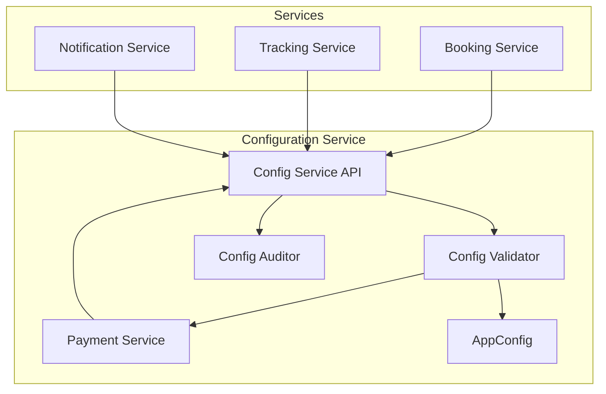
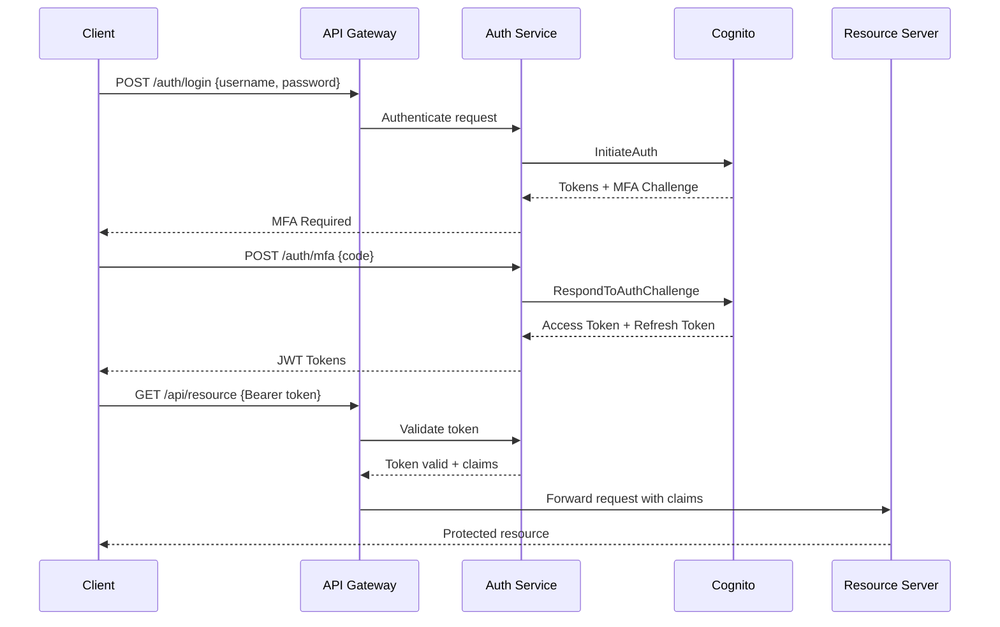

# 🔧 Technical Specifications Document
## Enterprise-Grade Implementation Components

**Version:** 1.0
**Date:** February 10, 2026
**Classification:** CONFIDENTIAL

---

## 1. Configuration Service Specification

### 1.1 System Architecture



### 1.2 API Specification

```yaml
openapi: 3.0.0
info:
  title: Configuration Service API
  version: 1.0.0

paths:
  /v1/config/{service}/{environment}/{path}:
    get:
      summary: Retrieve configuration
      parameters:
        - name: service
          in: path
          required: true
          schema:
            type: string
            enum: [booking, tracking, payment, notification]
        - name: environment
          in: path
          required: true
          schema:
            type: string
            enum: [dev, staging, production]
        - name: path
          in: path
          required: true
          schema:
            type: string
      responses:
        200:
          description: Configuration retrieved
          content:
            application/json:
              schema:
                type: object
                properties:
                  data:
                    type: object
                  version:
                    type: string
                  last_modified:
                    type: string
                  checksum:
                    type: string

    put:
      summary: Update configuration
      requestBody:
        required: true
        content:
          application/json:
            schema:
              type: object
              properties:
                data:
                  type: object
                change_ticket:
                  type: string
                  pattern: '^CHG-[0-9]{8}$'
                approval_token:
                  type: string
      responses:
        200:
          description: Configuration updated
```

### 1.3 Database Schema

```sql
-- Configuration audit table
CREATE TABLE configuration_audit (
    audit_id UUID PRIMARY KEY DEFAULT gen_random_uuid(),
    service_name VARCHAR(50) NOT NULL,
    environment VARCHAR(20) NOT NULL,
    config_path VARCHAR(255) NOT NULL,
    action VARCHAR(20) NOT NULL CHECK (action IN ('CREATE', 'UPDATE', 'DELETE', 'ACCESS')),
    old_value JSONB,
    new_value JSONB,
    change_ticket VARCHAR(20),
    user_id VARCHAR(100) NOT NULL,
    ip_address INET,
    timestamp TIMESTAMP WITH TIME ZONE DEFAULT CURRENT_TIMESTAMP,
    checksum VARCHAR(64),

    INDEX idx_service_env (service_name, environment),
    INDEX idx_timestamp (timestamp),
    INDEX idx_user (user_id)
);

-- Configuration versions table
CREATE TABLE configuration_versions (
    version_id UUID PRIMARY KEY DEFAULT gen_random_uuid(),
    service_name VARCHAR(50) NOT NULL,
    environment VARCHAR(20) NOT NULL,
    config_path VARCHAR(255) NOT NULL,
    version_number INTEGER NOT NULL,
    config_data JSONB NOT NULL,
    created_at TIMESTAMP WITH TIME ZONE DEFAULT CURRENT_TIMESTAMP,
    created_by VARCHAR(100) NOT NULL,
    is_active BOOLEAN DEFAULT true,

    UNIQUE KEY unique_version (service_name, environment, config_path, version_number)
);
```

### 1.4 Configuration Validation Schema

```json
{
  "$schema": "http://json-schema.org/draft-07/schema#",
  "title": "Pricing Configuration",
  "type": "object",
  "required": ["base_rate", "distance_rate", "material_rates"],
  "properties": {
    "base_rate": {
      "type": "number",
      "minimum": 100,
      "maximum": 10000,
      "description": "Base rate in INR per ton"
    },
    "distance_rate": {
      "type": "number",
      "minimum": 5,
      "maximum": 100,
      "description": "Distance rate in INR per km per ton"
    },
    "material_rates": {
      "type": "object",
      "patternProperties": {
        "^[a-z_]+$": {
          "type": "number",
          "minimum": 0.5,
          "maximum": 5.0
        }
      }
    },
    "surge_config": {
      "type": "object",
      "properties": {
        "enabled": {"type": "boolean"},
        "max_multiplier": {
          "type": "number",
          "minimum": 1.0,
          "maximum": 3.0
        },
        "triggers": {
          "type": "array",
          "items": {
            "type": "object",
            "properties": {
              "condition": {"type": "string"},
              "multiplier": {"type": "number"}
            }
          }
        }
      }
    }
  }
}
```

---

## 2. Authentication Service Specification

### 2.1 OAuth2.0 Flow



### 2.2 JWT Token Structure

```json
{
  "header": {
    "alg": "RS256",
    "typ": "JWT",
    "kid": "rsa-key-id"
  },
  "payload": {
    "sub": "user-uuid",
    "iss": "https://auth.ubertruck.com",
    "aud": ["api.ubertruck.com"],
    "exp": 1612137600,
    "iat": 1612134000,
    "jti": "unique-token-id",
    "tenant_id": "tenant-uuid",
    "roles": ["fleet_owner", "admin"],
    "permissions": [
      "booking:read",
      "booking:write",
      "payment:read"
    ],
    "metadata": {
      "ip_address": "192.168.1.1",
      "device_id": "device-uuid",
      "session_id": "session-uuid"
    }
  },
  "signature": "base64-encoded-signature"
}
```

### 2.3 RBAC Configuration

```yaml
rbac:
  roles:
    super_admin:
      description: "Full system access"
      permissions:
        - "*:*"
      mfa_required: true
      ip_whitelist: true

    fleet_owner:
      description: "Fleet management access"
      permissions:
        - "fleet:*"
        - "booking:read"
        - "payment:read"
        - "tracking:read"
      max_sessions: 3

    driver:
      description: "Driver mobile app access"
      permissions:
        - "trip:read:assigned"
        - "trip:update:status"
        - "tracking:write:location"
      device_binding: true

    shipper:
      description: "Shipper portal access"
      permissions:
        - "booking:*"
        - "payment:read:own"
        - "tracking:read:own"
      credit_check: true

  permission_matrix:
    booking:
      operations: [create, read, update, delete, cancel]
      resource_filters:
        - own
        - tenant
        - all

    payment:
      operations: [initiate, read, refund, settle]
      resource_filters:
        - own
        - tenant
      audit_required: true
```

---

## 3. Secrets Management Specification

### 3.1 Secret Rotation Lambda

```python
import boto3
import json
import pymysql
from typing import Dict
import secrets
import string

def lambda_handler(event, context):
    """
    Automated secret rotation handler
    """
    service_client = boto3.client('secretsmanager')
    token = event['Token']
    arn = event['SecretId']
    step = event['Step']

    # Get the secret
    metadata = service_client.describe_secret(SecretId=arn)

    if step == "createSecret":
        create_secret(service_client, arn, token)
    elif step == "setSecret":
        set_secret(service_client, arn, token)
    elif step == "testSecret":
        test_secret(service_client, arn, token)
    elif step == "finishSecret":
        finish_secret(service_client, arn, token)

def create_secret(service_client, arn, token):
    """Create new secret version"""
    # Get current secret
    current_secret = json.loads(
        service_client.get_secret_value(
            SecretId=arn,
            VersionStage="AWSCURRENT"
        )['SecretString']
    )

    # Generate new password
    new_password = generate_strong_password()

    # Create new secret version
    new_secret = current_secret.copy()
    new_secret['password'] = new_password
    new_secret['last_rotated'] = datetime.now().isoformat()

    # Store as pending
    service_client.put_secret_value(
        SecretId=arn,
        ClientRequestToken=token,
        SecretString=json.dumps(new_secret),
        VersionStages=['AWSPENDING']
    )

def generate_strong_password(length=32):
    """Generate cryptographically secure password"""
    alphabet = string.ascii_letters + string.digits + string.punctuation
    password = ''.join(secrets.choice(alphabet) for _ in range(length))
    return password

def set_secret(service_client, arn, token):
    """Update the actual resource with new secret"""
    # Get pending secret
    pending_secret = json.loads(
        service_client.get_secret_value(
            SecretId=arn,
            VersionStage="AWSPENDING",
            VersionId=token
        )['SecretString']
    )

    # Update database password (example)
    connection = pymysql.connect(
        host=pending_secret['host'],
        user=pending_secret['username'],
        password=pending_secret['old_password'],
        database='mysql'
    )

    with connection.cursor() as cursor:
        cursor.execute(
            f"ALTER USER '{pending_secret['username']}'@'%' "
            f"IDENTIFIED BY '{pending_secret['password']}'"
        )
    connection.commit()
```

### 3.2 Secret Access Policy

```json
{
  "Version": "2012-10-17",
  "Statement": [
    {
      "Effect": "Allow",
      "Principal": {
        "AWS": "arn:aws:iam::ACCOUNT:role/ServiceRole"
      },
      "Action": [
        "secretsmanager:GetSecretValue",
        "secretsmanager:DescribeSecret"
      ],
      "Resource": "arn:aws:secretsmanager:REGION:ACCOUNT:secret:ubertruck/*",
      "Condition": {
        "StringEquals": {
          "secretsmanager:VersionStage": "AWSCURRENT"
        },
        "IpAddress": {
          "aws:SourceIp": [
            "10.0.0.0/8"
          ]
        }
      }
    }
  ]
}
```

---

## 4. API Gateway Specification

### 4.1 Rate Limiting Configuration

```yaml
x-amazon-apigateway-request-validators:
  all:
    validateRequestBody: true
    validateRequestParameters: true

x-amazon-apigateway-gateway-responses:
  QUOTA_EXCEEDED:
    statusCode: 429
    responseTemplates:
      application/json: |
        {
          "message": "Rate limit exceeded",
          "type": "$context.error.responseType",
          "quotaLimit": "$context.quotaLimit",
          "quotaRemaining": "$context.quotaRemaining",
          "retryAfter": "$context.quotaPeriodEnd"
        }

x-amazon-apigateway-request-throttle:
  burstLimit: 5000
  rateLimit: 2000

paths:
  /booking:
    post:
      x-amazon-apigateway-request-throttle:
        burstLimit: 100
        rateLimit: 50
      x-amazon-apigateway-integration:
        type: aws_proxy
        httpMethod: POST
        uri: arn:aws:apigateway:${AWS::Region}:lambda:path/2015-03-31/functions/${BookingFunction.Arn}/invocations
        requestTemplates:
          application/json: |
            {
              "body": $input.json('$'),
              "headers": {
                #foreach($header in $input.params().header.keySet())
                  "$header": "$util.escapeJavaScript($input.params().header.get($header))"
                  #if($foreach.hasNext),#end
                #end
              },
              "requestContext": {
                "apiKey": "$context.identity.apiKey",
                "apiKeyId": "$context.identity.apiKeyId",
                "requestId": "$context.requestId",
                "sourceIp": "$context.identity.sourceIp",
                "userAgent": "$context.identity.userAgent"
              }
            }
```

### 4.2 Request Validation Schema

```json
{
  "$schema": "http://json-schema.org/draft-07/schema#",
  "title": "Booking Request",
  "type": "object",
  "required": ["pickup_location", "drop_location", "material_type", "quantity_mt"],
  "properties": {
    "pickup_location": {
      "type": "object",
      "required": ["lat", "lng", "address"],
      "properties": {
        "lat": {
          "type": "number",
          "minimum": -90,
          "maximum": 90
        },
        "lng": {
          "type": "number",
          "minimum": -180,
          "maximum": 180
        },
        "address": {
          "type": "string",
          "minLength": 10,
          "maxLength": 500
        }
      }
    },
    "material_type": {
      "type": "string",
      "enum": ["coal", "iron_ore", "limestone", "fertilizer", "grain", "sand"]
    },
    "quantity_mt": {
      "type": "number",
      "minimum": 1,
      "maximum": 1000
    }
  }
}
```

---

## 5. Service Mesh Specification

### 5.1 Virtual Service Configuration

```yaml
apiVersion: appmesh.k8s.aws/v1beta2
kind: VirtualService
metadata:
  name: booking-service
  namespace: ubertruck
spec:
  awsName: booking-service.ubertruck.local
  provider:
    virtualRouter:
      virtualRouterRef:
        name: booking-router

---
apiVersion: appmesh.k8s.aws/v1beta2
kind: VirtualRouter
metadata:
  name: booking-router
  namespace: ubertruck
spec:
  listeners:
    - portMapping:
        port: 8080
        protocol: http
  routes:
    - name: booking-route
      httpRoute:
        match:
          prefix: /
        action:
          weightedTargets:
            - virtualNodeRef:
                name: booking-v1
              weight: 90
            - virtualNodeRef:
                name: booking-v2
              weight: 10
        retryPolicy:
          maxRetries: 3
          perRetryTimeout:
            value: 10
            unit: s
          httpRetryEvents:
            - server-error
            - gateway-error
        timeout:
          perRequest:
            value: 30
            unit: s
```

### 5.2 Circuit Breaker Configuration

```yaml
apiVersion: appmesh.k8s.aws/v1beta2
kind: VirtualNode
metadata:
  name: payment-service
  namespace: ubertruck
spec:
  serviceDiscovery:
    dns:
      hostname: payment.ubertruck.local
  listeners:
    - portMapping:
        port: 8080
        protocol: http
      connectionPool:
        http:
          maxConnections: 100
          maxPendingRequests: 10
      outlierDetection:
        maxServerErrors: 5
        interval:
          value: 30
          unit: s
        baseEjectionDuration:
          value: 30
          unit: s
        maxEjectionPercent: 50
  backends:
    - virtualService:
        virtualServiceRef:
          name: database-service
```

---

## 6. Observability Specification

### 6.1 Distributed Tracing Configuration

```python
from aws_xray_sdk.core import xray_recorder
from aws_xray_sdk.ext.flask.middleware import XRayMiddleware
import json

# Initialize X-Ray
xray_recorder.configure(
    service='booking-service',
    context_missing='LOG_ERROR',
    daemon_address='127.0.0.1:2000',
    sampling_rules={
        "version": 2,
        "default": {
            "fixed_target": 1,
            "rate": 0.1
        },
        "rules": [
            {
                "description": "Payment transactions",
                "service_name": "payment-service",
                "http_method": "POST",
                "url_path": "/payments/*",
                "fixed_target": 2,
                "rate": 0.5
            }
        ]
    }
)

@xray_recorder.capture('process_booking')
def process_booking(booking_data):
    """Process booking with tracing"""
    subsegment = xray_recorder.current_subsegment()

    # Add metadata
    subsegment.put_metadata('booking_id', booking_data['id'])
    subsegment.put_metadata('amount', booking_data['amount'])

    # Add annotations for filtering
    subsegment.put_annotation('service', 'booking')
    subsegment.put_annotation('environment', os.environ['ENVIRONMENT'])

    try:
        # Process booking
        result = perform_booking_logic(booking_data)
        subsegment.put_annotation('status', 'success')
        return result
    except Exception as e:
        subsegment.put_annotation('status', 'error')
        subsegment.add_exception(e)
        raise
```

### 6.2 Custom Metrics

```python
from aws_embedded_metrics import metric_scope
import time

@metric_scope
def process_payment(payment_data, metrics):
    """Process payment with custom metrics"""
    start_time = time.time()

    # Set dimensions
    metrics.set_dimensions(
        {"Service": "PaymentService", "Environment": os.environ['ENVIRONMENT']}
    )

    try:
        # Process payment
        result = payment_processor.process(payment_data)

        # Record metrics
        metrics.put_metric("PaymentProcessed", 1, "Count")
        metrics.put_metric("PaymentAmount", payment_data['amount'], "None")
        metrics.put_metric("ProcessingTime", time.time() - start_time, "Seconds")

        # Add properties
        metrics.set_property("PaymentId", result['payment_id'])
        metrics.set_property("Gateway", payment_data['gateway'])

        return result
    except Exception as e:
        metrics.put_metric("PaymentFailed", 1, "Count")
        metrics.set_property("ErrorType", type(e).__name__)
        raise
```

---

## 7. CI/CD Pipeline Specification

### 7.1 GitHub Actions Workflow

```yaml
name: Production Deployment Pipeline

on:
  push:
    branches: [main]
  pull_request:
    branches: [main]

env:
  AWS_REGION: ap-south-1
  MINIMUM_COVERAGE: 80

jobs:
  code-quality:
    runs-on: ubuntu-latest
    steps:
      - uses: actions/checkout@v3

      - name: SonarQube Scan
        uses: sonarsource/sonarqube-scan-action@master
        env:
          GITHUB_TOKEN: ${{ secrets.GITHUB_TOKEN }}
          SONAR_TOKEN: ${{ secrets.SONAR_TOKEN }}
        with:
          args: >
            -Dsonar.projectKey=ubertruck
            -Dsonar.qualitygate.wait=true

      - name: Security Scan
        uses: aquasecurity/trivy-action@master
        with:
          scan-type: 'fs'
          scan-ref: '.'
          format: 'sarif'
          output: 'trivy-results.sarif'

      - name: Upload Security Results
        uses: github/codeql-action/upload-sarif@v2
        with:
          sarif_file: 'trivy-results.sarif'

  test:
    runs-on: ubuntu-latest
    needs: code-quality
    steps:
      - uses: actions/checkout@v3

      - name: Setup Python
        uses: actions/setup-python@v4
        with:
          python-version: '3.9'

      - name: Run Tests
        run: |
          pip install -r requirements.txt
          pytest --cov=. --cov-report=xml --cov-fail-under=${MINIMUM_COVERAGE}

      - name: Integration Tests
        run: |
          docker-compose up -d
          pytest tests/integration --maxfail=1
          docker-compose down

  deploy-staging:
    runs-on: ubuntu-latest
    needs: test
    if: github.ref == 'refs/heads/main'
    environment: staging
    steps:
      - name: Deploy to Staging
        run: |
          aws cloudformation deploy \
            --template-file infrastructure/staging.yaml \
            --stack-name ubertruck-staging \
            --capabilities CAPABILITY_IAM \
            --parameter-overrides \
              Environment=staging \
              Version=${{ github.sha }}

  deploy-production:
    runs-on: ubuntu-latest
    needs: deploy-staging
    environment: production
    steps:
      - name: Blue-Green Deployment
        run: |
          ./scripts/blue-green-deploy.sh \
            --environment production \
            --version ${{ github.sha }} \
            --rollback-on-failure
```

### 7.2 Deployment Validation

```python
# deployment_validator.py
import boto3
import time
from typing import Dict, List

class DeploymentValidator:
    """Validate deployment health before switching traffic"""

    def __init__(self, environment: str):
        self.environment = environment
        self.cloudwatch = boto3.client('cloudwatch')
        self.elbv2 = boto3.client('elbv2')

    def validate_deployment(self, target_group_arn: str) -> bool:
        """
        Comprehensive deployment validation
        """
        validations = [
            self._check_target_health(target_group_arn),
            self._check_error_rate(),
            self._check_latency(),
            self._check_dependencies(),
            self._run_smoke_tests()
        ]

        return all(validations)

    def _check_error_rate(self, threshold: float = 0.01) -> bool:
        """Check if error rate is below threshold"""
        metrics = self.cloudwatch.get_metric_statistics(
            Namespace='AWS/Lambda',
            MetricName='Errors',
            Dimensions=[
                {'Name': 'FunctionName', 'Value': f'ubertruck-{self.environment}'}
            ],
            StartTime=datetime.now() - timedelta(minutes=5),
            EndTime=datetime.now(),
            Period=300,
            Statistics=['Average']
        )

        if metrics['Datapoints']:
            error_rate = metrics['Datapoints'][0]['Average']
            return error_rate < threshold
        return True
```

---

## 8. Compliance Framework Specification

### 8.1 GDPR Implementation

```python
# gdpr_compliance.py
from typing import Dict, List
import json
import hashlib
from datetime import datetime, timedelta

class GDPRCompliance:
    """GDPR compliance implementation"""

    def __init__(self):
        self.audit_logger = AuditLogger()

    def handle_data_request(self, request_type: str, user_id: str) -> Dict:
        """Handle GDPR data subject requests"""

        handlers = {
            'ACCESS': self._handle_access_request,
            'RECTIFICATION': self._handle_rectification_request,
            'ERASURE': self._handle_erasure_request,
            'PORTABILITY': self._handle_portability_request,
            'RESTRICTION': self._handle_restriction_request
        }

        if request_type not in handlers:
            raise ValueError(f"Invalid request type: {request_type}")

        # Log the request
        self.audit_logger.log({
            'event': 'GDPR_REQUEST',
            'type': request_type,
            'user_id': user_id,
            'timestamp': datetime.now().isoformat()
        })

        # Process request
        result = handlers[request_type](user_id)

        # Generate compliance report
        return {
            'request_id': self._generate_request_id(),
            'request_type': request_type,
            'user_id': user_id,
            'status': 'completed',
            'processed_at': datetime.now().isoformat(),
            'result': result
        }

    def _handle_erasure_request(self, user_id: str) -> Dict:
        """Right to be forgotten implementation"""

        # Anonymize user data instead of deletion for audit trail
        anonymized_data = {
            'user_id': hashlib.sha256(user_id.encode()).hexdigest(),
            'email': 'deleted@example.com',
            'phone': '+00000000000',
            'name': 'DELETED USER',
            'address': 'DELETED'
        }

        # Update all services
        services_updated = []
        for service in ['user', 'booking', 'payment', 'tracking']:
            result = self._anonymize_in_service(service, user_id, anonymized_data)
            services_updated.append({
                'service': service,
                'status': result
            })

        return {
            'action': 'data_anonymized',
            'services_updated': services_updated,
            'retention_period': '7_years_for_legal_compliance'
        }
```

### 8.2 PCI-DSS Implementation

```python
# pci_compliance.py
import re
from cryptography.fernet import Fernet
from typing import Optional

class PCICompliance:
    """PCI-DSS compliance for payment card data"""

    def __init__(self):
        self.encryption_key = self._get_encryption_key()
        self.cipher = Fernet(self.encryption_key)

    def tokenize_card_number(self, card_number: str) -> str:
        """Tokenize credit card number"""

        # Validate card number
        if not self._validate_card_number(card_number):
            raise ValueError("Invalid card number")

        # Generate token
        token = self._generate_token()

        # Store encrypted card number with token mapping
        encrypted = self.cipher.encrypt(card_number.encode())
        self._store_token_mapping(token, encrypted)

        # Return token
        return token

    def mask_card_number(self, card_number: str) -> str:
        """Mask credit card for display"""
        if len(card_number) < 12:
            raise ValueError("Invalid card number length")

        return f"{'*' * (len(card_number) - 4)}{card_number[-4:]}"

    def _validate_card_number(self, card_number: str) -> bool:
        """Luhn algorithm validation"""

        # Remove non-digits
        card_number = re.sub(r'\D', '', card_number)

        if not card_number or len(card_number) < 13:
            return False

        # Luhn check
        total = 0
        for i, digit in enumerate(reversed(card_number)):
            n = int(digit)
            if i % 2 == 1:
                n *= 2
                if n > 9:
                    n -= 9
            total += n

        return total % 10 == 0
```

---

## 9. Performance Benchmarks

### 9.1 Target Metrics

| Service | Metric | Target | Alert Threshold |
|---------|--------|--------|-----------------|
| API Gateway | Latency (p99) | < 100ms | > 200ms |
| Lambda Functions | Cold Start | < 1s | > 2s |
| Lambda Functions | Execution Time | < 500ms | > 1s |
| DynamoDB | Read Latency | < 10ms | > 20ms |
| DynamoDB | Write Latency | < 20ms | > 50ms |
| Overall | Error Rate | < 0.1% | > 1% |
| Overall | Availability | > 99.99% | < 99.9% |

### 9.2 Load Testing Configuration

```yaml
# k6_load_test.js
import http from 'k6/http';
import { check, sleep } from 'k6';
import { Rate } from 'k6/metrics';

const errorRate = new Rate('errors');

export let options = {
  stages: [
    { duration: '5m', target: 100 },   // Ramp up
    { duration: '10m', target: 1000 },  // Stay at 1000 RPS
    { duration: '5m', target: 2000 },   // Peak load
    { duration: '10m', target: 2000 },  // Sustained peak
    { duration: '5m', target: 0 },      // Ramp down
  ],
  thresholds: {
    http_req_duration: ['p(99)<200'],  // 99% of requests under 200ms
    errors: ['rate<0.01'],              // Error rate under 1%
  },
};

export default function() {
  const payload = JSON.stringify({
    pickup_location: {
      lat: 28.6139,
      lng: 77.2090,
      address: "New Delhi, India"
    },
    drop_location: {
      lat: 19.0760,
      lng: 72.8777,
      address: "Mumbai, India"
    },
    material_type: "coal",
    quantity_mt: 100
  });

  const params = {
    headers: {
      'Content-Type': 'application/json',
      'Authorization': `Bearer ${__ENV.API_TOKEN}`,
    },
  };

  const res = http.post('https://api.ubertruck.com/v1/booking', payload, params);

  const success = check(res, {
    'status is 200': (r) => r.status === 200,
    'response time < 200ms': (r) => r.timings.duration < 200,
    'booking_id present': (r) => JSON.parse(r.body).booking_id !== undefined,
  });

  errorRate.add(!success);
  sleep(1);
}
```

---

## 10. Disaster Recovery Specification

### 10.1 Backup Strategy

```yaml
backup_strategy:
  databases:
    dynamodb:
      point_in_time_recovery: enabled
      backup_frequency: continuous
      retention: 35 days

    rds:
      automated_backups: enabled
      backup_window: "03:00-04:00"
      retention_period: 30 days
      snapshot_frequency: daily

  s3_buckets:
    versioning: enabled
    lifecycle_rules:
      - transition_to_ia: 30 days
      - transition_to_glacier: 90 days
      - expiration: 365 days

  cross_region_replication:
    primary: ap-south-1
    secondary: ap-southeast-1
    replication_time: < 15 minutes
```

### 10.2 Recovery Procedures

```python
# disaster_recovery.py
class DisasterRecovery:
    """Automated disaster recovery procedures"""

    def initiate_failover(self, reason: str) -> Dict:
        """Initiate failover to secondary region"""

        steps = [
            self._verify_secondary_health(),
            self._update_dns_records(),
            self._activate_secondary_databases(),
            self._redirect_traffic(),
            self._notify_stakeholders()
        ]

        results = []
        for step in steps:
            result = step()
            results.append(result)
            if not result['success']:
                self._rollback_failover(results)
                raise Exception(f"Failover failed at: {result['step']}")

        return {
            'status': 'failover_complete',
            'primary_region': 'ap-south-1',
            'active_region': 'ap-southeast-1',
            'reason': reason,
            'timestamp': datetime.now().isoformat(),
            'rto_achieved': self._calculate_rto(),
            'rpo_achieved': self._calculate_rpo()
        }
```

---

**Document Status:** APPROVED FOR IMPLEMENTATION
**Technical Review:** Completed
**Security Review:** Completed
**Next Steps:** Begin Phase 1 Implementation